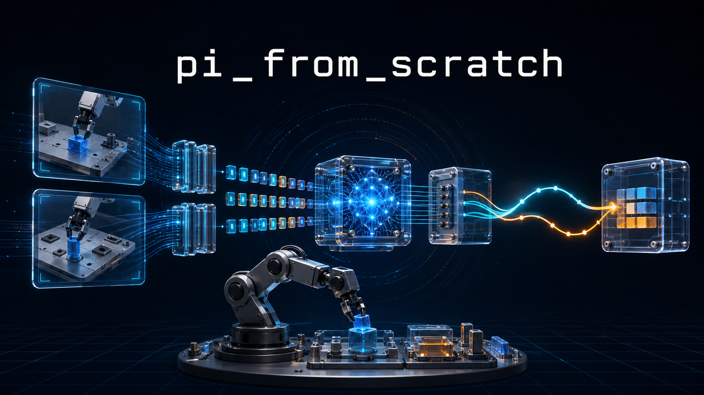

# pi_from_scratch



`pi_from_scratch` 是一个面向具备大模型/VLM 和基础具身知识读者的 π 系列学习项目。

我们将从一个可以在普通开发机上运行的小型模型出发，逐步理解并实现 π₀、FAST、RTC、π₀.₅、π*₀.₆、MEM 和 π₀.₇ 中的重要思想，最终把数据、训练、推理与仿真环境连接成一个完整的小型 VLA 系统。

本项目参考 [openpi](https://github.com/Physical-Intelligence/openpi)，但重点是用较小、易读、可实验的代码解释核心机制，而不是复现原论文的模型规模和性能。

## 你会学到什么

- 一个 VLA 系统如何连接视觉、语言、机器人状态和连续动作；
- LeRobot trajectory 如何变成带 action chunk 的训练样本；
- π₀ 如何使用 action expert 和 flow matching 生成连续动作；
- FAST 如何压缩高频动作并进行自回归预测；
- RTC 如何在存在推理延迟时连续执行 action chunk；
- π₀.₅、π*₀.₆、MEM 和 π₀.₇ 如何分别引入异构训练、经验学习、长短期记忆与 context steering；
- 如何在仿真环境中评估 success、reward、延迟、轨迹连续性与失败案例。

完整学习路线见 [课程大纲](docs/00_learning_path.md)，论文之间的关系见 [π 系列知识地图](docs/01_pi_family.md)。

## 从第一讲开始

第一讲先建立完整系统观，而不是直接进入公式：

> [第 1 讲：认识 VLA 系统——机器人如何从“看见、听懂”走到“行动”](docs/lessons/01_vla_system_overview.md)

这一讲会介绍数据、VLA policy、动作生成、训练目标、runtime、仿真环境和评估之间的关系，并通过一个不学习的 random policy 跑通最小闭环。

安装并运行第一讲实验：

```bash
python -m venv .venv
source .venv/bin/activate
pip install -e '.[dev]'

pi-contract-demo
pytest -q tests/test_contracts.py
```

第二讲开始处理真实机器人时序数据：

> [第 2 讲：从 LeRobot trajectory 得到无泄漏的训练样本](docs/lessons/02_lerobot_trajectory_to_training_sample.md)

先用无需下载的 toy episode 看清窗口边界、padding、mask 和 episode split：

```bash
pi-data-window-demo
pytest -q tests/test_data_windows.py
```

把一个真实 PushT action chunk 投影到图像上：

```bash
pip install -e '.[lerobot]'
pi-visualize-chunk --index 100 --horizon 16
```

图片默认保存到 `outputs/lesson02/pusht_chunk.png`。

## 代码目录

代码按职责分层，课程命令只负责把这些模块串起来：

```text
src/pi_from_scratch/
├── data/             # LeRobot adapter、episode split、时间窗口与 mask
├── representations/  # 文本与动作表示；后续加入 action transform、FAST tokenizer
├── models/           # tiny π₀ 等模型结构
├── objectives/       # flow matching 等训练目标
├── inference/        # Euler solver 等动作采样算法，不管理环境时钟
├── policies/         # 面向 runtime 的统一 policy 接口
├── cli/              # 各讲实验、训练和可视化命令入口
├── config.py         # 当前 Python 配置对象
└── contracts.py      # 跨模块共享的 observation/action 契约
```

后续 runtime、environment、evaluation 和 memory 会在对应课程真正需要时加入，不预先创建空目录。

## 运行最小训练

仓库目前提供一个小型 PyTorch π₀ 风格模型，包括：

- 图像、文本和低维 state 条件编码；
- action chunk；
- conditional flow-matching loss；
- Euler action sampling；
- synthetic dataset 和自动测试。

无需下载机器人数据即可运行：

```bash
pi-train --dataset synthetic --steps 20 --device cpu
pytest -q
```

训练完成后，checkpoint 会保存在 `outputs/debug/`。

## LeRobot PushT 数据

项目选择 [`lerobot/pusht`](https://huggingface.co/datasets/lerobot/pusht) 作为第一套真实数据。它体积较小、使用连续二维动作，适合检查数据窗口、action chunk、训练和闭环控制。

安装 LeRobot 并校验数据接口：

```bash
pip install -e '.[dev,lerobot]'
pi-train --dataset lerobot/pusht --steps 5 --device cuda
```

LeRobot 的数据读取能力属于额外依赖；本项目的 `lerobot` extra 已包含官方
`lerobot[dataset]`。当前版本要求 Python 3.12 或更高版本。

目前 PushT 接口用于管线 smoke test；训练集统计量归一化、episode split 和闭环环境评估会在后续课程中加入。在这些模块完成前，不应使用上述 5-step 结果评价策略性能。

PushT 只有一个固定任务，适合验证连续控制机制，但不能证明语言泛化、开放世界能力或分钟级记忆。后续高级章节会使用受控实验，并预留一个小型 LIBERO 多任务扩展。

## 当前内容

```text
图像 + 语言 + 本体状态
          ↓
      条件编码
          ↓
     action expert
          ↓
   flow matching action chunk
```

当前仓库已经包含前两讲正文、统一的 observation/action 接口、episode-safe action window、random policy 演示、小型 flow policy、synthetic 训练和测试。后续内容会按照 [课程大纲](docs/00_learning_path.md) 逐步加入。

## 项目边界

这是一个教学实现。小模型和小数据实验用于理解算法、检查接口和比较机制，不能代表 Physical Intelligence 原始模型在大规模跨机器人数据上的能力。
