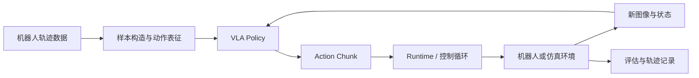
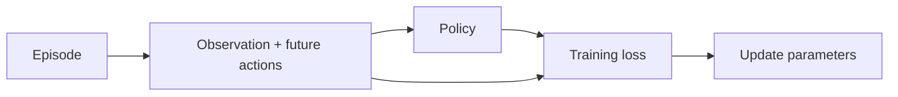
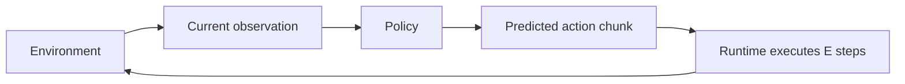

# 第 1 讲：认识 VLA 系统——机器人如何从“看见、听懂”走到“行动”

> 这一讲先建立全景。我们不急着推导 flow matching，也不急着训练模型，而是先看清一个 VLA 系统由哪些部分组成、每部分为什么存在，以及后续 π 系列工作究竟改进了哪里。

## 一句指令是怎样变成机器人动作的？

先想象我们最终要做的 PushT demo。

屏幕中有一个 T 形物体和目标区域。我们给机器人一句指令：“把 T 形物体推到目标位置。”机器人看到当前画面，也知道自己的二维位置，然后开始移动。

从人的视角看，这个过程很自然；从系统视角看，中间至少发生了四件不同的事：

1. 摄像头图像、机器人状态和文字指令被整理成模型能理解的观测；
2. 模型把视觉、语言和机器人状态融合起来，判断当前应该怎样行动；
3. 动作生成模块一次预测未来一小段动作，而不是只输出一个抽象答案；
4. 控制程序按固定频率执行动作，获取新观测，再次调用模型，直到任务结束。

这说明我们真正要构建的并不只是一个神经网络，而是一个完整的闭环系统。

可以先记住本讲最重要的一句话：

> **VLA 模型负责根据观测生成动作，VLA 系统负责让这些动作在真实或仿真环境中形成可靠的闭环行为。**

后续所有章节都会回到这个区别上。

## 一、先看全貌：VLA 系统里有什么？

VLA 是 Vision-Language-Action 的缩写。最简化的描述是：

```text
视觉观测 + 语言指令 + 机器人状态 -> 动作
```

但这个箭头隐藏了数据、模型、训练、推理和控制。一个可训练、可部署、可评估的 VLA 系统更接近下面的结构：



我们可以把它分成五层：

| 层次 | 主要职责 | 如果缺少它会怎样 |
|---|---|---|
| 数据与表征 | 把机器人轨迹变成时间对齐的训练样本 | 模型会学到错位或含义不明的动作 |
| VLA policy | 融合视觉、语言和状态，生成动作 | 系统没有可学习的决策核心 |
| 训练目标 | 告诉 policy 什么输出更接近数据 | 网络结构存在，但参数不会获得控制能力 |
| 推理与 runtime | 采样、缓存并按控制频率执行动作 | 模型输出无法稳定地驱动环境 |
| 环境与评估 | 产生新观测，并判断任务是否成功 | 只能看离线 loss，不知道机器人是否真的完成任务 |

这里的 `policy` 比“一个 forward 函数”稍宽：它还包括输入预处理、动作采样和输出反变换。但它不管理环境时钟，也不直接调用 `env.step()`。这条边界会让以后加入 FAST 或 RTC 时更清楚。

## 二、拆开来看：每个组件为什么存在？

### 1. 数据：VLA 学习的不是图片，而是带时间关系的轨迹

一条机器人数据通常不是互相独立的图片，而是一段 episode：

```text
(image_0, state_0, action_0),
(image_1, state_1, action_1),
...,
(image_T, state_T, action_T)
```

语言指令一般描述整段 episode 的目标，例如“把积木放进盒子”。训练时，我们从某个时刻取出当前或历史观测，再取出随后的一段动作作为监督信号。

因此，VLA 数据模块首先要回答的不是“图像 resize 到多大”，而是：

- 图像、state 和 action 是否来自同一时刻？
- 数据采集频率是多少？
- action 表示关节位置、末端位姿、增量还是速度？
- 一次要预测未来多少步？
- episode 结束时不足一个动作窗口怎么办？

这些问题会在第 2、3、4 讲分别处理。第一讲只需要意识到：**机器人数据中的时间和动作语义，与像素本身同样重要。**

### 2. 观测编码：让不同模态进入同一个决策上下文

在一次推理中，policy 可能收到：

- 一个或多个相机画面；
- 当前关节角、末端状态或仿真状态；
- 一句任务指令；
- 后续模型还可能收到 subtask、subgoal image、历史视频或文本记忆。

图像、文本和低维 state 的形态完全不同。VLA 需要先把它们编码为可以共同参与推理的表示。

π₀ 从预训练 VLM 出发，是因为 VLM 已经从大规模图文数据中获得了物体、场景和语言语义。但预训练 VLM 只会产生语言相关表示或离散 token，并不知道怎样以机器人控制频率输出连续动作。因此，继承 VLM 只是起点，不是完整答案。

### 3. 动作生成：从“理解任务”走到“控制机器人”

机器人最终需要的不是一句“向左推”，而是一串数值，例如：

```text
[x_t, y_t], [x_{t+1}, y_{t+1}], ..., [x_{t+H-1}, y_{t+H-1}]
```

这段未来动作称为 action chunk，长度记为 `H`。

π₀ 在 VLM 旁边加入 action expert，并用 flow matching 生成连续 action chunk。FAST 走了另一条路线：先把连续动作压缩成更短的离散 token，再像语言模型一样自回归生成。

这两种方法共享视觉、语言和状态条件，但动作的表示与解码方式不同。这正是为什么 runtime 不应直接依赖某个模型内部类。

### 4. 训练目标：把演示轨迹变成学习信号

训练阶段，policy 看到数据集中的 observation，并尝试重建未来动作。

不同 VLA 的训练目标可以不同：

- flow policy 学习一个把噪声逐渐变成动作的向量场；
- FAST policy 学习预测下一个 action token；
- π₀.₅ 还会混入高层语义和视觉语言目标；
- π*₀.₆ 会利用 reward、failure 和 intervention 区分动作质量。

训练目标决定模型从数据中吸收什么信息。即使模型结构完全相同，改变训练样本类型和 objective，也可能得到行为差异很大的 policy。

### 5. Runtime：模型算出动作之后，任务还没有结束

假设 policy 一次输出 `H=16` 步动作，环境控制频率是 10 Hz。这段 action chunk 覆盖 1.6 秒，但 runtime 不一定把 16 步全部执行完。

更常见的闭环过程是：

1. 根据当前 observation 预测 16 步；
2. 只执行前 `E` 步；
3. 获取新图像和 state；
4. 再预测新的 action chunk。

`E` 称为 execution horizon。较小的 `E` 让机器人更频繁地根据新观测纠正动作，但也增加推理压力。

#### 一个实际部署问题：训练动作是 10 Hz，电机控制是 20 Hz，怎么办？

这里先统一一个容易混淆的说法：`chunk` 指整段动作，不是其中的每一步。因此，“10 chunk”更准确的说法是“一个长度为 `H=10` 的 action chunk”；“20 chunk”则应写成“一个长度为 `H=20` 的 action chunk”。

还要区分系统里的三个时钟：

- **数据/动作频率**：数据集中相邻动作的时间间隔，也是模型学习到的动作时间语义；
- **policy 重规划频率**：runtime 多久调用一次模型，生成新的 action chunk；
- **底层控制频率**：控制器多久向电机发送一次命令。

假设训练数据是 10 Hz。在本课的约定下，一个 `H=10` 的 action chunk 表示约 1 秒的运动，而不是一串可以用任意速度播放的 10 个数字。部署时底层控制器以 20 Hz 运行，并不要求模型也改成预测 20 步。更稳妥的做法是：先给模型输出保留训练时的时间戳，再把这条约 1 秒的轨迹重采样为 20 Hz。这样会得到约 20 个控制点，但它们仍在约 1 秒内执行，轨迹的时间尺度没有改变。

反过来，如果模型输出的每一步原本代表 100 ms，runtime 却每 50 ms 就消费一步，那么轨迹会被压缩到一半时间。对绝对位置或位姿轨迹来说，终点和几何路径通常没有变，但名义速度约为原来的 2 倍，所需加速度、jerk、力矩以及接触冲击还可能增长得更多。因此，“电机走过的距离一定更大”并不准确；更普遍的风险是**同一段运动被执行得更快、更激烈**。

动作的表示方式会进一步改变结果：

| 动作表示 | 不保留时间语义、直接加速消费时会怎样 | 更合适的处理 |
|---|---|---|
| 绝对关节位置 / 末端位姿 | 路径和终点大致相同，但执行时间缩短，速度和动态冲击上升 | 按原时间戳插值，并在相同总时长内重采样 |
| 每步位置增量 | 整段增量的和可能不变，但会在更短时间内完成；若还改变重规划方式，累计位移也可能改变 | 先还原为绝对轨迹再重采样，或按实际 `dt` 正确缩放增量 |
| 关节 / 末端速度 | 位移由“速度 × 实际持续时间”决定；只把同样数量的命令更快发完，位移反而可能变小 | 重采样速度曲线，并用真实控制周期积分 |

所以，“把 10 Hz 的动作插值成 20 Hz”这个方向是对的，但必须补上两个条件：**总执行时长保持不变**，并且**插值方式与动作表示相匹配**。插值增加的是控制点密度，不会凭空增加 policy 的信息量，也不等于模型真的学会了 20 Hz 控制。

有意压缩执行时间，确实可能提高任务吞吐量，但这不是一个免费的推理加速技巧。它引入了训推时间尺度不一致，而且机器人动力学、接触过程和闭环观测都发生了变化。真正部署前至少要限制关节/工作空间的位置、速度、加速度、jerk 与力矩（或电流），依次经过仿真、真机低速和逐级提速验证。ROS 2 的轨迹控制器同样把轨迹点的时间与[速度缩放](https://control.ros.org/kilted/doc/ros2_controllers/joint_trajectory_controller/doc/speed_scaling.html)显式建模；MoveIt 的[时间参数化](https://moveit.picknik.ai/main/doc/examples/time_parameterization/time_parameterization_tutorial.html)也会依据速度和加速度上限为路径分配时间。

这也是为什么后续读取 LeRobot 数据时，我们不能只看 action tensor 的形状，还要读取数据集的 `fps`，并用以秒为单位的 `delta_timestamps` 构造时间窗口。相关字段可以在 [LeRobotDataset 文档](https://huggingface.co/docs/lerobot/main/api/datasets)中找到。

如果一次模型推理需要 200 ms，而控制器每 20 ms 就要消费一个动作，简单地停下来等待模型会造成卡顿。这就是 RTC 要解决的问题：模型生成下一段动作的同时，机器人仍在执行当前动作；新 chunk 还必须与已经承诺执行的动作保持一致。

所以，推理速度不是一项脱离控制系统的模型指标。它必须和 control frequency、action horizon、execution horizon 一起讨论。

### 6. 环境与评估：低 loss 不等于任务成功

离线 validation loss 只能说明模型在数据分布上更接近演示动作，却不能回答：

- 机器人偏离演示轨迹后能否恢复？
- 多次重规划会不会在 chunk 边界抖动？
- 推理延迟会不会让动作对应过时的画面？
- 最终是否真的把物体放到了正确位置？

因此，我们最终必须在 simulator 中闭环运行 policy，并记录 success、reward、轨迹、推理延迟和失败视频。

PushT 会成为本仓的第一条验证快线：它规模小、动作连续，也能让我们看到 action chunk 与 runtime 的真实交互。但它只有一个固定任务，所以不能证明语言泛化能力。

## 三、同一个系统，训练时和运行时有什么不同？

理解 VLA 最容易混淆的地方，是把训练循环和控制循环看成同一件事。

### 训练时：答案已经在数据中



训练样本同时包含 observation 和真实 action。模型预测错了，可以直接计算 loss 并更新参数。训练循环不需要让 simulator 真正执行预测动作。

### 运行时：没有未来动作答案



运行时只有当前观测，没有标准答案。policy 的输出会改变环境，改变后的环境又会产生下一次输入。误差会积累，因此必须进行闭环评估。

这两个循环使用同一个 policy，却对周围模块有完全不同的要求：训练关心 batch、loss 和梯度；运行关心时间戳、推理延迟、action buffer 和环境反馈。

## 四、π 系列工作分别改进了系统的哪里？

有了全景后，再看论文就不会只是记模型名字。

| 工作 | 主要改动的位置 | 它想解决的问题 |
|---|---|---|
| π₀ | VLM + action expert + flow objective | VLM 如何生成高频连续机器人动作 |
| FAST | 动作表征与 autoregressive decoder | 高频 action chunk 如何压缩成更短 token |
| π₀.₅ | 数据混合、训练目标和高层语义 | 如何获得更好的开放世界泛化与长任务能力 |
| RTC | 推理 sampler 与异步 runtime | 高延迟 policy 如何连续执行 action chunk |
| π*₀.₆ / RECAP | 经验数据、value/advantage 与 policy conditioning | 如何从自主尝试、失败和人工纠正中继续学习 |
| MEM | policy 的短期视频记忆与长期文本记忆 | 如何记住最近视觉细节和分钟级任务进度 |
| π₀.₇ | 多模态 context conditioning | 如何精确控制策略，并利用质量不同的数据 |

这张表也是整套课程的地图：后续每一讲，都是在本讲系统图中的某个位置增加能力，同时保持其他模块可比较。

## 五、为什么第一份代码仍然从“契约”开始？

我们已经知道系统中存在数据、policy、runtime 和 evaluator。它们要协作，就必须对传递的对象达成一致。

本仓先定义四个最小对象：

```text
ObservationBatch
    -> Policy.predict_chunk(...)
    -> PolicyOutput(ActionChunk)
    -> EpisodeResult
```

它们分别表达：

- `ObservationBatch`：policy 在哪个环境时刻看到了哪些图像、state 和 prompt；
- `ActionChunk`：未来动作的数值、有效位置、时间戳、单位和参考系；
- `PolicyOutput`：动作基于哪个 observation、何时生成、推理用了多久；
- `EpisodeResult`：闭环任务是否成功、执行了多少步、发生了多少次超时。

具体字段和检查规则在 [`contracts.py`](../../src/pi_from_scratch/contracts.py)。现在不需要记住每个字段，只要理解为什么这些信息不能只藏在一个任意字典或人的记忆中。

一个尤其重要的边界是：公共接口保留 raw prompt，而不是某个 VLM 的 `text_ids`。tokenization 属于具体 policy 内部；否则更换 VLM 会迫使 runtime 一起修改。

另一个重要边界是：policy 返回给 runtime 的动作必须已经回到 simulator/robot action space。训练时使用 normalized action 没问题，但它不能未经 inverse transform 就被执行。

## 六、配套实验：让一个“不会做任务”的 policy 跑通系统

第一讲还没有训练模型。我们使用 [`RandomPolicy`](../../src/pi_from_scratch/policies/random_policy.py) 验证接口：

```text
构造 observation
  -> random policy 生成 H=4 的 action chunk
  -> 消费第一个 action
  -> 用新 state 构造下一次 observation
  -> 重复三次
```

运行：

```bash
source .venv/bin/activate
pi-contract-demo
pytest -q tests/test_contracts.py
```

预期结果：

```json
{
  "contract": "ok",
  "num_replans": 3,
  "executed_actions_shape": [3, 2],
  "chunk_boundary_steps": [0, 1, 2],
  "note": "contract probe has no task objective"
}
```

注意最后一行：random policy 没有任务目标，因此 `success=False` 完全正常。这个实验验证的是模块能否协作，而不是机器人智能。

自动测试还会故意构造错误数据，例如 image 与 state 的 batch size 不同、有效 action timestamp 不递增、padding 后又出现有效 action。它们应当在进入模型前就失败。

阅读代码时，按下面顺序即可：

1. [`contracts.py`](../../src/pi_from_scratch/contracts.py)：看四个对象分别保存什么；
2. [`protocol.py`](../../src/pi_from_scratch/policies/protocol.py)：看 runtime 唯一依赖的 policy 方法；
3. [`random_policy.py`](../../src/pi_from_scratch/policies/random_policy.py)：看一个完全不懂 VLA 的实现怎样满足接口；
4. [`lesson01.py`](../../src/pi_from_scratch/lesson01.py)：看三次最小闭环怎样串起来。

## 七、回到全景：这一讲真正建立了什么？

现在再看开头的系统图，可以把一句“训练 VLA”展开为一条完整链路：

```text
机器人轨迹
  -> 时间对齐的训练样本
  -> 视觉/语言/state 条件
  -> 动作生成 policy
  -> action chunk
  -> runtime 执行与重规划
  -> simulator 新观测
  -> 闭环结果与失败分析
```

本讲最重要的不是记住 dataclass 字段，而是建立三个判断习惯：

1. 看到一个模型改进时，先问它改的是数据、表示、objective、policy、sampler 还是 runtime；
2. 看到一个 action tensor 时，先问它的时间、单位、参考系和 representation；
3. 看到一个离线指标时，先问它是否经过闭环 simulator 验证。

如果这三点清楚，后续 flow matching、FAST、RTC 和 MEM 就会落在同一张地图上，而不是互不相干的论文技巧。

### 本讲自检

尝试用自己的话回答：

1. VLA 模型和 VLA 系统有什么区别？
2. 为什么预训练 VLM 不能直接作为机器人 policy？
3. 为什么 action chunk 覆盖 1.6 秒，不代表 runtime 必须把 1.6 秒动作全部执行完？
4. 训练循环和控制循环分别拥有什么“答案”？
5. RTC 和 MEM 分别修改了系统图中的哪个部分？

### 与论文和 openpi 的边界

本讲是系统导论，不复现 π₀ 网络。配套 `RandomPolicy` 只验证模块接口；它的结果不能说明任何论文能力。当前 `TinyPi0` 仍使用早期任意字典 batch，后续会通过 adapter 接入本讲 contract，而不会在导论中混入训练重构。

参考阅读：

- [π₀ paper](https://www.physicalintelligence.company/download/pi0.pdf)：先看 Figure 3 的整体模型结构，不必立即追全部公式。
- [openpi model observation contract（固定 commit）](https://github.com/Physical-Intelligence/openpi/blob/15a9616a00943ada6c20a0f158e3adb39df2ccac/src/openpi/models/model.py)：观察工程实现中 image、mask、state、prompt 和 action 的组织方式。
- [MEM paper](https://arxiv.org/abs/2603.03596)：本讲只需看 Figure 1，体会短期视频记忆与长期文本记忆处于系统的什么位置。

下一讲，我们沿数据一侧继续：打开真实 `lerobot/pusht` episode，弄清楚图像、state、action、fps 和 episode boundary 如何共同组成一个正确的训练样本。
