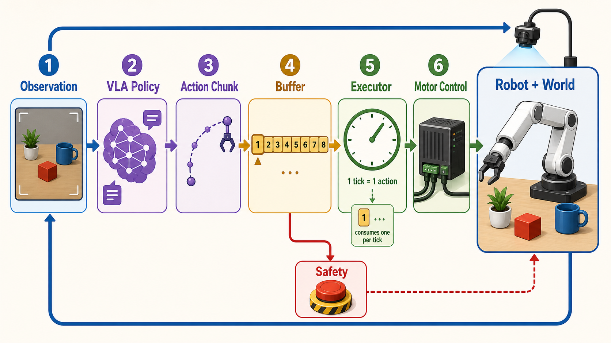
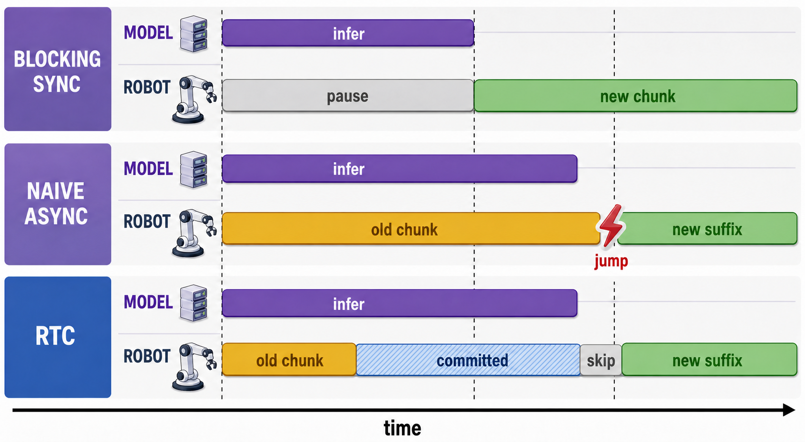
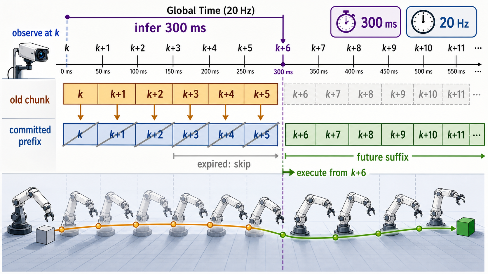

# 第 4 讲：Action chunk——一次预测多少步，又执行多少步？

> 模型输出 16 个 action，并不代表机器人一定会连续执行 16 步。还需要知道控制频率、真正执行了几个 action，以及什么时候重新观察环境。

## 从 `H=16, fps=10` 开始

第二讲里留下过一道时间题：`H=16, fps=10` 时，16 个 action 的时间戳从 `0.0 s` 排到 `1.5 s`，每个命令保持一个控制周期后，一共覆盖 `1.6 s`。

现在加入一个新条件：机器人只执行前 4 个 action，随后重新拍摄图像、调用模型，再生成一个新的 16 步 chunk。先暂时忽略模型推理耗时，得到一条最容易理解的基线。

此时系统的节奏是：

```text
模型每次预测：16 步，覆盖未来 1.6 s
机器人实际执行：4 步，持续 0.4 s
名义重规划频率：每 0.4 s 一次，也就是 2.5 Hz
每个 chunk 的后 12 步：在这个同步基线中被丢弃
```

这里的 `2.5 Hz` 只由执行时长计算，没有包含模型推理延迟。若一次推理需要 $L$ 秒，阻塞式系统两次请求之间的真实墙钟时间是 $L+0.4\,\text{s}$。本讲后面会把这段此前隐藏的时间放回完整 deploy 时序中。

所以这一讲要回答的问题是：

> Action chunk 怎样改变训练目标和执行方式？Prediction horizon、execution horizon 与 replanning interval 应该怎样区分？

可以带着下面几个问题继续阅读：

1. 为什么 VLA 倾向于一次预测多个 action？
2. `H` 个预测为什么可以只执行前 `E` 个？
3. `E` 变大或变小会怎样影响连贯性与反应速度？
4. 新旧 chunk 的交界处怎样检查动作是否突然跳变？

## 一个 VLA deploy 系统怎样持续运转？

Action chunk 处在完整闭环的中间。传感器持续产生观测，模型根据某个时刻的观测生成计划，执行器按照固定控制节拍消耗计划，机器人的运动又形成下一次观测。



这张图里同时运行着几种节拍：

```text
观测节拍       相机和状态多快产生一帧 observation
推理节拍       scheduler 什么时候请求模型；一次推理耗时 L
规划节拍       新 chunk 多久发布一次，以及覆盖未来多长时间
执行节拍       executor 按 f_ctrl Hz 从 buffer 取 action
电机节拍       机器人底层控制器的内部更新频率，通常更高
```

它们无需使用同一个频率。接口必须通过 timestamp、buffer 和明确的重采样规则把这些节拍接起来。模型可以 3 Hz 产生 chunk，executor 仍然可以 20 Hz 发控制命令；**前提是 buffer 中始终有与当前控制时刻对应的 action**。

本讲只实现图中的同步 `ActionChunk -> Executor` 路径，但先把三种 deploy 时序摆在一起。第 9 讲会实现异步 scheduler、buffer 和 deadline，第 10 讲再把 RTC 接入 flow sampler。



### 时序 A：阻塞式同步推理

第一行里，紫色 `infer` 与灰色 `pause` 占据同一段墙钟时间：runtime 等模型返回后，绿色的新 chunk 才开始执行。

若等待推理时控制器暂停，那么一次同步循环的墙钟时间是：

$$
T_{\text{sync}}=L+\frac{E}{f_{\text{ctrl}}}
$$

对应的真实重规划频率是 $1/T_{\text{sync}}$。等待期间还必须定义机器人保持上一条命令、进入安全保持，还是由低层轨迹控制器继续运行。`f_ctrl/E` 只能称为忽略推理延迟时的名义重规划频率。

### 时序 B：普通异步推理

第二行里，紫色 `infer` 和黄色 `old chunk` 在时间上重叠：后台计算时，机器人继续运动。新 suffix 到达边界后直接接管；普通异步没有约束两段计划的连续性，因此图中用红色折线标出了可能的 action jump。

其中：

$$
d=\left\lceil L f_{\text{ctrl}}\right\rceil
$$

表示一次推理期间大约经过了多少个控制步。异步模式避免了停下来等模型，但新 suffix 仍然由 $o_k,q_k$ 条件生成。它在第 $k+d$ 步开始生效时，观测已经陈旧了大约 $L$ 秒。环境越动态，这种延迟越容易降低精度。

普通异步还可能在 chunk 边界发生跳变：新模型没有被要求尊重推理期间已经执行的旧动作，因此它给出的后续轨迹可能和机器人当前运动趋势不一致。

异步 scheduler 通常根据 buffer 剩余量提前触发推理。若触发时还剩 $Q$ 个控制步，工程上至少希望满足：

$$
Q \ge \left\lceil L_{p99} f_{\text{ctrl}}\right\rceil + M
$$

$L_{p99}$ 是较保守的推理延迟，$M$ 是留给抖动的安全余量。若新 chunk 返回前 buffer 已经耗尽，就发生 `buffer underrun`，系统只能保持上一动作、切换 fallback 或安全停止。RTC 能改善 chunk 的生成和衔接，无法补回长期不足的推理吞吐量。

### 时序 C：RTC 约束已经承诺的动作

以 `f_ctrl=20 Hz, L=300 ms` 为例，$d=6$：



从图上方沿着全局时间轴阅读：系统在 `k` 拍下观测，模型计算 300 ms，机器人同时执行 `k` 到 `k+5` 六个旧动作。中间蓝色一行是新 chunk 中受约束的 committed prefix；模型返回时这些目标时刻已经过去，所以执行器跳过它们，从 `k+6` 对应的绿色 suffix 开始执行。

RTC 主要改善计划连续性和推理延迟下的稳定性。到达 `k+6` 时，suffix 依赖的仍然是 `o_k,q_k`；这份观测没有记录推理期间发生的意外扰动。因此 deploy 中要同时区分两件事：

- **动作连续性**：新计划能否沿着已经承诺的旧动作继续，RTC 负责这一部分；
- **观测新鲜度**：动作生效时，条件观测已经过去多久，仍受推理延迟影响。

后续讲到 runtime 时，我们会为每个 chunk 保存 `observation_timestamp`、`target_timestamps`、`inference_finished_at` 和 `chunk_id`，从代码层面重建上面的时间轴。

## 一、从单步动作扩展到 action chunk

单步 policy 在时刻 $t$ 接收观测 $o_t$，输出一个动作：

$$
\hat a_t=\pi_\theta(o_t)
$$

它每走一步都要重新观察和推理。在高频控制中，这会带来两个直接压力：

- 模型推理必须持续跟上控制频率；
- 每个动作单独预测，模型很难显式利用未来动作之间的时间结构。

Action-chunk policy 一次输出未来 $H$ 步：

$$
\hat A_t=
[\hat a_t,\hat a_{t+1},\ldots,\hat a_{t+H-1}]
=\pi_\theta(o_t)
$$

训练样本的 target 从 `[A]` 变成 `[H, A]`，batch 形式是：

```text
observation:  [B, ...]
actions:      [B, H, A]
valid_mask:   [B, H]
```

对 π₀ 风格的 flow model，整个 `[H, A]` action chunk 会一起加噪，action expert 在时间维度上处理这些 action token，再回归完整 vector field。这样模型可以学习一段轨迹里的相关性，例如“先靠近，再闭合夹爪”，以及连续控制中常见的平滑变化。

一个 trajectory 会产生很多彼此重叠的训练窗口：

```text
anchor t:     [a_t,   a_t+1, a_t+2, a_t+3]
anchor t+1:   [a_t+1, a_t+2, a_t+3, a_t+4]
```

这些重叠窗口增加了监督视角，不能视为彼此独立的新数据。Episode split 仍然要在切窗口之前完成。

## 二、三个长度分别控制什么？

### 2.1 Prediction horizon：模型看向多远

`H` 表示一次推理产生多少个未来 action：

```text
prediction horizon H = len(predicted_chunk)
```

在均匀控制频率 $f$ 下：

$$
\text{prediction coverage}=\frac{H}{f}
$$

第一个与最后一个 action timestamp 的跨度是：

$$
\text{timestamp span}=\frac{H-1}{f}
$$

两者相差一个控制周期，因为最后一个命令本身还要保持 $1/f$ 秒。

### 2.2 Execution horizon：当前 chunk 真正执行多少步

`E` 表示下一次重规划前，从当前 chunk 中取多少个 action 交给环境：

$$
1\le E\le H
$$

对应的执行时长是：

$$
\text{execution duration}=\frac{E}{f}
$$

常见的两个极端是：

```text
E = 1：每步重新观察，反应最快，推理调用最频繁
E = H：完整执行 chunk，计划保持最久，期间环境反馈最少
```

环境中物体会移动，接触状态也可能变化。较小的 `E` 能更快纳入新观测；较大的 `E` 能减少推理调用和频繁切换计划。最终选择要同时考虑模型速度、任务动态性和动作连续性。

### 2.3 Replanning interval：隔多少个控制 step 请求新计划

用 `R` 表示两次 policy 请求之间相隔的环境 step 数：

$$
\text{replanning period}=\frac{R}{f}
$$

本讲采用阻塞式同步执行：

```text
等待模型完成推理
执行 E 步
再次等待模型完成推理
```

在这个基线中：

$$
R=E
$$

这里的 $R=E$ 表示两次请求之间执行了多少个 control step。若控制循环在推理期间暂停，墙钟周期还要加上推理耗时 $L$：

$$
T_{\text{wall}}=L+\frac{E}{f}
$$

异步系统允许控制循环继续消耗 buffer，同时后台 worker 生成新 chunk。推理延迟、发布时间和 buffer 剩余量会让 `R` 与 `E` 的关系变得更复杂。第 9、10 讲会在 timestamped runtime 中处理这些情况。

还要留意 `observation horizon`：它表示模型输入包含多少帧历史，与这里三个输出和执行参数分属不同方向。

## 三、训练 horizon 和执行 horizon 承担不同职责

假设 `H=6, E=2`，每次预测和执行可以画成：

```text
control step:  0  1  2  3  4  5  6  7  ...

chunk 0:      [0  1  2  3  4  5]
execute:       x  x

chunk 1:            [2  3  4  5  6  7]
execute:             x  x

chunk 2:                  [4  5  6  7  8  9]
execute:                   x  x
```

模型在每个 anchor 上都学习完整 6 步 target，因此较远位置依然参与 loss。执行器只消费前 2 步，后 4 步的主要价值体现在训练 action expert 的时间结构和短期意图上。

这也解释了 `H` 和 `E` 可以分别调节：

- 增大 `H`：模型学习更长的局部计划，同时增加输出建模难度和采样成本；
- 减小 `E`：闭环更新更频繁，同时增加 policy 请求次数；
- 增大 `E`：降低请求频率，同时延长观测未更新的开环区间。

Episode 末尾还要服从 `valid_mask`。如果当前 chunk 只有 2 个真实 action，即使配置 `E=4`，执行器也只能取这 2 个；padding 值不会发送给环境。

## 四、同步 chunk executor 的边界

本讲实现的同步执行器接收多个 `ActionChunk`，每个 chunk 只取前 `E` 个有效 action，然后拼成实际执行轨迹：

```text
ActionChunk 0 --take prefix E--┐
ActionChunk 1 --take prefix E--┼--> ActionTrace
ActionChunk 2 --take prefix E--┘
```

它还记录：

```text
values                 实际发送的动作
timestamps_s           环境/机器人时间
source_chunk_indices   每个动作来自哪次推理
chunk_boundary_steps   哪些 step 开始使用新 chunk
ActionSpec             执行空间和单位
```

执行器拒绝 normalized chunk。进入 runtime 之前，policy adapter 必须完成：

```text
model prediction
  -> denormalize
  -> representation inverse
  -> robot/control-rate adaptation
  -> physical ActionChunk
  -> synchronous executor
```

这个边界延续了第三讲的原则：runtime 消耗机器人能够执行的命令，不需要了解模型内部使用 z-score、delta 还是 flow sampling。

openpi 中也能看到两种执行方式：

- [`ActionChunkBroker`](https://github.com/Physical-Intelligence/openpi/blob/main/packages/openpi-client/src/openpi_client/action_chunk_broker.py) 缓存一个 chunk，逐步返回 action，直到配置的 horizon 用完；
- [LIBERO rollout](https://github.com/Physical-Intelligence/openpi/blob/main/examples/libero/main.py) 通过 `replan_steps` 只取预测 chunk 的前缀，执行完再调用 policy。

本仓把 prefix 选择和 trace 记录抽成独立 runtime 模块，方便后续在相同接口下加入 receding horizon、异步 buffer 和 RTC。

## 五、新旧 chunk 交界处为什么可能跳变？

设第一个 chunk 执行到：

```text
old chunk executed: [..., 1.0]
```

新的观测触发第二次推理，新 chunk 的第一个动作可能是：

```text
new chunk starts: [1.5, ...]
```

控制器收到的命令从 `1.0` 跳到 `1.5`。这种差异可能来自观测噪声、模型采样随机性、环境变化，也可能来自模型对同一未来时刻给出的多次预测不一致。

本讲先记录边界 action jump：

$$
J_k=\left\|u_{b_k}-u_{b_k-1}\right\|_2
$$

其中 $b_k$ 是第 $k$ 个新 chunk 开始执行的 step，$u$ 是控制器真正收到的 action。

这个指标的物理含义取决于 representation：

- absolute position action：目标位置发生了多大跳变；
- velocity action：速度命令发生了多大跳变；
- torque action：力矩命令发生了多大跳变。

`action jump` 不能直接写成机器人运动学中的 jerk。Jerk 是加速度对时间的导数，需要状态轨迹、控制周期和更高阶差分。后续仿真评估会同时记录命令边界和实际运动轨迹。

还可以把边界 jump 与 chunk 内普通相邻变化比较：

$$
\rho=
\frac{\operatorname{mean}(\text{boundary action jump})}
{\operatorname{mean}(\text{within-chunk action change})+\epsilon}
$$

当 $\rho$ 明显大于 1，新计划的切换比正常运动更剧烈，值得检查可视化、控制频率和执行策略。

常见缓解手段包括：

- 提高重规划频率，让每次修正更小；
- 对同一执行时刻的重叠预测做 temporal ensemble；
- 在控制层加入满足速度、加速度约束的轨迹生成器；
- 通过 RTC 固定已经承诺执行的 action prefix。

这些方法会改变响应速度、延迟和动作分布。本讲保留未经平滑的同步基线，后续比较才有清晰参照。

## 六、训练频率和控制频率不一致时怎样理解 chunk？

设训练数据是 10 Hz，模型输出 10 个 action：

```text
H_model = 10
f_model = 10 Hz
coverage = 1.0 s
```

机器人控制器运行在 20 Hz。若希望保持同一秒内的运动，需要根据 timestamp 把这条轨迹转换成约 20 个控制命令，并明确最后一个区间采用保持、插值还是轨迹控制器补点：

```text
H_control ≈ 20
f_control = 20 Hz
coverage = 1.0 s
```

如果模型输出的 20 个 action 原本按 10 Hz 训练，它们覆盖 2 秒。直接以 20 Hz 顺序发送会在 1 秒内播完，动作时间尺度缩短一半，速度和加速度也会改变。这种操作已经改变了 policy 的执行语义。

因此 chunk contract 应优先携带 timestamp：

```text
values + timestamps + representation + units
```

重采样属于 policy/robot adapter 与 runtime buffer 之间的接口层。它根据物理 action 语义和 controller frequency 生成最终控制网格。神经网络无需管理电机时钟，普通 executor 也无需猜测模型训练 fps。

边界连续性有两个观察位置：

- 模型网格上的 jump：用于诊断 sampler 和 policy；
- 控制网格上的 jump：用于评价机器人真正收到的命令。

安全性和最终评估以重采样后的控制网格为准。RTC 将已承诺动作投回模型采样网格做 prefix constraint，再把生成结果转换到控制网格；详细实现留到第 10 讲。

## 七、配套实验：预测 6 步，只执行 2 步

安装项目后运行：

```bash
source .venv/bin/activate
pip install -e '.[dev]'
pi-chunk-execution-demo
pytest -q tests/test_chunk_execution.py
```

默认参数是：

```text
H = 6
E = 2
fps = 10
replans = 3
inference_latency_ms = 0
```

终端会打印：

- action timestamp span 和 control coverage；
- 每次重规划前实际执行的时长；
- 每个 chunk 被丢弃多少个尾部 action；
- 每个执行 step 来自哪一个预测 chunk；
- chunk boundary 上的 action jump。

默认输出中的 `nominal replanning rate` 忽略推理耗时。可以注入一个 300 ms 的阻塞推理延迟，对比名义频率和真实墙钟频率：

```bash
pi-chunk-execution-demo --inference-latency-ms 300
```

可以改变执行 horizon：

```bash
pi-chunk-execution-demo --horizon 8 --execution-horizon 1
pi-chunk-execution-demo --horizon 8 --execution-horizon 4
pi-chunk-execution-demo --horizon 8 --execution-horizon 8
```

观察 `E` 增大后，nominal replanning rate 怎样下降，以及每次有多少预测尾部真正进入执行。

阅读代码时建议按下面顺序：

1. [`chunk_execution.py`](../../src/pi_from_scratch/runtime/chunk_execution.py)：同步 prefix executor、时间定义和边界指标；
2. [`lesson04.py`](../../src/pi_from_scratch/cli/lesson04.py)：三个 replanned chunks 怎样组成实际轨迹；
3. [`contracts.py`](../../src/pi_from_scratch/contracts.py)：执行器为什么要求 physical `ActionChunk`；
4. [`test_chunk_execution.py`](../../tests/test_chunk_execution.py)：`H/E`、padding、timestamp 和 normalized-action 边界怎样被测试。

## 八、与完整系统的差距

本讲的 executor 刻意保持同步和确定性：

- policy inference 被视为在执行前已经完成；
- 没有真实 environment state transition；
- 没有 action buffer、deadline 和并发 worker；
- 没有 temporal ensemble、平滑器或 RTC；
- boundary jump 只检查命令轨迹。

它提供了一条可复现的执行基线。后续加入模型采样、环境和网络延迟时，`H`、`E`、timestamp 与 chunk source 仍沿用同一含义。

## 九、回到开头：16 个预测怎样进入闭环？

`H=16, fps=10` 只描述模型生成了一段覆盖 1.6 秒的局部计划。若设置 `E=4`，同步 runtime 每 0.4 秒重新观察一次，只执行每个 chunk 的前四步。

```text
prediction horizon H：决定模型一次规划多远
execution horizon E：决定当前计划实际采用多少步
replanning interval R：决定多快请求一次新计划
synchronous baseline：R = E
```

这三个量分开以后，action chunk 才真正进入闭环系统。下一讲将保持相同的 `[B,H,A]` 数据契约，专门研究 π₀ 的 conditional flow matching：怎样从 action、noise 和 time 构造训练目标，并保证训练与采样使用一致的时间方向。

## 自检问题

1. `H=16, E=4, fps=10` 时，prediction coverage、execution duration 和忽略推理耗时的 nominal replanning rate 分别是多少？若阻塞推理耗时为 0.2 秒，真实墙钟重规划频率又是多少？
2. 为什么 action chunk 的后 `H-E` 步即使没有执行，仍然可以参与训练？
3. `E=1` 和 `E=H` 分别会带来什么系统取舍？
4. 为什么 boundary action jump 不能直接称为机器人 jerk？
5. 10 Hz 的 20 步 chunk 直接按 20 Hz 执行，会怎样改变覆盖时长？

## 扩展阅读：action chunk 还能怎样设计？

### 1. ACT：chunk size、有效任务长度与 temporal ensemble

[ACT](https://arxiv.org/abs/2304.13705) 系统研究了 action chunking。建议重点阅读第 IV-A 节和第 VI-A 节：前者定义 chunk 与 temporal ensemble，后者通过改变 chunk size 展示反应性、有效任务长度和性能之间的关系。阅读时可以把论文中的 $k$ 对应到本讲的 `H`，再检查 rollout 中真正使用了多少步以及重叠预测怎样融合。

### 2. Diffusion Policy：receding-horizon action sequence

[Diffusion Policy](https://arxiv.org/abs/2303.04137) 将高维 action sequence 作为扩散模型的生成对象，并采用 receding-horizon control。建议阅读第 4.3 节与 horizon 消融，关注 observation horizon、action prediction horizon 和实际执行 action horizon 的区别。它也展示了 action representation 与 sequence prediction 之间的相互作用。

### 3. QueST：把 action sequence 压缩成可迁移 skill

[QueST](https://arxiv.org/abs/2407.15840) 继续把时间结构推进到 latent skill representation：先将 action sequence 压缩为量化 latent，再让策略预测这些技能表示。建议阅读方法总览和 tokenizer 部分，思考一个 chunk 何时只是连续动作数组，何时可以形成跨任务复用的技能单位。

### 4. RTC：推理延迟下保留已经承诺的 prefix

[Real-Time Execution of Action Chunking Flow Policies](https://arxiv.org/abs/2506.07339) 关注异步推理期间新旧 action chunk 怎样衔接。RTC 会把推理过程中控制器必然执行的 prefix 作为 flow sampling 约束，再生成剩余未来动作。建议当前先读论文引言与方法总览，理解“已经承诺的动作”为什么能够把异步调度转化为 inpainting 问题。第 10 讲会结合延迟注入、buffer timeline 和 sampler 完整实现，并给出论文与代码的逐项映射。
