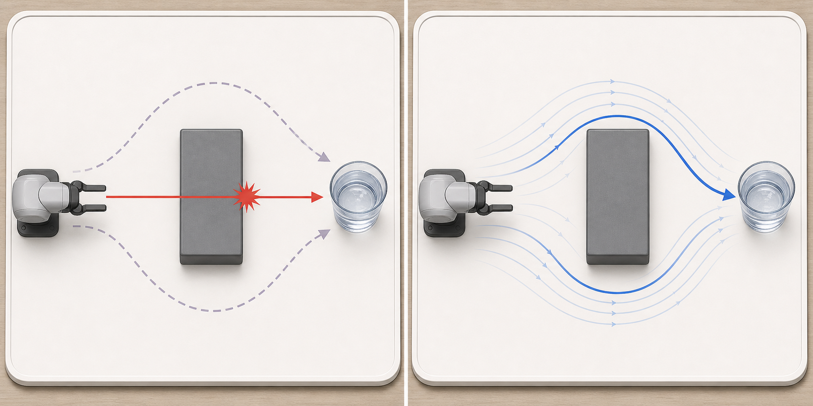
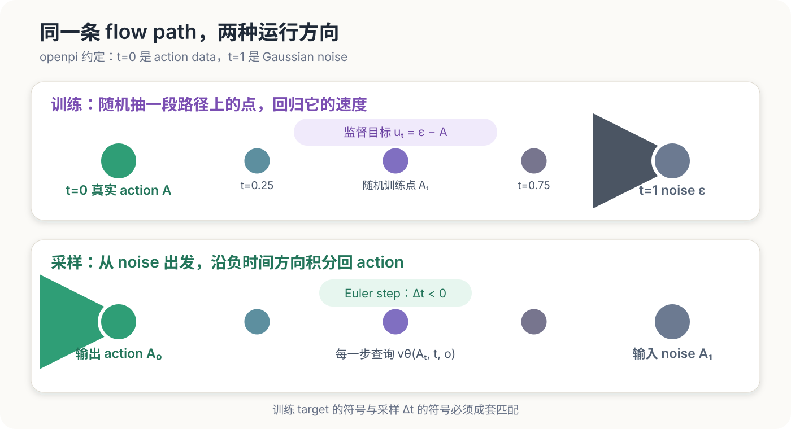

# 第 5 讲：让模型学会把噪声推回动作——Conditional Flow Matching

> 怎样从真实 action、随机 noise 和 flow time 构造一个可以监督学习的 vector field，并确保训练与采样沿着同一条时间轴运行。



图中机械臂需要绕过障碍物抓取水杯。左侧两条示范轨迹分别从障碍物上方和下方绕行；如果模型只用 MSE 回归一个确定答案，平均结果可能落在两条轨迹之间，径直撞上障碍物。右侧的 Flow Matching 学习动作分布对应的 vector field，让不同初始 noise 沿着连续流动逐渐形成合理的绕障轨迹。

这一讲暂时不讨论 VLM backbone、action expert 和 attention mask，也不比较 Euler、Heun 等数值积分方法。我们先把 π₀ 最核心的一组等式写对、跑通。

## 从“直接预测 action”遇到的问题开始

假设相同画面下，机械臂可以从障碍物上方绕过去，也可以从下方绕过去。两条轨迹都能完成任务：

```text
轨迹 A：从上方绕开障碍物，再靠近杯子
轨迹 B：从下方绕开障碍物，再靠近杯子
```

如果用普通 MSE 让模型直接输出唯一 action chunk，两种模式可能被平均。平均轨迹有机会径直撞向障碍物。

π₀ 希望学习条件分布：

$$
p(A\mid o)
$$

$o$ 是图像、语言和机器人状态组成的 observation，$A\in\mathbb{R}^{H\times D}$ 是未来 $H$ 步、每步 $D$ 维的 action chunk。随机 noise 给模型提供了生成不同合理动作的入口；observation 决定哪些动作与当前场景相符。

Flow Matching 把这个生成问题转换为 vector-field regression。训练时无需运行完整 ODE。我们随机选取路径上的一点，直接告诉模型这一点应该朝哪个方向移动。

## 一、先固定全仓的时间方向

这里最容易出现一个看起来很小、实际会让采样完全反向的错误。

本仓跟随 openpi 源码使用：

```text
t = 0：真实 action 数据
t = 1：Gaussian noise
训练路径：data → noise
采样路径：noise → data，因此 dt < 0
```

π₀ 论文使用另一套记号：论文中的 $\tau=0$ 是 noise，$\tau=1$ 是 data。两套写法通过下面的变量替换互相转换：

$$
t=1-\tau
$$

只要 path、target velocity、起点和积分方向一起转换，两套记号描述的是同一个过程。混用其中一部分会让采样远离 action 数据。

后面的代码和公式统一采用 openpi 记号。



## 二、训练输入输出契约

第二至第四讲已经得到归一化后的 action chunk 和 padding mask。：

| 字段 | shape | dtype | 含义 |
|---|---|---|---|
| `actions` | `[B, H, D]` | floating point | 归一化后的真实 action chunk，位于 `t=0` |
| `valid_mask` | `[B, H]` | `bool` | `True` 表示真实 timestep，`False` 表示 episode 尾部 padding |
| `noise` | `[B, H, D]` | 与 action 相同 | 标准 Gaussian noise，位于 `t=1` |
| `time` | `[B]` | floating point | batch 中每条 chunk 独立采样的 flow time |

目标构造器输出一个 `FlowMatchingBatch`：

| 字段 | shape | 含义 |
|---|---|---|
| `noisy_actions` | `[B, H, D]` | 路径在时间 `t` 的位置 $A_t$ |
| `time` | `[B]` | 模型必须知道自己位于路径的哪个位置 |
| `target_velocity` | `[B, H, D]` | 这一位置对应的监督速度 $u_t$ |
| `noise` | `[B, H, D]` | 本次构造路径使用的终点，方便诊断和复现 |

`time` 只在 batch 维采样一次，然后广播到整个 `[H,D]` action chunk。同一条 chunk 中所有 action timestep 共享一个 flow time。机器人时间和 flow time 是两条不同的轴：

```text
机器人时间：action[0], action[1], ..., action[H-1]
flow time： 整条 action chunk 从 data 逐渐变成 noise 的程度
```

## 三、线性 probability path 怎样产生监督信号？

从一条真实 action chunk $A$ 和同 shape 的 noise $\epsilon$ 出发：

$$
\epsilon\sim\mathcal{N}(0,I)
$$

openpi 使用的线性路径是：

$$
A_t=(1-t)A+t\epsilon
$$

检查两个端点：

$$
A_0=A,\qquad A_1=\epsilon
$$

对 $t$ 求导：

$$
u_t=\frac{\mathrm d A_t}{\mathrm d t}=\epsilon-A
$$

因为这条路径是直线，target velocity 与 $t$ 无关。模型仍然需要接收 $t$：真实 conditional vector field 是许多训练路径在同一位置的条件平均，不同时间的速度场通常不同；后续采样也会在每个积分时刻查询模型。

用一维数字可以直接看到这条路径。设：

```text
真实 action A = 2
noise ε       = -1
target velocity = ε - A = -3
```

于是：

| `t` | $A_t=(1-t)A+t\epsilon$ | $u_t$ |
|---:|---:|---:|
| 0.00 | 2.00 | -3.00 |
| 0.25 | 1.25 | -3.00 |
| 0.50 | 0.50 | -3.00 |
| 0.75 | -0.25 | -3.00 |
| 1.00 | -1.00 | -3.00 |

训练时，模型看到的是：

$$
v_\theta(A_t,t,o)
$$

它需要回归：

$$
v_\theta(A_t,t,o)\approx\epsilon-A
$$

observation $o$ 在这里就是 condition。相同的 noisy action 在不同场景中可能对应不同的合理去向，所以 condition 不能从 vector field 中拿掉。

## 四、Flow Matching loss

最小训练目标是：

$$
\mathcal{L}_{\mathrm{FM}}
=
\mathbb{E}_{A,o,\epsilon,t}
\left[
\left\|
v_\theta(A_t,t,o)-(\epsilon-A)
\right\|_2^2
\right]
$$

对 episode 尾部的 padding，我们只在有效机器人 timestep 上求平均：

$$
\mathcal{L}_{\mathrm{masked}}
=
\frac{
\sum_{b,h}m_{b,h}\,
\operatorname{mean}_{d}
\left(v_{b,h,d}-u_{b,h,d}\right)^2
}{
\sum_{b,h}m_{b,h}
}
$$

$m_{b,h}$ 来自第二讲的 `valid_mask`。Padding 位置仍可生成 noise 和 $A_t$，但它们不能贡献 loss。

openpi 没有均匀采样时间，而是使用：

$$
t\sim 0.001+0.999\cdot\operatorname{Beta}(1.5,1)
$$

在当前记号下，这个分布更常采到靠近 `t=1` 的位置，也就是 noise 较多的区域。论文使用 $\tau=1-t$，所以论文会把相同设计描述成更强调较低、更 noisy 的 $\tau$。

## 五、最小实现与 openpi 的逐项对应

本仓的核心代码只有三步：

```python
time_view = time[:, None, None]
noisy_actions = (1.0 - time_view) * actions + time_view * noise
target_velocity = noise - actions
```

对应实现位于：

1. [`linear_flow_path`](../../src/pi_from_scratch/objectives/flow_matching.py)：给定 action、noise 和 time，确定性地构造路径点；
2. [`sample_flow_batch`](../../src/pi_from_scratch/objectives/flow_matching.py)：采样 Gaussian noise 与 Beta time；
3. [`masked_flow_matching_loss`](../../src/pi_from_scratch/objectives/flow_matching.py)：只对有效 action timestep 回归 vector field。

训练主循环的逻辑可以压缩为：

```python
flow = sample_flow_batch(actions)
predicted_velocity = model(
    flow.noisy_actions,
    flow.time,
    observation,
)
loss = masked_flow_matching_loss(
    predicted_velocity,
    flow.target_velocity,
    valid_mask,
)
```

这里没有让 objective 读取图像或语言。Objective 只负责制造监督目标；具体模型怎样把 observation 编码成 condition，留到第 6 讲。

## 六、为什么采样时要反向积分？

训练 path 沿 `t=0 → 1` 从 action 走向 noise。生成时我们手里只有随机 noise，因此从 `t=1` 出发，用负步长向 `t=0` 积分：

$$
A_{t+\Delta t}
=
A_t+\Delta t\,v_\theta(A_t,t,o),
\qquad \Delta t<0
$$

在前面的例子里，target velocity 是 `-3`。采样时 `dt` 为负数，所以一次更新中的位移 `dt * velocity` 为正，状态会从 `-1` 朝 `2` 移动。

本讲用解析 oracle 做 V1 测试。对于 condition 已知的确定目标 $A$，线性路径上的速度可以由当前位置写成：

$$
v^*(A_t,t,o)=\frac{A_t-A(o)}{t}
$$

从同一份 noise 出发：

```text
初始 noise MAE：           1.875
正确 velocity + 负 dt：   0.000
velocity 符号反转：        9.375
```

符号反转后误差比初始 noise 更大，这个测试会在任何模型训练之前发现时间方向错误。

## 七、实验：四条 action chunk 的 tiny overfit

解析测试只能证明公式一致。接下来加入一个最小可学习实验，确认网络、loss 和反向传播能够连通。

### 7.1 实验设置

```text
condition 数量：             4
每个 condition 的 action：   1 条确定性二维 chunk
action shape：               [4, 6, 2]
每个 condition 的 flow 点：  16
固定训练 bank：              64 个 flow points
模型：                       两层小 MLP
优化器：                     Adam, lr=3e-3
训练步数：                   1000
seed：                       7
设备：                       CPU
```

唯一变化是模型参数更新。Action、condition、noise、time 和评估 bank 全部固定，便于判断它能否记住这组监督目标。

运行：

```bash
pi-flow-matching-demo
pytest -q tests/test_flow_matching.py
```

一次参考输出是：

```text
fixed evaluation loss before: 2.008351
fixed evaluation loss after:  0.000008
sampled action MAE:           0.298636
```

训练 loss 接近零，说明最小 vector-field regression 可以过拟合。这个结果只达到 V2 tiny-overfit 验证，不能说明模型已学到可靠的 action distribution。

### 7.2 保留失败结果：loss 很低，采样仍有误差

同一个实验在未见过的 noise 和连续积分时刻上，sampled action MAE 仍约为 `0.30`。原因很直接：网络记住了固定 bank 中有限的 `(A_t,t,o) → u_t` 对，却没有充分覆盖采样轨迹实际经过的位置。

这揭示了三层不同的验收：

```text
解析方向正确       证明公式和 sampler 符号一致
固定 flow bank 过拟合  证明训练管线能降低目标函数
新 noise 采样准确    需要更充分的训练分布、模型容量与 sampler 验证
```

第 7 讲会用真正的数据 batch、held-out loss 和轨迹可视化检查第三层。第 8 讲再独立研究积分步数带来的数值误差。

## 八、与 π₀ 论文和 openpi 的差异

### 保留的核心机制

- 整条 `[B,H,D]` action chunk 一起进入 flow path；
- 使用 Gaussian noise；
- 使用线性 interpolation path；
- 回归完整 action vector field；
- 使用 Beta 分布采样 flow time；
- 推理从 noise 出发，通过 ODE 积分生成 action。

### 本仓的简化

- 本讲的 condition 只是二维 toy vector；π₀ 使用图像、语言和 proprioceptive state；
- toy MLP 只用于验证 objective；π₀ 使用 VLM backbone 与 action expert；
- 本仓 loss 在 objective 内完成 mask 和标量化；openpi 模型先返回 `[B,H]` 的逐 action-timestep loss，再由训练框架归约；
- 本讲只验证 Euler 的方向，不评估 solver steps、latency 和生成质量；
- toy overfit 使用固定 flow bank，不能代表 π₀ 的大规模随机训练。

π₀ 论文采用 `τ=0 noise, τ=1 data`；openpi 代码改成了本讲使用的 `t=1 noise, t=0 data`。阅读源码时可以直接对照固定 commit 中的 [`compute_loss` 和 `sample_actions`](https://github.com/Physical-Intelligence/openpi/blob/d9d61d4da43c859d51cf51318f57c8a160ad1dff/src/openpi/models/pi0.py#L188-L279)。

## 九、本讲验收

安装项目后运行：

```bash
source .venv/bin/activate
pip install -e '.[dev]'
pi-flow-matching-demo --steps 1000 --seed 7
pytest -q tests/test_flow_matching.py
```

需要同时满足：

1. `t=0` 的 `noisy_actions` 等于真实 action；
2. `t=1` 的 `noisy_actions` 等于 noise；
3. target velocity 等于 `noise - action`；
4. oracle 使用负 `dt` 能从 noise 回到 action；
5. 反转 velocity 后误差明显增大；
6. padding timestep 不贡献 loss；
7. 固定 flow bank 的最终 loss 低于初始值的 1%。

## 十、这一讲冻结了什么？

从这里开始，全仓冻结以下约定：

```text
flow time：        t=0 data，t=1 noise
linear path：      A_t=(1-t)A+tε
target velocity：  ε-A
sampling：         从 t=1 积分到 t=0，dt<0
flow tensors：     [B,H,D]
time tensor：      [B]
padding：          由 [B,H] valid_mask 排除
```

下一讲不修改这些公式。第 6 讲只新增模型结构：图像、语言和 state 怎样形成 observation prefix，noisy action 和 time 怎样形成 action suffix，action expert 如何输出这里定义的 vector field。

## 自检问题

1. 在本仓约定下，`t=0.8` 更接近 action 还是 noise？
2. 若 `A=2, ε=-1`，为什么 target velocity 是 `-3`，采样却会从 `-1` 朝 `2` 移动？
3. π₀ 论文写 `τ=0 noise`，怎样转换成本仓的 `t`？
4. 为什么 action chunk 的 $H$ 个机器人 timestep 共享一个 flow time？
5. 固定 flow bank 的 loss 接近零，为什么还不能证明采样可靠？

## 扩展阅读

### 必读：π₀ 的 flow action 公式

[π₀: A Vision-Language-Action Flow Model for General Robot Control](https://arxiv.org/abs/2410.24164) 第 IV 节给出 conditional action distribution、线性 Gaussian path、flow loss 和 Euler inference。阅读时重点标出论文的 $\tau$ 方向，再与 openpi 源码的 `t` 做一次变量替换。模型架构部分留到下一讲。

### 选读：Flow Matching 的一般形式

[Flow Matching for Generative Modeling](https://arxiv.org/abs/2210.02747) 继续回答“为什么回归 conditional vector field 可以得到 marginal probability path”。本课程主线只需要线性 path 的实现；希望理解理论保证时，可重点阅读 Conditional Flow Matching objective 与 Optimal Transport conditional path。

### 选读：Flow Matching Guide and Code

[Flow Matching Guide and Code](https://arxiv.org/abs/2412.06264) 系统整理了 source/target convention、probability path、simulation-free training 和不同 parameterization。遇到不同论文时间方向相反时，可以用它建立统一记号，再回到具体代码检查积分起点和 `dt`。
