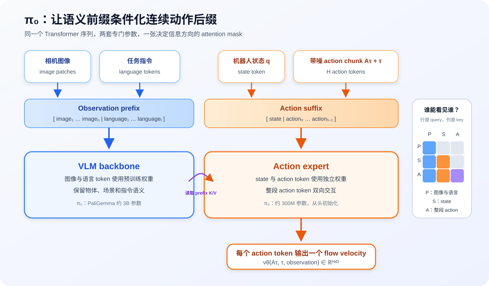
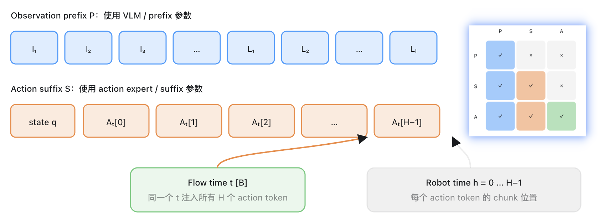

# 第 6 讲：让 VLM 看懂场景，让 Action Expert 生成动作

> 图像、语言和机器人状态怎样进入 π₀，并共同条件化第五讲定义的 flow vector field。



先看完整答案。π₀ 把一次 forward 中的 token 分成两组：

```text
observation prefix = image tokens + language tokens
action suffix      = state token + noisy action tokens
```

图像和语言 token 使用从 PaliGemma 初始化的 VLM backbone 权重；state 与 action token 使用另一套较小的 Transformer 权重，论文称它为 **action expert**。两组 token 仍在同一张注意力图中交互，因此 action expert 能读取场景和指令，再为 action chunk 的每个位置输出 flow velocity。

这一结构把前五讲的内容接到了一起：

```text
第 2～4 讲：observation o 与 action chunk A
第 5 讲：    noisy action A_t、flow time t、target velocity ε-A
第 6 讲：    v_θ(A_t, t, o) 怎样真正同时读到 A_t、t 和 o
```

## 一、只有 Flow Matching 公式还不够

第五讲的 toy model 用一个二维向量表示 condition。它足以验证 flow path 和 target velocity，却没有回答真实 VLA 面对的问题。

想象桌上同时放着红杯和蓝杯，机械臂收到两条不同指令：

```text
“拿起红色杯子”
“拿起蓝色杯子”
```

当前关节状态、画面中的物体和带噪 action chunk 可能完全相同，文字指令变了，最终动作分布也应该跟着改变。模型至少需要完成三类工作：

1. 从图像中找到杯子、障碍物和机械臂；
2. 用语言确定目标对象和任务意图；
3. 结合当前机器人状态，把语义目标变成连续、精细的 action chunk。

第三项还要在多个 flow time 上反复执行。一次采样通常会调用 action 网络多次，而图像与语言表达在同一次 policy invocation 中保持不变。

π₀ 因此保留预训练 VLM 擅长的图文语义，并增加专门处理机器人 state、noisy action 和 flow time 的 action expert。π₀ 论文使用 PaliGemma 作为约 3B 参数的 VLM，并增加约 300M 参数、从头初始化的 action expert。论文也报告了不使用 VLM 初始化的 `π₀-small` 消融，用来检验 Internet-scale 视觉语言预训练是否真的带来收益，避免把参数规模误当成 VLA 能力的来源。

## 二、先看一次 forward 的输入输出契约

沿用前几讲的符号：batch size 为 $B$，action horizon 为 $H$，action dimension 为 $D_a$，文字长度为 $L$。本讲增加 token sequence 维度 $N$ 和 hidden width $d$。

### 1. 对外仍然是 observation 与 action chunk

| 输入 | shape | dtype | 时间与语义 |
|---|---|---|---|
| `image` | `[B,3,height,width]` | floating point | 当前视觉观测；教学实现先用单相机 |
| `text_ids` | `[B,L]` | integer | 当前任务指令的 token id |
| `text_mask` | `[B,L]` | `bool` | `True` 表示有效文字 token |
| `state` | `[B,D_s]` | floating point | 与图像同一 observation timestamp 的本体状态 |
| `noisy_actions` | `[B,H,D_a]` | floating point | 线性 flow path 在时间 `t` 的位置 $A_t$ |
| `time` | `[B]` | floating point | 整条 action chunk 共享的 flow time |
| `action_mask` | `[B,H]` | `bool` | episode 尾部的有效 action prefix |

模型输出：

```text
predicted_velocity: float[B,H,D_a]
```

它与第五讲的 `target_velocity = noise - action` 逐位置计算 MSE。VLM 不输出自然语言答案，action expert 也不直接输出 denormalized 电机命令。这里得到的仍是归一化 action space 中的 vector field。

### 2. 模型内部把输入变成两段 token

教学实现的内部契约是：

| token 分组 | shape | 由什么产生 | 使用哪套参数 |
|---|---|---|---|
| image tokens | `[B,N_img,d]` | 小型 CNN 的 `2×2` feature grid | prefix / VLM 侧 |
| language tokens | `[B,L,d]` | teaching tokenizer + embedding | prefix / VLM 侧 |
| state token | `[B,1,d]` | state linear projection | suffix / action expert 侧 |
| action tokens | `[B,H,d]` | noisy action projection + position + time embedding | suffix / action expert 侧 |

于是：

$$
P=[I_1,\ldots,I_{N_{img}},L_1,\ldots,L_L]
$$

$$
S=[Q,A_0^t,\ldots,A_{H-1}^t]
$$

$P$ 是 observation prefix，$S$ 是 action suffix。这里的 prefix/suffix 描述 Transformer 序列中的位置，与语言 tokenizer 的词缀概念无关。

论文中的 observation 可以包含 2～3 个相机画面，openpi 也把每个相机分别编码为 image tokens，并用 `image_masks` 屏蔽缺失相机。本讲先固定单相机，把多相机差异保留在输入适配层，attention 规则不受相机数量影响。

## 三、Action Expert 到底是什么？

把 action expert 理解成 VLM 后面接一个 MLP，会漏掉 π₀ 的关键设计。

π₀ 的每一层都可以看成有两套 Transformer 参数：

```text
prefix token -> VLM 的 attention / MLP 参数
suffix token -> action expert 的 attention / MLP 参数
```

它们各自计算 query、key、value 和 MLP，但 attention mask 允许 action query 读取 prefix key/value。这样既保留模态专长，又让连续动作受到图像和语言条件控制。

本仓的 [`TwoExpertTransformerBlock`](../../src/pi_from_scratch/models/prefix_suffix.py) 直接表达这个结构：

```python
prefix_q, prefix_k, prefix_v = prefix_qkv(prefix).chunk(3, dim=-1)
suffix_q, suffix_k, suffix_v = suffix_qkv(suffix).chunk(3, dim=-1)

query = concat(prefix_q, suffix_q)
key   = concat(prefix_k, suffix_k)
value = concat(prefix_v, suffix_v)

context = attention(query, key, value, attention_mask)
```

`prefix_qkv` 和 `suffix_qkv` 是两套独立参数；`key/value` 出现在同一注意力计算中。经过 attention 后，prefix 与 suffix 又分别进入自己的 output projection、normalization 和 MLP。

### 为什么要保留 VLM backbone？

预训练 VLM 已经从大量图文数据中学习了物体类别、属性、空间关系和自然语言指令表达。机器人数据的规模通常小得多，只依赖机器人演示重新学习这些语义会浪费数据，也更难迁移到新物体和新场景。

这种先验不会自动变成控制能力。VLM 在网页图文上学到“杯子是什么”，并不意味着它知道当前机械臂要以怎样的速度、姿态和接触方式拿起杯子。机器人数据仍要训练整条条件化链路。

### 为什么再增加 action expert？

action token 和文字 token 面临的目标差异很大：

- 文字通常采用离散 token 和 next-token cross entropy；
- π₀ 的动作是高精度连续向量，用 flow-matching MSE 监督；
- action chunk 中的相邻位置表达未来控制轨迹，具有强时序相关性；
- 采样时同一组 action token 会在多个 flow time 上反复更新。

独立参数让 action 分支可以适应连续控制目标，同时继续读取 VLM 的语义表示。论文报告 action expert 从头初始化，规模也小于 VLM，以降低多次 flow forward 的推理成本。

### 两套参数是否意味着两个互不相干的模型？

两组 token 在每层 attention 中发生条件交互。action expert 能读取 VLM token，最终 loss 的梯度也可以沿这条路径更新允许训练的 VLM 参数。哪些 VLM 权重冻结、全量微调或使用 LoRA，属于训练策略；action expert 这一结构本身没有强制一种答案。

## 四、Attention mask 决定信息能往哪里流

第六讲最值得写成单元测试的部分就是 attention mask。一个看似合理的全连接 mask 可能让 observation token 读取带噪动作；错误的 causal mask 又会阻止 action chunk 内部互相协调。

把 token 简写为：

```text
P：image + language prefix
S：state token
A：H 个 noisy action tokens
```

π₀ 需要的规则是：

| query \ key | Prefix `P` | State `S` | Actions `A` |
|---|---:|---:|---:|
| Prefix `P` | 可见 | 不可见 | 不可见 |
| State `S` | 可见 | 可见 | 不可见 |
| Actions `A` | 可见 | 可见 | 整段双向可见 |

这里有三个需要分别理解的约束。

### 1. Prefix 内部使用 full attention

图像 patch 和语言 token 共同描述当前 observation。它们可以互相读取，形成完整的语义上下文。

### 2. Prefix 不能读取 action suffix

训练时 noisy action 由真实 action 与随机 noise 混合得到。若 observation 表示反过来读取 action suffix，prefix cache 就会随每个 flow step 改变，静态语义条件与待生成变量也会纠缠在一起。单向条件关系可以写成：

$$
P \longrightarrow S \longrightarrow A
$$

箭头表示后面的 block 可以读取前面的 block。

### 3. Action chunk 内部使用 bidirectional attention

flow model 一次为所有 $H$ 个 action 位置预测 velocity。`A_0`、`A_1` 到 `A_{H-1}` 同时存在，并没有“先生成 A0，再生成 A1”的 next-token 顺序。因此 action token 可以读取同一 chunk 内的所有 action token。

如果错误地套用语言模型的三角 causal mask，较早 action 看不到后面的轨迹位置，模型协调整段运动的能力会受到限制。π₀ 论文明确写出 action expert 使用 full bidirectional attention。

### openpi 怎样用一维标记生成整张 mask？

openpi 的 `make_attn_mask(input_mask, mask_ar)` 先对 `mask_ar` 做 cumulative sum，再让每个 query 读取 block id 小于等于自己的 key。对于 π₀：

```text
token:       P  P  P | S | A0 A1 A2
block_start: 0  0  0 | 1 | 1  0  0
block_id:    0  0  0 | 1 | 2  2  2
```

同一 `block_id` 内双向可见，较大的 block 可以读取更早 block。本仓的 [`make_blockwise_attention_mask`](../../src/pi_from_scratch/models/prefix_suffix.py) 保留了同样的规则，并额外把 padding query 和 padding key 全部屏蔽。

运行演示会打印：

```text
attention mask: row=query, column=key, 1=visible
     I0 I1 L0  S A0 A1 A2
 I0   1  1  1  0  0  0  0
 I1   1  1  1  0  0  0  0
 L0   1  1  1  0  0  0  0
  S   1  1  1  1  0  0  0
 A0   1  1  1  1  1  1  1
 A1   1  1  1  1  1  1  1
 A2   1  1  1  1  1  1  1
```

读 mask 时始终先确认“行是 query、列是 key”。不少注意力实现采用相反的展示方式，矩阵转置后数值仍像一张合理的图，很容易在这里误判。

## 五、Noisy action 和 flow time 怎样进入 Action Expert？

第五讲已经构造：

$$
A_t=(1-t)A+t\epsilon
$$

模型先把每个 action timestep 的 $D_a$ 维连续向量投影到 hidden width $d$：

$$
E_A=W_A A_t
$$

flow time $t$ 经过 sinusoidal embedding 和 MLP：

$$
E_t=\operatorname{MLP}(\operatorname{SinCos}(t))
$$

再把同一个 $E_t$ 加到 chunk 中所有 action token：

$$
X_h=E_A^{(h)}+E_t+E_{pos}^{(h)},\qquad h=0,\ldots,H-1
$$

这三个分量分别回答：

- 当前 noisy action 在哪里；
- 整条 chunk 处于多大的噪声水平；
- 当前 token 对应 chunk 中第几个机器人 timestep。

action position 与 flow time 是两条轴。`h=8` 表示未来动作中的第 8 个位置，`t=0.8` 表示整条 action chunk 更靠近 noise。二者不能共用同一个标量。



`π₀.₅` 会改变 state 和 flow time 的注入方式：state 被离散化后放进语言侧，time 通过 adaptive RMSNorm 条件化 action expert。本讲严格讲 π₀，等进入 π₀.₅ 章节时再比较这两处变化。

## 六、最小实现怎样对应上面的结构？

本讲把原先 `TinyPi0` 中“把图像、文字和 state 池化成一个 condition vector”的 M0 骨架替换为真正的 prefix/suffix 结构。

### 1. 编码 observation prefix

[`TinyPi0.encode_prefix`](../../src/pi_from_scratch/models/tiny_pi0.py) 做两件事：

```python
image_tokens = image_encoder(image)       # [B, 4, d]
text_tokens = text_embedding(text_ids)    # [B, L, d]

prefix_tokens = concat(image_tokens, text_tokens)
prefix_mask = concat(image_mask, text_mask)
```

教学 CNN 只产生 `2×2=4` 个 image tokens。这个选择让 CPU test 很快，也保留“视觉是一组 token”的关键结构。

### 2. 编码 action suffix

```python
state_token = state_input(state)[:, None]       # [B, 1, d]
action_tokens = action_input(noisy_actions)     # [B, H, d]
action_tokens += action_position + time_tokens
suffix_tokens = concat(state_token, action_tokens)
```

state token 单独形成一个 block，action tokens 形成下一个双向 block。action padding mask 只作用于对应的 action query/key，不会误伤 state token。

### 3. 运行双专家 Transformer

每层拥有 prefix 和 suffix 两套 QKV、output projection、normalization 与 MLP 参数。attention mask 负责连接两侧。最后只读取 suffix 中 action 对应的位置：

```python
prefix_out, suffix_out = transformer(prefix_tokens, suffix_tokens, layout)
velocity = action_output(suffix_out[:, 1 : H + 1])
```

第一个 suffix 位置是 state，因此输出时跳过它。

## 七、跟着代码走完一次训练和推理

前面分别看了 token、attention 和 action expert，现在沿着真实调用链把它们串起来。入口是 [`TinyPi0.loss`](../../src/pi_from_scratch/models/tiny_pi0.py)。先使用默认配置，并假设 batch size 为 2：

```text
B = 2                 batch size
H = 16                action horizon
D_a = 2               action dimension
L = 16                padded text length
d = 128               Transformer hidden width
N_img = 4             2×2 image feature grid
```

一次训练 forward 的全貌如下：

```text
batch
 ├─ image + text ──> encode_prefix() ───────────────> prefix tokens
 │
 ├─ state ──────────────────────────────────────────┐
 │                                                  │
 └─ clean actions ─> sample_flow_batch()            │
                      ├─ noisy action A_t ───────────┤
                      ├─ flow time t ────────────────┤
                      └─ target velocity ε - A       │
                                                     v
                              predict_velocity(A_t, t, prefix, state)
                                                     │
                                                     v
                                      predicted velocity [B,H,D_a]
                                                     │
                                                     v
                                      masked flow-matching MSE
```

### 1. `loss(batch)` 收到了什么？

[`SyntheticPiDataset`](../../src/pi_from_scratch/data/datasets.py) 和 `LeRobotPiDataset` 最终都返回同一组键。经过 DataLoader 组成 batch 后，默认 shape 为：

| batch key | shape | 在本次 forward 中的用途 |
|---|---:|---|
| `image` | `[2,3,96,96]` | 构造视觉 prefix tokens |
| `text_ids` | `[2,16]` | 构造语言 prefix tokens |
| `text_mask` | `[2,16]` | 屏蔽文字 padding |
| `state` | `[2,2]` | 构造 suffix 的第一个 token |
| `actions` | `[2,16,2]` | 构造 flow 路径与监督目标 |
| `action_mask` | `[2,16]` | 屏蔽 episode 尾部的 padding action |

这里的 `actions` 是数据集给出的干净专家动作 $A$，模型还没有直接看到它。

### 2. 图像和文字先组成 prefix

`loss` 首先调用 [`encode_prefix`](../../src/pi_from_scratch/models/tiny_pi0.py)：

```python
prefix_tokens, prefix_mask = self.encode_prefix(
    batch["image"], batch["text_ids"], batch["text_mask"]
)
```

图像经过 CNN 和 `2×2` pooling 后得到 4 个 token；16 个文字位置经过 embedding 后得到 16 个 token。二者沿 sequence 维拼接：

```text
image tokens    [2,  4,128]
text tokens     [2, 16,128]
                         │ concat
                         v
prefix_tokens   [2, 20,128]
prefix_mask     [2, 20]
```

`prefix_tokens` 保留全部 20 个位置，`prefix_mask` 标出其中哪些文字位置有效。padding token 仍占据张量位置，但无法参与后面的 attention。

### 3. 干净动作只用来构造 flow 训练样本

接下来调用 [`sample_flow_batch`](../../src/pi_from_scratch/objectives/flow_matching.py)：

```python
flow_batch = sample_flow_batch(batch["actions"].float())
```

它采样噪声 $\epsilon$ 和 flow time $t$，然后计算：

$$
A_t=(1-t)A+t\epsilon,\qquad u_t=\epsilon-A
$$

对应 shape 为：

```text
clean actions A          [2,16,2]
noise ε                  [2,16,2]
time t                   [2]
noisy actions A_t        [2,16,2]
target velocity ε - A    [2,16,2]
```

`time` 每个样本只有一个标量，通过 `[B,1,1]` 广播到整条 action chunk。同一条 chunk 的 16 个位置因此处于相同的噪声水平。

从这里开始要留意一条边界：`predict_velocity` 收到的是 `A_t` 和 `t`，干净动作 $A$ 只留在 loss 一侧。若把 $A$ 直接传进模型，模型就可能绕过条件生成任务，训练损失也失去意义。

### 4. State、带噪动作和时间组成 suffix

[`predict_velocity`](../../src/pi_from_scratch/models/tiny_pi0.py) 内部先调用 `embed_suffix`：

```text
state              [2, 2]
  └─ linear ─────> [2, 1,128]

noisy actions      [2,16,  2]
  └─ linear ─────> [2,16,128]
       + action position
       + flow-time embedding

suffix_tokens      [2,17,128]
                    1 state + 16 actions
```

随后 `make_pi0_attention_layout(prefix_mask, action_mask)` 构造完整 attention mask。此时 Transformer 处理的 token 总数为：

```text
20 prefix tokens + 17 suffix tokens = 37 tokens
attention_mask shape = [2,37,37]
```

### 5. 两个 expert 在 attention 中连接

[`TwoExpertTransformerBlock.forward`](../../src/pi_from_scratch/models/prefix_suffix.py) 先用两套参数分别计算 QKV：

```python
prefix_q, prefix_k, prefix_v = self.prefix_qkv(...).chunk(3, -1)
suffix_q, suffix_k, suffix_v = self.suffix_qkv(...).chunk(3, -1)
```

再沿 token 维拼接它们：

```python
query = concat(prefix_q, suffix_q)
key   = concat(prefix_k, suffix_k)
value = concat(prefix_v, suffix_v)
```

两套参数让 prefix expert 和 action expert 各自学习适合本模态的变换；拼接后的 attention 让 action query 真正读取图像和语言 key/value。经过三层双专家 block 后，输出 shape 仍然是：

```text
prefix_output    [2,20,128]
suffix_output    [2,17,128]
```

### 6. 只读取 action 位置并计算 loss

suffix 的第 0 个位置属于 state，代码通过切片跳过它：

```python
velocity = self.action_output(suffix_output[:, 1 : horizon + 1])
```

shape 随之变化：

```text
action hidden states    [2,16,128]
predicted velocity      [2,16,  2]
```

最后，[`masked_flow_matching_loss`](../../src/pi_from_scratch/objectives/flow_matching.py) 比较预测速度和 `target_velocity = ε - A`：

```text
[2,16,2] --对动作维求 MSE--> [2,16] --action_mask 加权平均--> scalar loss
```

一次训练 forward 只采样一个随机 $t$，运行一次网络并回归该位置的 vector field。完整 ODE 积分留在推理阶段。

### 7. `sample_actions()` 怎样复用同一个模型？

推理入口是 [`TinyPi0.sample_actions`](../../src/pi_from_scratch/models/tiny_pi0.py)。这时没有数据集提供的干净动作，也没有 `target_velocity`：

```text
image + text + state
          │
          ├─ encode prefix
          │
Gaussian noise x_1 [B,H,D_a]
          │
          ├─ t=1.0 预测 velocity，Euler 更新
          ├─ t=0.9 预测 velocity，Euler 更新
          ├─ ...
          └─ t=0.1 预测 velocity，Euler 更新
                          │
                          v
                  sampled action x_0
```

[`euler_sample`](../../src/pi_from_scratch/inference/flow_sampling.py) 使用负步长：

```python
dt = -1.0 / num_steps
x_t = x_t + dt * velocity_fn(x_t, time)
```

训练目标 `ε - A` 指向 data-to-noise 方向，负的 `dt` 让积分沿相反方向从 noise 回到 data。每一步变化的只有 $A_t$ 和 $t$；图像、语言与 state 在同一次 policy invocation 中保持不变。

本实现只复用了 CNN 和 text embedding 产生的 `prefix_tokens`，每个 Euler step 仍会让 prefix 重新经过三层 Transformer。openpi 会进一步缓存 prefix K/V，使后续 step 只运行 suffix query。这是本仓有意保留到推理优化章节再处理的性能差异。

### 8. 读代码时最容易断开的四个连接

1. `actions` 是 flow target 的数据来源，`noisy_actions` 才是模型输入。
2. state 位于 suffix 第一个位置，输出 velocity 时必须从 `suffix_output[:, 1:]` 开始切片。
3. 两个 expert 的参数彼此独立，QKV 拼接与 attention mask 负责跨 expert 传递条件。
4. 训练在随机 $t$ 上做一次回归，推理从 $t=1$ 到 $t=0$ 多次调用同一个 `predict_velocity`。

把这四点连起来，`TinyPi0` 的核心职责可以压缩成一句话：prefix 描述当前场景和任务，suffix 描述机器人状态与当前 flow 位置，双专家 Transformer 据此预测整条 action chunk 的 velocity。

## 八、实验：怎样证明条件通路确实接通？

本讲属于 V0 contract 与结构验证。模型仍是随机初始化，我们关注“信息能否到达”，暂时不评价动作是否正确。

### 实验 A：attention truth table

- **固定变量**：token 数、mask 规则；
- **检查项**：逐元素比较整张 expected mask；
- **失败信号**：prefix 能读取 action、state 能读取 action，或 action 之间只能 causal attention。

`tests/test_prefix_suffix.py` 用完整布尔矩阵做断言，也检查 padding token 既不能作为 query，也不能作为 key。

### 实验 B：prefix isolation

输入同一组 prefix，两次使用完全不同的 action suffix：

```text
prefix_out(prefix, suffix_A)
prefix_out(prefix, suffix_B)
```

正确 mask 下，两次 prefix output 应逐元素一致。测试同时反向检查：改变 prefix 时，action suffix output 应发生变化。

### 实验 C：condition path probe

固定 `noisy_actions` 和 `time=0.6`，每次只改变一种条件：

```text
baseline
只改变 image
只改变第一个 text token
只改变 state
```

seed 7 的一次 CPU 结果：

```text
prefix tokens:       20
suffix tokens:       5 (1 state + 4 actions)
change image |Δv|:   0.012867
change text  |Δv|:   0.027181
change state |Δv|:   0.007500
```

三个差值都大于零，说明图像、文字和 state 都能影响 action velocity。数值大小没有性能含义，随机权重也无法理解“拿红杯”。这项实验只能发现断路、错误 mask、错误 slicing 等结构 bug。

### 一个值得保留的失败案例

若测试用 `prefix_b = prefix_a + 1` 改变 prefix，LayerNorm 会消除每个 token 的统一平移，suffix output 可能保持不变。这并不说明条件链路断开；probe 本身选了会被 normalization 抵消的扰动。

更可靠的检查是只改变某些 feature、替换真实 image/text token，或直接计算 output 对 prefix 的梯度。测试最终采用“只改变第一个 feature”，避免把 LayerNorm 的不变性误诊为 attention 问题。

## 九、本仓实现与 π₀/openpi 的逐项映射

本讲以 openpi 固定 commit `d9d61d4` 为参照：

| 本仓教学实现 | openpi 对应位置 | 语义 |
|---|---|---|
| `ImageEncoder` | `PaliGemma.img` / SigLIP | 图像变成 patch tokens |
| `text_embedding` | `PaliGemma.llm(..., method="embed")` | prompt id 变成 language tokens |
| `encode_prefix` | `Pi0.embed_prefix` | 拼接多相机 image tokens 与语言 tokens |
| `state_input` | `state_proj` | π₀ state token 进入 action expert suffix |
| `action_input + time_mlp` | `action_in_proj + action_time_mlp_*` | 融合 noisy action 与 flow time |
| `make_blockwise_attention_mask` | `make_attn_mask` | 用 block id 构造 prefix/suffix mask |
| `TwoExpertTransformer` | `_gemma.Module(configs=[paligemma, action_expert])` | 两套权重在同一注意力图中工作 |
| `action_output` | `action_out_proj` | action hidden state 映射为 velocity |

openpi 的训练 forward 会把 prefix 与 suffix 一次送入多专家 Gemma。采样时 prefix 在多个 Euler step 中保持不变，因此 openpi 先计算 prefix KV cache，之后每一步只运行 suffix query。这项优化不会改变 attention 语义，具体成本会在第 8 讲的 sampler 与 latency 实验中测量。

可以直接阅读固定版本中的 [`embed_prefix`、`embed_suffix`、`compute_loss` 和 `sample_actions`](https://github.com/Physical-Intelligence/openpi/blob/d9d61d4da43c859d51cf51318f57c8a160ad1dff/src/openpi/models/pi0.py#L106-L279)。

## 十、哪些地方仍然是教学简化？

| 项目 | 本仓第 6 讲 | π₀/openpi | 简化带来的限制 |
|---|---|---|---|
| 视觉编码 | 小型随机 CNN，4 个 tokens | 预训练 SigLIP，多个相机 | 不能验证视觉语义迁移 |
| 语言编码 | hash tokenizer + 随机 embedding | PaliGemma tokenizer + Gemma | 不能理解真实指令含义 |
| backbone | 小型双专家 Transformer | 约 3B PaliGemma + 约 300M action expert | 参数规模与训练动力学不可外推 |
| expert width | prefix/suffix 使用相同 width | action expert width 1024，VLM 侧更大 | 省略异构 hidden width 的工程细节 |
| image slots | 单相机始终有效 | 多相机 + image mask | 未覆盖缺失相机组合 |
| inference | 只复用 prefix embedding | openpi 缓存 prefix KV | 采样耗时明显更高 |
| 验证 | mask 与随机网络敏感性 | 大规模预训练、真实机器人评估 | 只能证明结构接通 |

本讲复现的是架构语义和 attention contract，不宣称复现 π₀ 的语义能力或控制指标。

## 十一、本讲验收

安装或刷新 editable package 后运行：

```bash
source .venv/bin/activate
pip install -e '.[dev]'
pi-prefix-suffix-demo
pytest -q tests/test_prefix_suffix.py tests/test_model.py
```

必须满足：

1. prefix query 只能读取有效 prefix key；
2. state query 可以读取 prefix 与自身，不能读取 action；
3. 每个 action query 可以读取 prefix、state 和所有有效 action；
4. padding query/key 全部被屏蔽；
5. 改变 action suffix 不会改变 prefix output；
6. 改变 image、text 或 state 都会改变 predicted velocity；
7. 原有 flow loss、backward 与 action sampling shape test 继续通过。

## 十二、这一讲冻结了什么？

从这里开始，本仓冻结：

```text
prefix：       image tokens + language tokens
suffix：       one state token + H noisy action tokens
parameter：    prefix 与 suffix 使用两套 expert 参数
information：  prefix -> state -> bidirectional action block
output：       只从 H 个 action positions 读取 [B,H,D_a] velocity
flow time：    每条 chunk 一个 t，注入全部 action tokens
```

第 7 讲不再改变这张 attention 图。下一步会把真实的数据 split、normalizer、prefix/suffix model、flow objective、optimizer、checkpoint 和 validation 组装成一次可诊断训练，并区分“loss 能下降”“模型能过拟合小样本”和“held-out 样本有效”这三件事。

## 自检问题

1. 为什么 action tokens 可以彼此双向 attention，而语言生成通常使用 causal attention？
2. 若 prefix 可以读取 noisy action，训练和 flow sampling 时会出现什么接口问题？
3. state 为什么单独形成一个 block，而没有直接与 action token 放在完全相同的 block？
4. `h=8` 和 `t=0.8` 分别表示哪一条时间轴？
5. 随机模型对 image/text/state 都敏感，为什么仍不能说明它理解了指令？
6. action expert 有独立参数，action loss 还能不能更新 VLM？由什么训练配置决定？
7. `batch["actions"]`、`flow_batch.noisy_actions` 和 `target_velocity` 分别在哪一侧使用？
8. 训练目标写成 $\epsilon-A$ 时，为什么推理积分的 `dt` 必须为负？

## 扩展阅读

### 必读：π₀ 模型结构与附录

[π₀: A Vision-Language-Action Flow Model for General Robot Control](https://arxiv.org/abs/2410.24164) 第 IV 节解释 VLM、action expert、state/action token 和 bidirectional action attention；附录 A-B 给出 projection、time MLP、action expert width 与参数量。阅读时可以画出 prefix query 和 action query 各自允许读取哪些 key。

### 选读：PaliGemma 提供了什么起点？

[PaliGemma: A Versatile 3B VLM for Transfer](https://arxiv.org/abs/2407.07726) 解释 SigLIP image encoder、Gemma language model 和 prefix-LM 训练方式。这里只需关注图像怎样变成与文字共同处理的 token，以及预训练 checkpoint 给下游迁移带来了什么；通用 VLM 训练细节不进入课程主线。

### 选读：离散与连续 token 如何共享 Transformer

[Transfusion: Predict the Next Token and Diffuse Images with One Multi-Modal Model](https://arxiv.org/abs/2408.11039) 研究同一 Transformer 中的离散语言目标和连续生成目标，并为连续 block 使用内部双向 attention。π₀ 论文明确把它列为架构灵感。建议重点读 mixed-modality sequence、block attention mask 和不同 objective 的路由方式。

### 选读：专门的 action module 是否值得扩大？

[CogACT: A Foundational Vision-Language-Action Model for Synergizing Cognition and Action](https://arxiv.org/abs/2411.19650) 同样把 VLM 认知表示与专门的连续 action module 分开，并比较 MLP 与不同规模 diffusion Transformer。它继续追问本讲留下的问题：action head 只是小适配器，还是应当成为具有独立序列建模能力的大模块？重点看 action model architecture ablation，论文指标不要直接与本仓 toy model比较。
