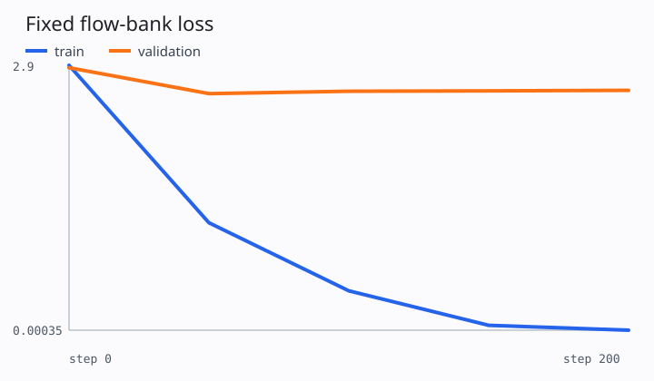
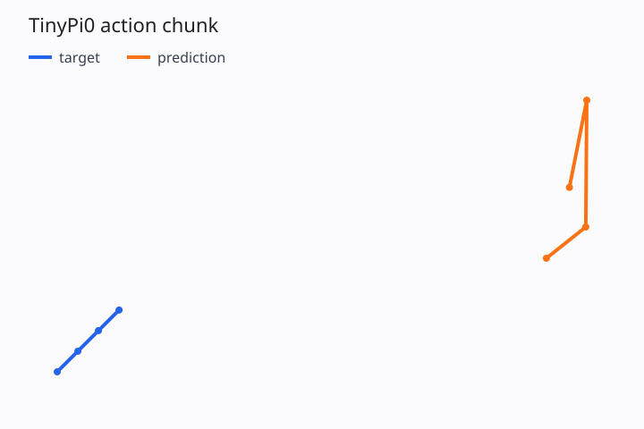

# 第 7 讲：让 TinyPi0 真正学起来——从反向传播到可诊断训练

> 把前六讲的数据、归一化、双专家模型和 Flow Matching 组装起来后，怎样判断模型确实学到了？

先看这一讲的完整答案。一次值得相信的训练至少要连续通过三道检查：

```text
V0：管线能运行
    loss 有限、梯度存在、checkpoint 能保存
             ↓
V2：固定小样本能够过拟合
    证明模型容量、条件通路和优化器可以共同工作
             ↓
V3：held-out episode 上有可重复的指标
    证明训练集之外的样本也得到改善
```

终端里不断下降的一个 `loss` 数字，只覆盖了其中一部分。它可能来自不断变化的 flow noise 和 time，也可能受 validation 泄漏影响；即使训练 loss 接近零，正向积分得到的 action chunk 仍可能偏离真实轨迹。

本讲只解决训练闭环和离线诊断。Euler、Heun 等 solver 的误差与采样步数留到第 8 讲，环境中的 success、reward 和闭环稳定性留到第 9 讲。

## 一、为什么“训练能跑”还不够？

假设训练终端显示：

```text
step 20:  loss=1.42
step 40:  loss=0.91
step 60:  loss=0.47
```

这个趋势让人自然地产生“模型正在学习”的判断，但它还不能回答下面几个问题：

1. 每个 step 使用了新的 noise 和 flow time，三个 loss 是否在评估同一批问题？
2. normalization statistics 是否偷偷使用了 validation episodes？
3. 模型是在学习 observation 到 action 的规律，还是只记住了少量 flow points？
4. checkpoint 是否包含 action normalizer、数据 split 和模型配置？
5. flow loss 下降后，从 noise 积分出来的动作轨迹是否真的靠近 target？

这些问题分别对应可比性、数据泄漏、模型容量、可恢复性和生成质量。训练脚本需要留下足够证据，让我们逐项检查。

因此第七讲使用两种训练模式：

- `pi-training-demo`：固定 8 个训练样本及其 noise/time，专门做 V2 tiny overfit；
- `pi-train`：每个 step 重新采样 flow point，用于正常的 stochastic Flow Matching 训练。

前者是管线验收工具，后者才接近后续真实训练方式。

## 二、训练实验的输入输出契约

### 1. 输入配置

训练入口接收一个 `TrainConfig`，其中会影响实验结论的字段都必须保存：

| 字段 | 本讲示例 | 含义 |
|---|---:|---|
| `dataset` | `synthetic` | 数据来源；真实数据可换成 `lerobot/pusht` |
| `dataset_revision` | `v3.0` | LeRobot 数据 revision |
| `validation_fraction` | `0.2` | 按完整 episode 划分的 validation 比例 |
| `action_horizon` | `4` | 每个训练 target 的机器人时间长度 |
| `batch_size` | `8` | 一次优化使用的样本数 |
| `learning_rate` | `3e-3` | tiny overfit 使用的学习率 |
| `steps` | `200` | optimizer update 次数 |
| `eval_every` | `50` | 固定评估 bank 的检查间隔 |
| `sampling_steps` | `20` | 最终轨迹可视化使用的 Euler steps |
| `overfit_samples` | `8` | 非空时启用固定小样本 flow bank |
| `seed` | `7` | split、模型初始化、训练与评估随机源 |

配置中的 `action_horizon` 描述机器人时间轴；评估 bank 中的 flow time 仍是另一条生成时间轴。

### 2. 训练 batch

经过 episode split 和 action normalization 后，模型看到：

| 字段 | shape | 训练语义 |
|---|---|---|
| `image` | `[B,3,height,width]` | 当前视觉 observation |
| `text_ids` | `[B,L]` | 当前指令 token |
| `text_mask` | `[B,L]` | 文字 padding mask |
| `state` | `[B,D_s]` | 当前本体状态 |
| `actions` | `[B,H,D_a]` | 使用 train statistics 归一化后的 target |
| `action_mask` | `[B,H]` | episode 尾部有效动作位置 |

`TinyPi0.loss` 内部再采样：

```text
noise ε       [B,H,D_a]
flow time τ   [B]
```

并构造第五讲定义的：

$$
A_\tau=(1-\tau)\epsilon+\tau A,\qquad u_\tau=A-\epsilon
$$

### 3. 一次训练必须留下哪些产物？

本讲的 output directory 包含：

```text
resolved_config.json       # 实际使用的完整配置
run_metadata.json          # git commit、Python、PyTorch、device、seed
split.json                 # train/validation episode ids
normalization.json         # mean、std、count、train episode provenance
metrics.json               # 固定 train/validation flow loss 与 action MAE
loss_curve.svg             # 同一评估 bank 上的 loss 曲线
validation_trajectory.svg  # denormalized target 与 prediction
checkpoint_000200.pt       # 模型、优化器、配置、flow convention、split、normalizer、metrics
```

只保存 `model.state_dict()` 会让后续部署缺少反归一化依据，也无法确认 checkpoint 对应哪次数据切分。第 3 讲定义的 normalizer artifact 从这一讲开始正式进入 checkpoint。

## 三、数据顺序：先切 episode，再拟合 normalizer

训练数据准备顺序为：

```text
全部 episode ids
        │
        ├─ episode-level split ──> train episodes
        │                              │
        │                              └─ 计算 mean/std
        │
        └───────────────────────> validation episodes
                                       │
                                       └─ 复用 train mean/std
```

代码入口是 [`create_dataset_splits`](../../src/pi_from_scratch/data/datasets.py)。Synthetic 数据先构造 episode id，再把每个 episode 的所有 frame 放进同一侧；LeRobot 数据直接把 episode id 传给 `LeRobotDataset(..., episodes=...)`。

归一化统计量随后由 [`fit_action_normalizer`](../../src/pi_from_scratch/training/experiment.py) 遍历 `splits.train` 得到：

```python
accumulator = RunningActionStats()
for sample in train_dataset:
    accumulator.update(sample["actions"], sample["action_mask"])

stats = accumulator.finalize(
    train_episode_ids=split.train,
)
```

这里有两个边界：

1. padding action 不进入 mean/std；
2. validation action 不参与统计量计算。

第二点即使在窗口没有交叉时也很重要。若 mean/std 使用全数据计算，训练阶段就已经获得 validation action 分布的位置与尺度。泄漏通常不会让结果突然变得完美，却会让 held-out 指标失去严格含义。

本讲的 `normalization.json` 会同时记录：

```json
{
  "artifact_id": "action-zscore-ba9c9d7ba1c3",
  "count": 64,
  "train_episode_ids": [0, 1, 2, 3]
}
```

`split.json` 中的 validation episode 是 `[4]`。测试会直接断言两组 id 不相交，并检查 normalizer provenance 与 train ids 完全一致。

## 四、为什么 validation loss 要固定 noise 和 flow time？

Flow Matching 的训练目标包含两层随机变量：

$$
\epsilon\sim\mathcal N(0,I),\qquad
z\sim\operatorname{Beta}(1.5,1),\qquad \tau=0.999(1-z)
$$

如果每次 validation 都重新采样，两个 step 的 loss 实际在回答不同的问题：

```text
step 50：  模型 M_50 在 flow bank F_a 上的误差
step 100： 模型 M_100 在 flow bank F_b 上的误差
```

此时 loss 的变化同时包含模型更新和抽样波动。

本仓的 [`evaluate_flow_loss`](../../src/pi_from_scratch/training/experiment.py) 每次都用同一个 seed 重新生成完全相同的 noise/time：

```text
step 0：   M_0   在 F_fixed 上评估
step 50：  M_50  在 F_fixed 上评估
step 100： M_100 在 F_fixed 上评估
```

训练模式依然可以每步采样新的 flow point。固定 bank 只服务于评估可比性，不会代替训练分布。

### 三个容易混淆的 loss

本讲同时记录三个值：

| 指标 | 是否固定 flow bank | 用途 |
|---|---:|---|
| `optimization_loss` | 正常训练时否；overfit 模式下是 | 当前 optimizer step 的即时信号 |
| `train_flow_loss` | 是 | 判断训练样本上的拟合程度 |
| `validation_flow_loss` | 是 | 判断 held-out episodes 上的变化 |

正常训练时，`optimization_loss` 上下抖动很常见。只要固定 bank 的趋势改善，优化仍可能在正确方向上前进。

## 五、跟着训练代码走一遍

可复用训练主路径位于 [`train_experiment`](../../src/pi_from_scratch/training/experiment.py)。一次 run 可以压缩为六个阶段：

```text
1. seed all random sources
2. episode split
3. fit train-only normalizer
4. create model + AdamW
5. optimize and evaluate fixed banks
6. sample trajectory + save provenance/checkpoint
```

### 1. 构造数据与 normalizer

```python
splits = create_dataset_splits(
    config.data,
    config.model,
    seed=config.seed,
)
normalizer = fit_action_normalizer(
    splits.train,
    train_episode_ids=splits.episode_ids.train,
)
```

`NormalizedActionDataset` 是一个薄 wrapper。它只替换 `sample["actions"]`，不修改底层 dataset，也不会改变 image、state、mask 和 prompt。

### 2. 初始化模型和优化器

```python
model = TinyPi0(config.model).to(device)
optimizer = torch.optim.AdamW(
    model.parameters(),
    lr=config.learning_rate,
    weight_decay=config.weight_decay,
)
```

第六讲已经把 prefix/suffix 和 flow objective 接进 `TinyPi0.loss`，所以训练循环无需了解 attention mask 的内部结构。

### 3. 一次普通训练 step

```python
batch = move_to_device(next_batch, device)
loss = model.loss(batch)

optimizer.zero_grad(set_to_none=True)
loss.backward()
gradient_norm = clip_grad_norm_(model.parameters(), 1.0)
optimizer.step()
```

`model.loss(batch)` 每次重新采样 noise 和 time。梯度经过 action output、suffix expert、跨 expert attention，最终可以到达允许训练的 prefix 参数。

梯度裁剪返回的 `gradient_norm` 是裁剪前的总范数。它可以发现梯度爆炸或完全断路，但单独的数值大小没有统一好坏阈值。

### 4. Tiny overfit 模式

`overfit_samples=8` 时，代码会固定：

```text
8 个训练 samples
8 条 Gaussian noise
8 个 shifted-Beta flow times
```

随后 200 个 optimizer steps 重复解决同一组 vector-field regression。这个实验刻意降低数据难度：

> 如果 TinyPi0 连固定的 8 个 flow points 都学不会，先检查模型连接、mask、loss、梯度和学习率。

过拟合成功只证明这条链路具备拟合能力。它没有覆盖完整 noise/time 分布，也没有证明新 episode 上有效。

### 5. 保存 checkpoint

本讲的 checkpoint 包含：

```python
{
    "flow_time_convention": "paper_tau_noise_0_action_1_v1",
    "step": step,
    "model": model.state_dict(),
    "optimizer": optimizer.state_dict(),
    "config": resolved_config,
    "split": episode_split,
    "normalization": normalization_artifact,
    "metrics": fixed_bank_metrics,
}
```

第 8 讲加载 checkpoint 做采样时，必须使用同一份 flow time convention、model config 和 action normalizer。Loader 会拒绝缺失或不匹配的 convention，防止旧方向训练出的权重被新版 sampler 静默加载。第 9 讲接 runtime 前，还要在 policy adapter 中完成 denormalization。

## 六、实验：TinyPi0 能不能记住 8 个 flow points？

### 1. 固定实验设置

```text
seed：                 7
device：               CPU
train episodes：       0, 1, 2, 3
validation episodes：  4
overfit samples：      8
action shape：         [8,4,2]
model width：          32
Transformer layers：   1
optimizer：            AdamW
learning rate：        3e-3
training steps：       200
evaluation interval：  50
```

运行：

```bash
pi-training-demo
```

### 2. Seed 7 的实际结果

| step | fixed train flow loss | fixed validation flow loss |
|---:|---:|---:|
| 0 | 2.546272 | 2.374461 |
| 50 | 0.067051 | 2.785703 |
| 100 | 0.005585 | 2.305114 |
| 150 | 0.000740 | 2.328194 |
| 200 | 0.000347 | 2.352170 |



训练 bank 的 loss 下降了约四个数量级，说明以下路径能够一起工作：

```text
batch -> normalization -> flow target -> prefix/suffix model
      -> masked MSE -> backward -> AdamW update -> checkpoint
```

validation loss 在 `2.3～2.8` 间波动，并没有跟随 train loss 下降。模型正在越来越精确地记住固定训练 bank，却没有改善 held-out episode。

这正是 tiny overfit 应有的解读：V2 通过，V3 仍需正常随机 flow 训练、更大数据和独立超参数实验。

### 3. Flow loss 下降后，动作轨迹怎样？

训练结束后，代码对 validation batch 使用一份固定 Gaussian noise，执行 20 步 Euler 采样，再把预测值和 target 一起 denormalize。

```text
validation action MAE = 0.368288
```



橙色预测轨迹已经形成连续 chunk，但仍明显偏离蓝色 target。这里同时存在三类误差来源：

1. 模型只记住 8 个固定训练 flow points；
2. validation episode 没有进入优化；
3. Euler solver 使用有限步数。

第 7 讲先确认第一类问题。第 8 讲会固定模型和初始 noise，只改变 solver steps，单独测量第三类误差。

## 七、失败时按什么顺序排查？

### 情况 A：初始 loss 就是 NaN

优先检查：

1. raw action、normalization mean/std 是否有限；
2. 某个 action dimension 的 std 是否接近零；
3. image dtype 与数值范围；
4. action mask 是否至少包含一个有效位置。

### 情况 B：loss 有限，但 200 步完全不下降

先尝试固定 flow bank，并只保留 4～8 个样本。随后按梯度路径检查：

```text
action_output.grad
suffix_qkv.grad
prefix_qkv.grad
image_encoder.grad
```

若 action expert 有梯度、prefix 没有梯度，重点检查第六讲的 attention mask。若所有梯度都接近零，检查 loss 是否意外 detach，或 optimizer 是否拿到了模型参数。

### 情况 C：train loss 接近零，validation loss 不改善

这通常说明 V2 已通过。下一步检查：

- train/validation 是否按 episode 切分；
- validation 是否复用 train normalizer；
- 训练是否覆盖足够的 noise/time；
- condition 与 action 是否真的存在可学习关系；
- 模型容量、正则化和训练数据量是否匹配。

不要通过把 validation episodes 加进训练来“修复”曲线，那会直接改变问题定义。

### 情况 D：flow loss 下降，sampled action 仍很差

Flow Matching loss 测量局部 vector field，最终 action 需要多次积分。可以依次固定：

1. validation observation；
2. initial Gaussian noise；
3. model checkpoint；
4. solver 类型和步数。

固定前 3 项后再改变第 4 项，才能判断问题来自模型还是数值积分。

### 一个保留在本讲中的典型失败

最初的训练脚本只打印 stochastic optimization loss。不同 step 使用不同 noise/time，曲线抖动时无法判断模型更新还是抽样变化造成了差异。

第七讲保留 stochastic loss 供优化诊断，同时增加固定 train/validation flow banks。两条指标承担不同职责，训练日志因此可以解释。

## 八、普通训练与 overfit benchmark 怎样切换？

V2 验收使用：

```bash
pi-training-demo
```

它把 `overfit_samples` 固定为 8，并使用一份固定 flow bank。

普通 synthetic 训练使用：

```bash
pi-train \
  --dataset synthetic \
  --steps 1000 \
  --batch-size 32 \
  --eval-every 100 \
  --output-dir outputs/synthetic_train
```

此时 `overfit_samples=None`，每个 optimizer step 都会重新采样 noise/time。评估 bank 依旧固定。

切换到 LeRobot PushT：

```bash
pip install -e '.[dev,lerobot]'

pi-train \
  --dataset lerobot/pusht \
  --dataset-revision v3.0 \
  --steps 1000 \
  --batch-size 32 \
  --device cuda \
  --output-dir outputs/pusht_train
```

PushT 下载与视频解码不进入 CPU 必修验收。本仓会按 episode id 创建两个 `LeRobotDataset`，并只扫描 train dataset 拟合 action statistics。

当前 TinyPi0 只归一化 action；synthetic state 已位于 `[-1,1]`。PushT 等真实数据的 state 数值尺度也应纳入 normalization artifact，这项扩展需要与输入 transform contract 一起实现。使用当前 PushT 命令可以检查数据和训练管线，暂时不要把结果当作正式离线基准。

## 九、与 π₀/openpi 的对应和差异

本讲参考 openpi 固定 commit `d9d61d4`：

| 本仓 | openpi | 差异 |
|---|---|---|
| `TrainConfig` dataclass | `training.config.TrainConfig` | 本仓只保留单机教学字段 |
| `TinyPi0.loss` | `model.compute_loss` | 同样返回 flow regression loss；规模不同 |
| AdamW + gradient clipping | Optax/PyTorch optimizer path | 本仓没有 schedule、EMA、FSDP 和 mixed precision |
| `normalization.json` | checkpoint `assets/.../norm_stats.json` | 本仓当前只保存 action z-score |
| `checkpoint_*.pt` | Orbax 或 safetensors checkpoint directory | 本仓使用单个 PyTorch 文件 |
| 固定本地 JSON metrics | W&B + training logs | 本仓优先保证离线可复现 |
| episode-held-out validation | openpi 主训练脚本主要记录 train metrics | 本仓为教学诊断显式增加 validation |

openpi 的训练 step 同样完成 `compute_loss → gradient → optimizer update`，并记录 loss、gradient norm 和 parameter norm。其 checkpoint 会保存可用于 inference 的参数与 normalization assets。

可以对照阅读：

- [openpi JAX train step](https://github.com/Physical-Intelligence/openpi/blob/d9d61d4da43c859d51cf51318f57c8a160ad1dff/scripts/train.py#L137-L276)
- [openpi normalization statistics script](https://github.com/Physical-Intelligence/openpi/blob/d9d61d4da43c859d51cf51318f57c8a160ad1dff/scripts/compute_norm_stats.py)
- [openpi checkpoint assets](https://github.com/Physical-Intelligence/openpi/blob/d9d61d4da43c859d51cf51318f57c8a160ad1dff/src/openpi/training/checkpoints.py)

本讲的 validation 设计服务于课程中的小模型和可诊断实验，不代表 openpi 官方训练 recipe 的逐项复现。

## 十、本讲验收

安装或刷新 editable package：

```bash
source .venv/bin/activate
pip install -e '.[dev]'
```

运行 V2 tiny overfit：

```bash
pi-training-demo
```

必须满足：

1. fixed train flow loss 至少下降 90%；
2. train/validation episode ids 不相交；
3. normalizer 的 `train_episode_ids` 与 split 完全一致；
4. validation 使用固定 noise/time，重复评估结果一致；
5. checkpoint 包含 model、optimizer、config、split、normalization 和 metrics；
6. `loss_curve.svg` 与 `validation_trajectory.svg` 能生成；
7. validation action MAE 有限。

自动测试：

```bash
pytest -q tests/test_training.py tests/test_model.py
```

完整回归：

```bash
ruff check src tests
pytest -q
```

## 十一、这一讲冻结了什么？

从这里开始，训练侧冻结：

```text
split：          complete episodes, train ∩ validation = ∅
normalization：  fit on train, reuse on validation and inference
optimization：   stochastic flow points for normal training
evaluation：     fixed noise/time bank for comparable loss
checkpoint：     model + optimizer + config + split + normalizer + metrics
offline sample： fixed observation + fixed noise + denormalized trajectory
```

第 8 讲不会改变数据 split、模型参数或 normalizer。它会加载同一个 checkpoint，固定 observation 和 initial noise，只改变 solver 与 integration steps，从而单独研究推理采样。

## 自检问题

1. stochastic optimization loss 为什么不适合直接比较相隔很远的两个 step？
2. validation window 与 train window 没有交叉时，normalizer 为什么仍然只能使用 train episodes？
3. fixed-bank tiny overfit 接近零，能够证明哪些模块已经接通？
4. train flow loss 和 validation flow loss 分别回答什么问题？
5. checkpoint 缺少 normalizer 时，为什么模型参数本身不足以部署？
6. flow loss 下降而 sampled action MAE 很高时，怎样分离模型误差和 solver 误差？
7. overfit 模式为什么固定 noise/time，普通训练为什么要持续重采样？

## 扩展阅读

### 必读：openpi 的训练状态和 checkpoint

[openpi training code](https://github.com/Physical-Intelligence/openpi/tree/d9d61d4da43c859d51cf51318f57c8a160ad1dff/src/openpi/training) 展示了大模型训练中如何组织 optimizer state、参数冻结、EMA、sharding、normalization assets 与 checkpoint。阅读时重点追踪 `TrainConfig → data loader → compute_loss → train state → checkpoint`，分布式实现细节可以先跳过。

### 选读：Diffusion Policy 怎样评价 action sequence 生成？

[Diffusion Policy](https://arxiv.org/abs/2303.04137) 同样使用迭代生成过程预测连续 action sequence。它继续追问本讲留下的问题：离线生成误差与闭环控制效果之间有什么差距？建议重点阅读 action prediction horizon、receding-horizon control 和实验 protocol，第 8～9 讲会重新连接这些概念。

### 选读：ACT 的小数据训练与 action chunk

[Learning Fine-Grained Bimanual Manipulation with Low-Cost Hardware](https://arxiv.org/abs/2304.13705) 使用 action chunking transformer 处理长时序精细操作。它与本讲相连的部分是小规模示范数据、chunk prediction 和训练后 rollout 之间的落差。建议关注 validation、temporal aggregation 与真实机器人评估，Transformer 基础结构不进入本课主线。
