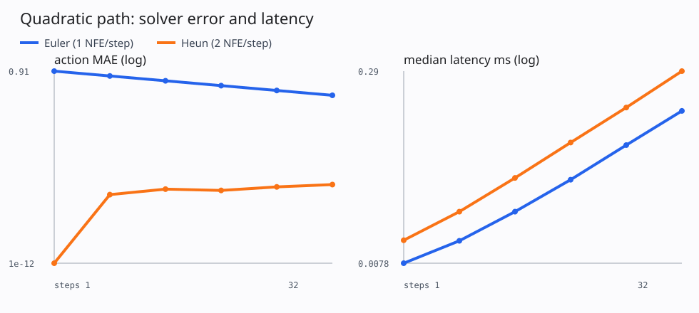
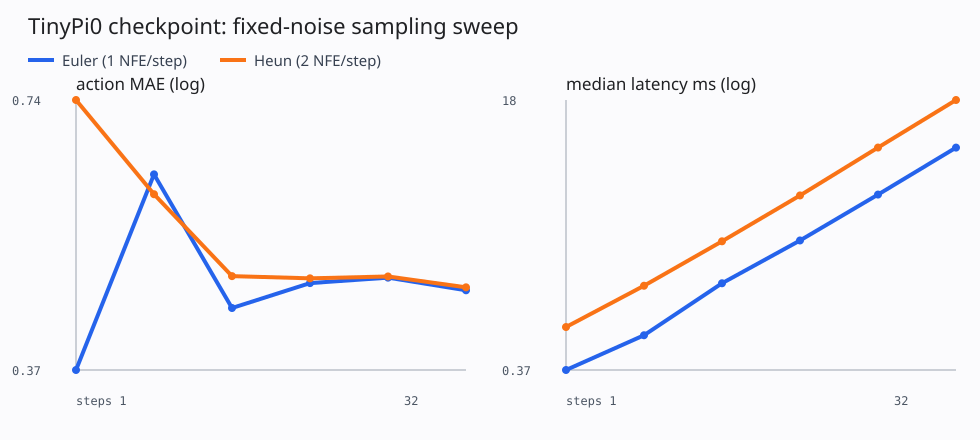
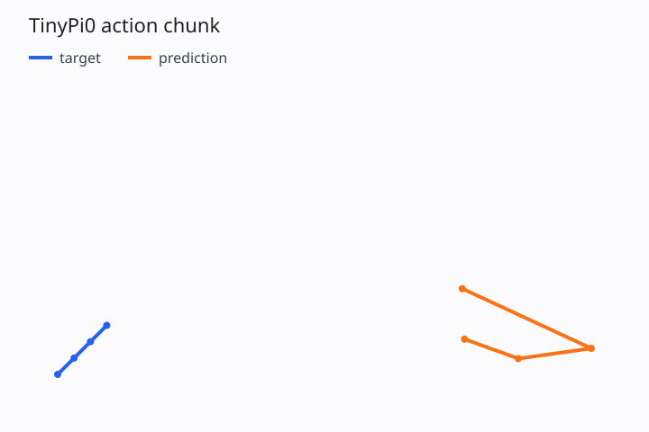

# 第 8 讲：从一团噪声到 Action Chunk——把 Flow 推理看成数值积分

> 固定 checkpoint、observation 和 initial noise 后，solver 与 sampling steps 怎样共同影响误差、延迟和模型调用次数？

先看一次 policy inference 的全貌：

```text
observation
  ├─ image
  ├─ language
  └─ state
       │
       └─ encode prefix

initial noise x₁ ~ N(0,I)       flow time t=1
       │
       ├─ velocity model vθ(x₁,1,o)
       ├─ numerical update
       ├─ velocity model vθ(x_t,t,o)
       ├─ numerical update
       └─ ...
                         flow time t=0
                               │
                               ▼
                 normalized action chunk x₀
                               │
                         denormalization
                               │
                               ▼
                      executable action space
```

第五讲训练出的对象是 vector field，第七讲保存的是 vector-field model。推理还需要一个数值积分器，负责多次查询模型并把 noise 沿 flow time 推到 action。

本讲只研究这段离线 sampling。模型推理何时触发、action buffer 何时消费结果、控制周期是否超时，统一留到第 9～10 讲。

## 一、为什么默认写 10 个 Euler steps 还不够？

第六讲的 `TinyPi0.sample_actions()` 已经可以生成 action：

```python
actions = model.sample_actions(batch, num_steps=10)
```

这里的 `10` 看起来像普通超参数，实际上同时决定：

1. flow time 被切成多少段；
2. Euler 离散误差有多大；
3. velocity model 被调用多少次；
4. 单次 policy inference 需要多长时间；
5. action expert 在一次推理中消耗多少计算。

把 steps 从 10 增加到 20，Euler 的模型调用次数也会从 10 增加到 20。换成 Heun 后，每个 step 需要两次 velocity evaluation，20 steps 对应 40 次模型调用。

还要控制 initial noise。若两次实验分别使用不同 noise：

```text
实验 A：solver=euler, steps=8,  noise=ε₁
实验 B：solver=heun,  steps=8,  noise=ε₂
```

动作差异同时受到 solver 和生成随机性的影响，无法单独归因。

第八讲因此冻结：

```text
checkpoint
observation
normalizer
initial noise tensor
device
```

实验中只改变 `solver` 和 `steps`。

## 二、Sampling 的输入输出契约

统一采样入口是 [`flow_sample`](../../src/pi_from_scratch/inference/flow_sampling.py)：

```python
sample = flow_sample(
    velocity_fn,
    shape=(B, H, D_a),
    device=device,
    num_steps=S,
    noise=fixed_noise,
    solver="euler",
)
```

### 1. 输入

| 输入 | shape / 类型 | 语义 |
|---|---|---|
| `velocity_fn` | callable | 输入 `x_t,t`，输出 `vθ(x_t,t,o)` |
| `shape` | `(B,H,D_a)` | 整条 action chunk 的 shape |
| `noise` | `[B,H,D_a]` | `t=1` 的固定 Gaussian initial state |
| `num_steps` | positive integer | flow interval `[1,0]` 的离散段数 |
| `solver` | `euler` / `heun` | 每一段采用的数值更新规则 |
| observation | closure 中固定 | image、language、state 条件 |

`velocity_fn` 的输出必须与 `x_t` 同 shape。这里的 velocity 位于 flow action space：

```text
flow velocity: d x_t / d t
```

它与电机关节速度、末端线速度没有直接等价关系。若 action representation 本身是 joint velocity，模型最终生成的 `x_0` 才具有对应物理语义。

### 2. 输出

采样器返回：

```text
x_0: float[B,H,D_a]
```

它仍处在训练时使用的 normalized action space。进入 policy/runtime 边界前需要使用 checkpoint 中的 normalizer 做 inverse。

### 3. 评估指标

本讲记录：

| 指标 | 含义 |
|---|---|
| `steps` | 数值积分的宏观步数 |
| `NFE` | number of function evaluations，即 velocity model 调用次数 |
| `action MAE` | 固定 target 下的离线动作误差 |
| `median latency ms` | warmup 后多次采样的延迟中位数 |

对 Euler：

$$
\operatorname{NFE}_{Euler}=S
$$

对 Heun：

$$
\operatorname{NFE}_{Heun}=2S
$$

比较计算预算时要同时报告 steps 和 NFE。只比较“8 steps”会忽略两个 solver 每步成本不同。

## 三、从 Flow Matching 公式得到推理 ODE

全仓继续采用 openpi 的时间约定：

```text
t=1：noise
t=0：action data
sampling：1 → 0
```

模型近似条件 vector field：

$$
v_\theta(x_t,t,o)\approx\frac{\mathrm dx_t}{\mathrm dt}
$$

给定 observation $o$ 和 initial noise $x_1=\epsilon$，推理要解常微分方程：

$$
\frac{\mathrm dx_t}{\mathrm dt}=v_\theta(x_t,t,o),
\qquad x_1=\epsilon
$$

我们想得到 $x_0$。若把 `[1,0]` 均匀分成 $S$ 段：

$$
\Delta t=-\frac{1}{S}
$$

$$
t_i=1+i\Delta t,\qquad i=0,\ldots,S
$$

负号来自积分方向。第五讲训练 path 的正方向是 data-to-noise，采样沿时间反向走回 data。

## 四、Euler：每一步只查询一次模型

Euler 更新为：

$$
x_{i+1}
=
x_i+\Delta t\,v_\theta(x_i,t_i,o)
$$

代码与公式逐项对应：

```python
dt = -1.0 / num_steps

for step in range(num_steps):
    t = 1.0 + step * dt
    velocity = velocity_fn(x_t, t)
    x_t = x_t + dt * velocity
```

当 `S=4`：

```text
query t:      1.00, 0.75, 0.50, 0.25
state update: x₁ → x₀.₇₅ → x₀.₅ → x₀.₂₅ → x₀
```

Euler 在每段起点读取一次 vector field。实现简单、NFE 低，也是 openpi `π₀.sample_actions()` 使用的方法。

误差来自一段时间内 vector field 可能发生弯曲。Euler 用起点的一个向量近似整段变化；步长变小时，这项近似通常会改善。

## 五、Heun：用区间两端的速度做修正

Heun 是二阶 predictor-corrector。每个 step 先用 Euler 做一次预测：

$$
k_1=v_\theta(x_i,t_i,o)
$$

$$
\tilde{x}_{i+1}=x_i+\Delta t\,k_1
$$

再在区间终点查询：

$$
k_2=v_\theta(\tilde{x}_{i+1},t_i+\Delta t,o)
$$

最后平均两端速度：

$$
x_{i+1}
=
x_i+\frac{\Delta t}{2}(k_1+k_2)
$$

对应代码：

```python
velocity = velocity_fn(x_t, time)
proposal = x_t + dt * velocity
next_velocity = velocity_fn(proposal, next_time)
x_t = x_t + 0.5 * dt * (velocity + next_velocity)
```

Heun 对光滑且准确的 vector field 通常能用更少 steps 获得较小离散误差，代价是每步两次 NFE。

本实现最后一次 corrector 会查询 `t=0`。训练时 shifted-Beta sampling 位于 `[0.001,1]`，所以精确的 `t=0` 属于训练边界之外的一个极小外推。openpi 的 Euler 循环最后查询 `t=1/S`，更新后到达 `t=0`，不会在 `t=0` 再调用模型。这是比较 solver 时需要记录的接口差异。

## 六、先用解析 vector field 隔离数值误差

直接拿训练模型比较 solver 会混入模型误差。我们先构造一条有解析解的弯曲路径：

$$
x_t=A+t^2(\epsilon-A)
$$

其中：

- $A$ 是目标 action chunk；
- $\epsilon$ 是固定 initial noise；
- $x_0=A$；
- $x_1=\epsilon$。

对 $t$ 求导：

$$
v^*(x_t,t)=2t(\epsilon-A)
$$

这个 velocity 随时间线性变化。Euler 的起点近似会产生可预测误差；Heun 对区间两端的线性函数做梯形积分，可以精确恢复 $A$，只剩浮点误差。

运行：

```bash
pi-sampling-demo
```

Seed 7 的结果：

| solver | steps | NFE | action MAE |
|---|---:|---:|---:|
| Euler | 1 | 1 | 0.908466 |
| Euler | 2 | 2 | 0.454233 |
| Euler | 4 | 4 | 0.227117 |
| Euler | 8 | 8 | 0.113558 |
| Euler | 16 | 16 | 0.056779 |
| Euler | 32 | 32 | 0.028390 |
| Heun | 1 | 2 | 0.000000 |
| Heun | 4 | 8 | 约 $3.3\times10^{-8}$ |
| Heun | 32 | 64 | 约 $4.2\times10^{-8}$ |



Euler 每次把 steps 翻倍，MAE 也约减半，符合一阶方法的预期。Heun 在这个特定问题上精确积分，说明 predictor-corrector 的实现和时间方向一致。

图中的 oracle latency 只有微秒级，主要反映 Python 循环开销。真实 VLA 的主要成本来自 velocity-network forward。

## 七、固定 TinyPi0 checkpoint 后会发生什么？

第二个实验加载第七讲的 step-200 checkpoint，并冻结：

```text
checkpoint step：       200
validation observation：episode 4 的第一个 sample
normalizer artifact：   action-zscore-ba9c9d7ba1c3
initial noise seed：    7
device：                CPU
```

命令：

```bash
pi-sampling-demo \
  --checkpoint outputs/lesson07/checkpoint_000200.pt \
  --steps 1,2,4,8,16,32 \
  --repeats 10
```

本机的一次结果：

| solver | steps | NFE | action MAE | median latency ms |
|---|---:|---:|---:|---:|
| Euler | 1 | 1 | 0.370495 | 0.370 |
| Euler | 2 | 2 | 0.612902 | 0.608 |
| Euler | 4 | 4 | 0.434562 | 1.279 |
| Euler | 8 | 8 | 0.463319 | 2.360 |
| Euler | 16 | 16 | 0.469883 | 4.550 |
| Euler | 32 | 32 | 0.454840 | 8.905 |
| Heun | 1 | 2 | 0.742131 | 0.684 |
| Heun | 2 | 4 | 0.582340 | 1.235 |
| Heun | 4 | 8 | 0.471712 | 2.332 |
| Heun | 8 | 16 | 0.469027 | 4.493 |
| Heun | 16 | 32 | 0.471307 | 8.913 |
| Heun | 32 | 64 | 0.458312 | 17.594 |



这里出现了比解析实验更重要的现象：

1. latency 基本随 NFE 增长；
2. action MAE 没有随 steps 单调下降；
3. Heun 在相同 steps 下更慢；
4. Heun 在相近 NFE 下也没有稳定优于 Euler；
5. Euler 1 step 的 MAE 恰好最低。

第五点不能解读为“一步 Euler 普遍最好”。这个 TinyPi0 只在 8 个固定 flow points 上过拟合，vector field 本身并不准确。粗糙的离散误差有时会偶然抵消模型误差，导致某个 steps 在一个 sample 上看起来更好。

观察到的离线误差同时受到：

```text
vector-field approximation error
numerical integration error
initial noise 对应的生成模式
单条 demonstration 作为 target 的局限
```

它们没有简单的标量加法关系。解析 oracle 先证明 solver 正确，checkpoint sweep 再测量实际组合效果。

### 32 steps 的轨迹

| Euler | Heun |
|---|---|
|  |  |

两条 prediction 都已经形成连续轨迹，且都没有贴合 validation target。继续增加 solver steps 很难修复一个尚未学准的 vector field。

## 八、固定 noise 与更换 noise 分别回答什么？

Flow policy 的 initial noise 是生成过程的一部分：

$$
\epsilon\sim\mathcal N(0,I)
$$

同一个 observation 使用不同 $\epsilon$，可以生成不同 action chunk。对多模态任务，这种差异可能对应绕障碍物上方或下方等不同合理方案。

### 固定 noise

适用于机制对比：

- Euler 与 Heun；
- 4、8、16 steps；
- KV cache 开关；
- float32 与 mixed precision；
- 两个 checkpoint。

它保证每种方法从同一个 $x_1$ 出发。

### 扫描多个 noise seeds

适用于模型分布评估：

- action error 的均值和方差；
- 多种动作模式是否出现；
- 某些 noise 是否导致异常动作；
- closed-loop success 是否稳定。

不能在 validation 上尝试很多 noise 后只报告最好的一条，那会把 seed selection 引入评估。后续正式 benchmark 会预先固定一组 evaluation seeds，并同时报告聚合统计。

### “固定 seed”和“固定 tensor”的差别

固定全局随机 seed 仍可能受调用顺序影响。中间多一次随机采样，后面的 noise 就会变化。

本讲先生成 `noise` tensor，再把同一 tensor 显式传给所有 solver：

```python
noise = torch.randn(shape, generator=fixed_generator)

euler_result = model.sample_actions(..., noise=noise, solver="euler")
heun_result = model.sample_actions(..., noise=noise, solver="heun")
```

这样比较不依赖其他模块消耗了多少随机数。

## 九、Sampling steps 应该怎样选？

可以按三层约束选择。

### 1. 先通过解析测试

若 Euler 增加 steps 后，解析问题误差不下降，优先检查：

- `dt` 符号；
- query time；
- velocity 符号；
- loop 次数；
- endpoint；
- solver 的 predictor/corrector 顺序。

### 2. 再在固定 checkpoint 上找拐点

记录：

```text
steps
NFE
latency
offline action metric
```

当误差改善已经停滞，继续增加 NFE 只会延长 inference。

### 3. 最后用闭环任务决定

单条 demonstration 的 action MAE 有明显限制。一个不同但有效的绕障轨迹可能获得较高 MAE，真正重要的 success、碰撞和轨迹稳定性需要 simulator 或机器人 rollout。

第八讲只给出离线候选，例如 Euler 4/8/16 steps。第九讲会在同一 closed-loop protocol 下比较这些候选。

## 十、速度与实时性的关系

一次采样的粗略成本可以写成：

$$
T_{\text{sample}}
\approx
T_{\text{prefix}}
+
\operatorname{NFE}\cdot T_{\text{velocity}}
+
T_{\text{postprocess}}
$$

openpi 会先为 observation prefix 建立 KV cache，所以后面的 NFE 主要运行 suffix/action expert。当前 TinyPi0 只复用了 image/text embedding，每次 velocity query 仍会让 prefix 重新经过 Transformer，因此延迟比例可以参考，绝对值不能外推到 openpi。

本讲测量的是单次离线 policy invocation latency。它还没有回答：

- 采样期间电机是否继续执行旧 chunk；
- inference latency 是否超过 execution horizon；
- 新 observation 在什么时候采集；
- action queue 何时切换；
- RTC 如何保护已经 committed 的 prefix。

这些属于 runtime 时序，第 9～10 讲会把 sampling latency 放回完整 deploy timeline。

## 十一、实现与 openpi 的对应和差异

本仓统一采样代码位于：

1. [`flow_sample`](../../src/pi_from_scratch/inference/flow_sampling.py)：Euler/Heun 共同入口；
2. [`model_evaluations`](../../src/pi_from_scratch/inference/flow_sampling.py)：把 steps 转成 NFE；
3. [`run_sampling_sweep`](../../src/pi_from_scratch/evaluation/sampling.py)：固定条件并测量 MAE/latency；
4. [`load_tiny_checkpoint`](../../src/pi_from_scratch/training/checkpoints.py)：恢复 model、split 和 normalizer；
5. [`lesson08.py`](../../src/pi_from_scratch/cli/lesson08.py)：解析 oracle 与 checkpoint sweep。

与 openpi 固定 commit `d9d61d4` 的对照：

| 项目 | 本仓 | openpi |
|---|---|---|
| 时间约定 | `t=1` noise，`t=0` data | 相同 |
| 默认 solver | Euler | Euler |
| 默认 steps | 10 | 10 |
| initial noise | 可显式传入 | 可显式传入 |
| prefix reuse | 复用 input embedding | 缓存完整 prefix KV |
| Heun | 教学扩展 | 该版本 `π₀.sample_actions` 未实现 |
| sweep metrics | MAE、NFE、本地 latency | 不在模型方法内部负责 |

openpi 的 Euler loop 可以直接阅读 [`π₀.sample_actions`](https://github.com/Physical-Intelligence/openpi/blob/d9d61d4da43c859d51cf51318f57c8a160ad1dff/src/openpi/models/pi0.py#L217-L279)。

Heun 用来讲清 solver order 与 NFE tradeoff，不代表 π₀ 论文或 openpi 默认采用它。

## 十二、失败诊断

### 1. 增加 steps 后结果向 noise 远离

检查 `dt` 是否为负，并复用第五讲的 sampling-direction oracle。

### 2. 固定 noise 后结果仍不一致

检查：

- model 是否处于 `eval()`；
- dropout 是否关闭；
- 是否真的传入同一个 noise tensor；
- device kernel 是否存在 nondeterminism；
- observation preprocessing 是否包含随机增强。

### 3. Heun 比 Euler 差很多

先在解析二次路径上验证 Heun。若解析测试通过，进一步检查 learned model 在 `t=0` 的行为，以及 predictor point 是否离开训练分布。

### 4. latency 没有随 NFE 近似增长

可能受到 warmup、异步 device execution、编译、数据搬运或计时范围影响。GPU/MPS 测量需要在计时边界同步 device。本仓 sweep 已在 CUDA/MPS 前后调用 synchronize，并报告中位数。

### 5. 某一个 steps 的 MAE 特别低

换一组预先固定的 validation samples 和 noise seeds。单个 sample 上的最低点可能来自误差抵消，不能直接升级为全局配置。

## 十三、本讲验收

刷新 editable package：

```bash
source .venv/bin/activate
pip install -e '.[dev]'
```

运行解析 sweep：

```bash
pi-sampling-demo
```

加载第七讲 checkpoint：

```bash
pi-sampling-demo \
  --checkpoint outputs/lesson07/checkpoint_000200.pt \
  --steps 1,2,4,8,16,32
```

自动测试：

```bash
pytest -q tests/test_flow_sampling.py tests/test_flow_matching.py tests/test_model.py
```

必须满足：

1. Euler 在二次路径上的误差随 steps 增加而下降；
2. Heun 在该解析问题上恢复 target；
3. `dt<0`，sampling 从 `t=1` 走到 `t=0`；
4. 固定 noise 时重复采样逐元素一致；
5. Euler NFE 等于 steps，Heun NFE 等于两倍 steps；
6. checkpoint loader 校验 dataset split 与 normalizer artifact；
7. sweep 同时输出 action MAE、median latency 和 NFE；
8. 误差/延迟 SVG 与两张 trajectory SVG 能生成。

## 十四、这一讲冻结了什么？

从这里开始，policy sampling 侧冻结：

```text
flow interval：   t=1 → t=0
initial state：   explicit Gaussian noise tensor
default solver：  Euler
solver metric：   steps + NFE + latency + offline action metric
comparison：      fixed checkpoint + observation + normalizer + noise
output：          denormalized action chunk before runtime
```

第 9 讲会选择一个固定 sampler 配置，把 `policy.sample_actions()` 接到 simulator、action buffer 和 control clock。solver 不再拥有环境 step，也不决定 action chunk 执行多少步。

## 自检问题

1. flow velocity 与机器人关节速度分别描述什么？
2. 为什么 `dt` 为负？
3. Euler 8 steps 和 Heun 8 steps 的计算预算为什么不同？
4. 比较两个 solver 时，为什么要显式复用同一个 noise tensor？
5. 解析问题上 Heun 更准确，为什么 TinyPi0 checkpoint 上没有同样结论？
6. 增加 steps 后 action MAE 不单调，可能有哪些误差来源？
7. openpi 缓存 prefix KV 后，sampling latency 的主要重复成本在哪里？
8. offline action MAE 为什么无法替代 closed-loop success？

## 扩展阅读

### 必读：π₀ 的 Flow Sampling

[π₀: A Vision-Language-Action Flow Model for General Robot Control](https://arxiv.org/abs/2410.24164) 解释 flow-based action generation；结合 [openpi `sample_actions`](https://github.com/Physical-Intelligence/openpi/blob/d9d61d4da43c859d51cf51318f57c8a160ad1dff/src/openpi/models/pi0.py#L217-L279) 阅读，可以对齐论文与代码相反的时间记号。重点关注 noise endpoint、velocity prediction、Euler update 和 action expert 的重复调用。

### 选读：Flow Matching 的 ODE 视角

[Flow Matching for Generative Modeling](https://arxiv.org/abs/2210.02747) 从 probability paths 与 vector fields 推导连续生成。它继续追问本讲的基础问题：什么样的 conditional path 会诱导可学习的 marginal vector field？建议重点阅读 conditional flow matching objective 与 ODE sampling，通用生成实验可以跳过。

### 选读：高阶 solver 能否减少神经网络调用？

[DPM-Solver](https://arxiv.org/abs/2206.00927) 研究 diffusion ODE 的高阶快速求解。它和本讲的连接点是 NFE、solver order 与少步采样；其推导针对 diffusion ODE 的特定结构，不能直接当作 π₀ Flow Matching 的替换代码。阅读时重点关注“同样 NFE 下怎样比较误差”的实验思路。
