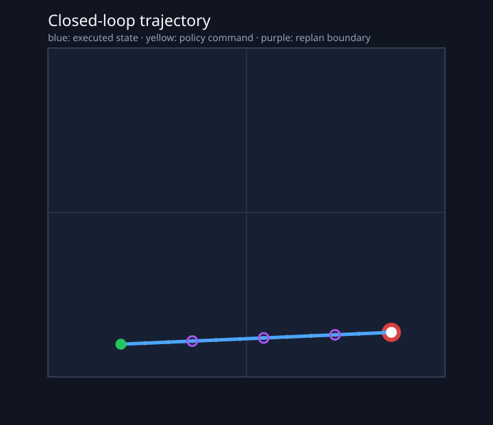

# 第 9 讲：让 Policy 真正闭环——观察、规划、执行与再次观察

> 前八讲已经能从 observation 生成 action chunk。机器人只有在执行动作之后重新观察环境，才能把一段离线预测变成持续运行的系统。



先读这张轨迹图。绿色圆点是机器人起点，红色圆点是目标，蓝线是环境真正走过的轨迹，黄色点是 policy 给出的绝对位置命令。紫色圆圈每隔三个控制步出现一次，表示 runtime 丢弃旧 chunk 的剩余部分，使用新观测重新规划。

这条轨迹一共执行了 12 个 action，调用了 4 次 policy。它把前面几讲分散的组件接成了第一条完整链路：

```text
env.reset
   ↓ observation o₀
policy.predict_chunk(o₀)
   ↓ A₀ = [a₀, a₁, ..., a₇]
execute first E=3 actions
   ↓ observation o₃
policy.predict_chunk(o₃)
   ↓ A₃ = [a₃, a₄, ..., a₁₀]
execute first E=3 actions
   ↓
repeat until success / truncated
```

## 本讲只解决什么问题

本讲解决一个问题：**policy inference、environment step、action chunk 与重新观察怎样组成同步闭环？**

我们会完成：

- 一个与模型无关的 environment contract；
- 一个同步、阻塞式 action-chunk runner；
- 每一步 action 来自哪次 observation、哪次 plan 的完整记录；
- 可运行的二维环境，以及复用同一 runner 的官方 PushT adapter；
- success、reward、重规划边界和 inference latency 的结果文件。

异步 worker、action buffer 并发更新和 RTC 留到下一讲。第 10 讲会保持本讲的 `Policy` 与 `ClosedLoopEnv` 接口，只替换 runtime 调度方式和 flow sampler 的约束。

## 一、为什么离线 action error 还不够？

第 7、8 讲在固定 validation observation 上比较预测 action 与数据 action。这样的离线评估很重要，但它看不到误差如何改变下一帧 observation。

假设数据中的轨迹是：

```text
q₀ --a₀--> q₁ --a₁--> q₂ --a₂--> q₃
```

模型在 $q_0$ 上产生了稍有偏差的动作 $\hat a_0$：

```text
q₀ --â₀--> q̂₁
```

下一次推理面对的是 $\hat q_1$，训练数据在相同时刻记录的却是 $q_1$。如果误差继续积累，policy 会逐渐进入 demonstration 很少覆盖的状态区域。这就是模仿学习中的 distribution shift 在闭环里的具体样子。

离线 action MAE 回答：“在给定数据 observation 时，预测动作离数据动作有多远？”闭环 rollout 继续回答：“执行这些预测后，系统能否到达目标？偏离以后能否根据新 observation 修正？”

两种评估需要同时保留。任务 success 很高也不能自动证明每一维 action 都正确；较低的 action MAE 同样不能保证接触任务成功。

## 二、先看完整闭环中的三条时间轴

部署代码容易混乱，通常因为三种时间被一个变量 `t` 混在一起。

### 2.1 Simulator time

环境每执行一次 `env.step(action)`，仿真时间增加：

$$
\Delta t_{\text{ctrl}}=\frac{1}{f_{\text{ctrl}}}.
$$

本讲默认 $f_{\text{ctrl}}=10\,\text{Hz}$，所以每个 action 覆盖 $0.1\,\text{s}$。12 个 action 对应 $1.2\,\text{s}$ 的控制覆盖时长。

### 2.2 Action target time

一个 action chunk 内每个位置都带目标时间戳：

$$
t^{a}_{k+i}=t^{obs}_k+\frac{i}{f_{\text{ctrl}}},
\qquad i=0,1,\ldots,H-1.
$$

它回答“这条命令属于哪一个控制位置”。runtime 会检查 action timestamp 是否落在 environment 的控制网格上。

### 2.3 Host monotonic time

模型推理耗时使用 host monotonic clock 测量：

$$
L=t^{wall}_{finish}-t^{wall}_{start}.
$$

同步 simulator 在 policy 计算期间不会调用 `env.step`，因此 simulator time 暂停，wall time 仍然向前。真实机器人无法自动暂停物理世界，等待期间需要保持上一条命令、使用低层轨迹控制器继续运动，或者安全停止。

本讲把 $L$ 记录下来，却不使用 `sleep(L)` 推进 simulator。下一讲加入异步 runtime 后，wall time 会决定后台生成期间旧 buffer 被消费了多少步。

## 三、冻结环境输入输出契约

代码位于 [`envs/protocol.py`](../../src/pi_from_scratch/envs/protocol.py)。runtime 只依赖两个方法：

```python
class ClosedLoopEnv(Protocol):
    fps: float
    action_spec: ActionSpec

    def reset(self, *, seed: int) -> ObservationBatch: ...
    def step(self, action: Tensor) -> EnvTransition: ...
```

### 3.1 `reset` 返回 observation

```text
images:       {camera_name: [1, C, H, W]}
image_masks:  {camera_name: [1] bool}
state:        [1, state_dim]
state_mask:   [1, state_dim] bool
prompts:      tuple[str], len = 1
timestamp_s:  [1]
```

batch size 固定为 1，因为这一讲沿着一条 episode 时间线阅读。并行环境可以在后续评估工具中把多条独立时间线组成 batch，单条 runtime 的语义无需改变。

### 3.2 `step` 只接收物理动作

```text
action: [action_dim]
```

它必须已经完成：

```text
model output
  -> inverse normalization
  -> inverse action representation transform
  -> optional control-rate resampling
  -> ActionSpec bounds check
  -> env.step
```

模型若在 10 Hz 网格上输出 chunk，而 controller 工作在 20 Hz，重采样器位于 policy adapter/runtime adapter 的边界。`PolicyOutput` 交给本讲 runner 时已经处于 environment 的 20 Hz 网格。RTC 的 committed-prefix 约束先定义在模型网格上，完整轨迹生成后再做执行频率重采样。

这里再次体现 `ActionSpec` 的价值。相同的 `[H, 2]` Tensor 可能表示二维绝对位置、逐周期增量或速度；环境不能根据 shape 猜测其含义。

### 3.3 `EnvTransition` 返回下一次决策所需信息

```text
observation: 下一控制时刻的 ObservationBatch
reward:      当前 step 的有限浮点奖励
terminated:  任务自然结束
truncated:   达到时间上限等外部截断
success:     是否完成任务
```

`success` 与 `terminated` 分开保留。时间耗尽会结束 episode，但不能计为任务成功。

## 四、用透明环境验证 runner

[`PointReachEnv`](../../src/pi_from_scratch/envs/point_reach.py) 是一个依赖很少的二维环境：

```text
state  = [agent_x, agent_y, target_x, target_y]
action = [target_x, target_y]
range  = [-1, 1] × [-1, 1]
```

action 是绝对位置命令。环境每个控制周期最多移动 `0.12`，所以即使 policy 给出远处目标，机器人也会受到低层速度限制：

$$
q_{k+1}
=q_k+
\min\left(1,\frac{d_{max}}{\lVert a_k-q_k\rVert_2}\right)
(a_k-q_k).
$$

这个环境不能代表 PushT 的接触动力学。它的职责是让以下错误在秒级 CPU test 中暴露：

- policy 与 env 的 action 维度或语义不同；
- action 仍处于 normalized space；
- chunk timestamp 没有对齐控制网格；
- runner 少执行、多执行或重复执行了 chunk 元素；
- episode 结束后仍然调用 `step`。

### 4.1 为什么还需要一个 scripted goal policy？

本讲加入 [`PointGoalPolicy`](../../src/pi_from_scratch/policies/goal_policy.py)，它读取 state 中的 agent 和 target，生成一段直线 chunk。这个 policy 没有学习过程，内部决策很容易检查。

```python
displacement = target - agent
direction = displacement / distance.clamp_min(1e-8)
travel = (step_numbers * motion_per_step).minimum(distance[:, None])
actions = agent[:, None] + direction[:, None] * travel
```

如果透明 policy 也不能闭环成功，问题大概率出在 environment contract、时间戳或 runner。等这些接口通过后，再接入 TinyPi0，失败范围就会缩小到 observation preprocessing、normalization、模型能力和 sampling。

## 五、同步 action-chunk runner 怎样工作？

核心实现位于 [`runtime/closed_loop.py`](../../src/pi_from_scratch/runtime/closed_loop.py)。删除校验和记录代码后，主循环只有几行：

```python
observation = env.reset(seed=seed)

while not finished:
    output = policy.predict_chunk(observation)

    for chunk_offset in range(execution_horizon):
        action = output.action_chunk.values[0, chunk_offset]
        transition = env.step(action)
        observation = transition.observation

        if transition.terminated or transition.truncated:
            break
```

真正值得保留的是循环旁边的约束。

### 5.1 每次推理只使用一个确定的 observation

`PolicyOutput.source_observation_timestamp_s` 必须等于调用时的 `observation.timestamp_s`。这让我们以后可以准确计算 action 生效时的 observation age：

$$
\text{observation age}=t^{execute}-t^{obs}.
$$

普通异步和 RTC 都会用到这个指标。

### 5.2 只执行前 `E` 个有效 action

runner 使用：

$$
N_{execute}=\min(E,N_{valid},N_{remaining}).
$$

其中 `N_valid` 来自 chunk mask，`N_remaining` 是 episode 允许的剩余 step。达到 success 后会立刻停止，chunk 后面的动作不会继续发送。

### 5.3 新 plan 从新的 observation 开始

当 `E=3` 时：

```text
global step:       0  1  2 | 3  4  5 | 6  7  8 | 9 10 11
plan index:        0  0  0 | 1  1  1 | 2  2  2 | 3  3  3
chunk offset:      0  1  2 | 0  1  2 | 0  1  2 | 0  1  2
source obs step:   0  0  0 | 3  3  3 | 6  6  6 | 9  9  9
```

`ClosedLoopTrace` 把这些字段全部保存下来。第 10 讲引入 buffer 后，同一个 global step 可能来自更早的 plan，`chunk_offset` 也可能从 committed prefix 之后开始；现在先把最简单的同步关系记录正确。

## 六、执行时长怎样约束推理延迟？

当前 runner 在推理期间暂停 simulator，所以它不会真的发生 buffer underrun。我们仍然计算一个面向下一讲的诊断量。

执行前缀覆盖：

$$
T_E=\frac{E}{f_{ctrl}}.
$$

如果未来让 policy 在旧前缀执行期间异步生成下一段计划，那么最基本的 refill 条件是：

$$
L \le T_E.
$$

本讲把每个满足 $L>T_E$ 的请求记为一次 `refill_deadline_miss`。例如：

```text
f_ctrl = 10 Hz
E = 3
T_E = 300 ms
```

`L=310 ms` 会错过 refill deadline。下一讲会把固定延迟和抖动真正注入时间线，并比较 buffer 是否耗尽、chunk 接管是否跳变、observation age，以及 RTC 如何固定 committed prefix 再生成 future suffix。

要注意，$L\le T_E$ 只说明平均吞吐有机会跟上。部署还要使用 latency 的 p95/p99、调度开销和安全余量，单次平均值无法保证实时性。

## 七、运行实验

安装项目并运行默认闭环：

```bash
pip install -e '.[dev]'

pi-closed-loop-demo \
  --env point \
  --policy goal \
  --horizon 8 \
  --execution-horizon 3 \
  --seed 7 \
  --output-dir outputs/lesson09
```

输出包括 `summary.json` 和 `trajectory.svg`。固定 seed 7 的实测结果：

| policy | success | control steps | replans | refill deadline misses |
|---|---:|---:|---:|---:|
| straight-line goal | true | 12 | 4 | 0 |
| random | false | 80 | 27 | 0 |

随机策略没有 deadline miss，因为它计算得很快；它仍然无法完成任务。这个结果把两种问题分开了：

- runtime correctness：action 确实按照 chunk 与时间戳进入环境；
- policy competence：给定 observation 后能否产生有用的 action。

### 7.1 主动制造一个时间戳错误

测试 `test_runner_rejects_policy_on_the_wrong_control_grid` 把整个 chunk 平移 `0.05 s`。在 10 Hz 环境里，这些动作落在半个控制周期的位置，runner 会拒绝：

```text
ValueError: policy action timestamps do not match the environment control grid
```

它比“先执行看看”更安全。真实机器人上的半周期错位可能表现为相位延迟、边界跳变或错误的 RTC prefix 长度。

### 7.2 主动制造一次推理超时

测试 policy 报告 `L=0.31 s`，配置是 `E=3, fps=10`，所以每次请求都会超过 `0.30 s` refill budget。同步轨迹仍能成功，因为 simulator 暂停等待；`deadline_misses` 会明确记录它无法直接转换成实时异步系统。

## 八、接入官方 PushT

[`GymPushTEnv`](../../src/pi_from_scratch/envs/pusht.py) 把官方 `gym-pusht/PushT-v0` 转换成相同的 `ClosedLoopEnv`。PushT action 是工作区中的二维连续目标位置，任务目标是把 T 形物体推入目标区域。环境和 action space 可查看 [gym-pusht 官方说明](https://github.com/huggingface/gym-pusht/blob/main/README.md)。

推荐使用 Python 3.11 或 3.12：

```bash
pip install -e '.[lerobot,sim]'
pi-closed-loop-demo --env pusht --policy random --max-steps 300
```

随机 policy 只用于验证 adapter 和 rollout 文件，预期不会得到有意义的 success。训练过的 PushT TinyPi0 policy adapter 还需要补齐 state normalization、checkpoint-only deploy loader 和足够训练预算。仓库当前没有报告 TinyPi0 的 PushT 闭环性能。

本地开发环境使用 Python 3.14，`gym-pusht==0.1.6` 的间接依赖 `pygame` 没有可用 wheel，并在缺少 SDL headers 时编译失败。因此本讲的自动验收覆盖 dependency-free 环境；PushT 命令作为可选 V4 路径保留。LeRobot 对 benchmark 的统一数据流与 success 汇总方式可参考其 [Adding a New Benchmark 官方文档](https://huggingface.co/docs/lerobot/en/adding_benchmarks)。

## 九、与论文、openpi 和 LeRobot 的边界

π₀ policy 负责把 observation 和语言条件变成 action chunk。openpi 的模型采样、policy serving 与机器人侧 client 各有职责边界。本仓用一个很小的 `Policy.predict_chunk` 把这些细节封装起来，避免 simulator 读取 flow timestep、KV cache 或模型 hidden state。

本讲没有复现 openpi 的真实机器人部署栈，也没有声称二维 goal policy 是 VLA。它只冻结高级模型共同依赖的闭环接口。

LeRobot 的统一评估同样经过 environment observation、preprocessing、policy、postprocessing 和 `env.step`，并聚合 success 与 reward。本仓实现较小的单 episode 版本，让时间戳、chunk offset 和 source observation 对初学者保持可见。

本讲还保留几项简化：

- 同步 simulator 会隐藏推理期间真实世界继续变化的问题；
- PointReach 没有接触、遮挡和动力学不确定性；
- 单环境无法测量批量推理吞吐；
- scripted policy 不代表学习模型的闭环能力；
- PushT adapter 已实现，当前 Python 3.14 环境没有完成运行验证。

这些限制不会阻止我们进入 RTC。RTC 需要的核心量——observation timestamp、action target timestamp、inference latency、plan index 和 chunk offset——已经进入 trace。

## 十、为什么这条闭环是后续论文工作的公共底座？

接下来几项工作分别改变系统中的不同位置：

```text
observation / context
   ├── MEM：增加短期视频记忆与长期语义记忆
   │
policy training and representation
   ├── FAST：把连续 action chunk 压缩成离散 token
   ├── π₀.₅：加入异构数据和多目标训练
   │
policy sampling + runtime
   └── RTC：利用即将执行的 action prefix 约束新 chunk
   │
action buffer -> env.step -> next observation
```

它们最终都要回答同一条闭环里的问题。保持 `Policy` 与 `ClosedLoopEnv` 不变，我们才能比较改进来自模型、动作表示、上下文，还是 runtime 调度。

## 十一、本讲验收

执行：

```bash
ruff check .
pytest -q
pi-closed-loop-demo --seed 7
```

机器可检查的条件：

- goal policy 在 40 步内完成 PointReach；
- trace 中 `num_states = num_actions + 1`；
- action timestamp 严格递增；
- 每条 action 都保存 source observation、plan index 和 chunk offset；
- 错误的半周期 timestamp 被拒绝；
- `L > E/fps` 时 refill deadline miss 增加；
- summary JSON 与 trajectory SVG 可以生成。

## 十二、下一讲接口

本讲冻结：

```text
ClosedLoopEnv.reset / step
Policy.predict_chunk
PolicyOutput timing provenance
ClosedLoopTrace
physical action + control-grid boundary
```

第 10 讲会新增：

```text
asynchronous scheduler
timestamped action buffer
fixed / jittered latency source
blocking / unconstrained async / RTC strategies
flow action-prefix inpainting
buffer underrun + observation age + boundary jerk metrics
```

我们会先画出同一条 episode 在三种 runtime 下的完整时间线，再对着代码实现 RTC。

## 自测问题

1. `H=8, E=3, fps=10` 时，一个预测 chunk 覆盖多久？两次同步重规划之间执行多久？
2. 为什么同步 simulator 中 `L=500 ms` 仍可能跑出成功轨迹，却不能证明真实机器人可部署？
3. `source_observation_timestamp_s` 和 `action_timestamps_s` 分别回答什么问题？
4. success、terminated 和 truncated 为什么要分别记录？
5. 模型输出 10 Hz、环境执行 20 Hz 时，重采样应该在哪个 contract 之前完成？
6. 随机 policy 没有 deadline miss，却任务失败，说明哪两类验收需要分开？

## 扩展阅读

- [gym-pusht](https://github.com/huggingface/gym-pusht)：关注 action space、observation type、reward/success 和 reset state，理解 dataset action 怎样进入 simulator。
- [LeRobot：Adding a New Benchmark](https://huggingface.co/docs/lerobot/en/adding_benchmarks)：关注 environment → preprocessing → policy → postprocessing → `env.step` 的数据流，以及 success metric 如何聚合。
- 第 10 讲 RTC：继续追问推理与执行重叠后，新 chunk 怎样尊重已经承诺的动作。它属于必修主线，会直接复用本讲 trace 字段。
