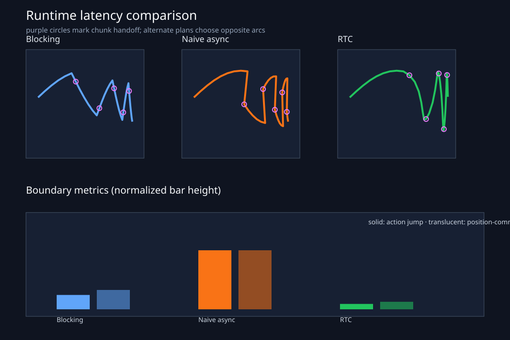

# 第 10 讲：RTC——模型思考时，机器人怎样继续平稳运动？

> 当前 chunk 还在执行，后台模型已经拿旧 observation 开始推理。新计划返回时，机器人已经走到了另一个时刻。RTC 处理的是这段时间里“已经承诺的动作”与“仍可重新规划的未来”怎样接在一起。



先看上面的三条轨迹。三种 runtime 面对相同的交替计划：policy 一次选择从上方绕行，下一次又选择从下方绕行。紫色圆圈表示新 chunk 接管控制的位置。

- Blocking 等模型完成后再执行，轨迹较平缓，但控制吞吐降到约 `7.06 Hz`；
- Naive async 在模型推理时继续执行旧 chunk，吞吐恢复到 `10 Hz`，接管时发生明显跳跃；
- RTC 同样保持 `10 Hz`，新 chunk 的生成受到旧 chunk 前缀约束，边界更连续。

这张图先给出整体结果。接下来我们沿着完整时间线拆开它。

## **推理延迟存在时，怎样异步生成 action chunk，并让新旧 chunk 保持连续？**

- 用控制步数定义 inference delay；
- blocking、naive async 与 RTC 三种 runtime 的统一时间线；
- RTC hard prefix 与 exponential soft mask；
- 与 RTC 论文一致的 `τ=0` 噪声、`τ=1` 动作 flow guidance；
- action jump、position-command jerk、throughput、observation age 和 deadline miss；
- training-time RTC 的 clean-prefix 训练 batch 与 TinyPi0 loss。

本讲的实验使用解析 flow field 和可控的二维多策略轨迹，验证 RTC 数学与 runtime 接口。它没有复现论文的 Kinetix 训练规模，也没有报告真实机器人性能。

## 一、先看全景：人们说的 RTC 可能指什么？

RTC 想解决的共同问题可以用一句话概括：**模型生成新 chunk 的同时，机器人还在消费旧 chunk；新计划返回时，要从已经承诺的动作之后继续走。**

围绕这个目标，目前可以看到三种相关做法：

| 路线 | 已承诺动作怎样参与生成 | 是否需要重新训练 | 推理额外开销 | 连续性来自哪里 |
|---|---|---:|---:|---|
| inference-time RTC | 作为 sampler 的约束，通过 VJP 修正每一步 flow velocity | 否 | 每个 denoising step 多一次 VJP | 采样时把新 chunk 拉向旧计划 |
| hard-prefix inpainting | 每个采样步直接把 prefix 写回 latent | 否 | 较低 | prefix 被硬覆盖，suffix 由模型补全 |
| training-time RTC | clean prefix 直接放进 action token，并给每个 token 设置独立 flow time | 是 | 无 VJP | 模型在训练中学会根据 prefix 续写 suffix |

这里有两个容易混淆的层次：

1. **方法路线**决定旧动作通过 sampler guidance 进入，还是通过模型 condition 进入；
2. **约束范围**决定只固定 committed prefix，还是继续用 soft mask 约束更长的 overlap。

因此，`hard` 和 `exponential soft mask` 主要描述约束覆盖范围。它们和“推理时引导 / 训练时条件化”并非同一组分类维度。

把三条路线放到相同时间线上，会更容易看出差异：

```text
已有普通 flow policy
    ├── 推理时加入旧计划误差 + VJP ──> inference-time RTC（本讲主线）
    └── 每步覆盖已知 prefix ─────────> hard-prefix inpainting（轻量基线）

训练 flow policy 时就加入 clean prefix
    └── 学习 p(A[d:H] | observation, A[0:d])
                                      ──> training-time RTC（本讲第九节）
```

原始 RTC 的价值在于兼容已经训练好的 π₀ / π₀.₅ 一类 flow policy。后续的 training-time action conditioning 则把这项能力学进模型，换取更轻的在线推理。两条路线都要由 runtime 完成时间对齐、跳过过期 action 和队列管理。

## 二、旧 observation 会影响精度吗？

会。

假设控制频率是 `10 Hz`，模型在时刻 $k$ 收到 observation $o_k$，推理耗时 `300 ms`。推理期间机器人继续执行旧 chunk：

```text
control step:       k       k+1       k+2       k+3
old chunk:          a_k     a_k+1     a_k+2
model worker:       |---------- inference ----------|
new chunk ready:                                  here
```

新 chunk 生效时，条件 observation 已经有约 `300 ms` 的年龄：

$$
\text{observation age}
=t_{execute}-t_{observation}.
$$

如果机器人被人推了一下、物体滑动了，或者接触结果与旧计划不同，$o_k$ 无法描述这些变化。RTC 无法恢复推理期间没有观测到的信息。

RTC 改善另一项问题：**机器人在推理期间确定会执行哪些旧动作，新计划要沿着这些动作继续生成。**

因此 deploy 时要同时检查：

```text
observation freshness：新动作依据的画面和 state 有多旧
cross-chunk continuity：新动作能否接住已经执行和承诺的旧计划
```

第 9 讲已经把 `source_observation_timestamp_s` 放进 trace。本讲会保留 observation age，让连续性改善不会掩盖条件陈旧。

## 三、从秒转换成控制步

论文用 $\delta$ 表示模型生成一个 chunk 的墙钟耗时，用 $\Delta t$ 表示控制周期。inference delay 写成控制步数：

$$
d=\left\lfloor\frac{\delta}{\Delta t}\right\rfloor.
$$

论文为了推导清楚，假设观测、action 消费和模型完成都落在控制步边界。真实 scheduler 常使用向上取整和 p95/p99 latency 做保守预算：

$$
d_{budget}=\left\lceil L_{p99}f_{ctrl}\right\rceil.
$$

本讲 CLI 直接接收整数 `--delay-steps`，因此不引入亚控制周期的取整分歧。

需要同时区分三个长度：

| 符号 | 含义 |
|---|---|
| $H$ | prediction horizon，新 chunk 一共有多少步 |
| $s$ | execution horizon，两次 inference start 之间消耗多少控制步 |
| $d$ | inference delay，后台生成期间会经过多少控制步 |

RTC 的基本可行性约束是：

$$
d\le s\le H-d.
$$

左侧保证下一次推理开始后，旧 chunk 至少还能支撑到新 chunk 返回；右侧保证旧 chunk 与新 chunk 有足够长的重叠前缀。如果 $H=8,s=6,d=3$，就违反 $s\le H-d=5$，任何 inpainting 都补不回已经不存在的 buffer。

## 四、三种 runtime 在同一条时间线上做了什么？

设当前 chunk 为：

$$
A^{old}=[a_0,a_1,\ldots,a_{H-1}].
$$

系统已经执行了前 $s$ 步，下一次推理开始时保留：

$$
A^{prev}=A^{old}_{s:H}.
$$

### 4.1 Blocking

```text
execute s actions -> stop/hold -> inference -> execute new chunk from index 0
```

它使用推理开始时最新的 observation，并从新 chunk 第 0 项开始执行。真实墙钟周期包含等待：

$$
T_{blocking}=\frac{s}{f_{ctrl}}+L.
$$

位置控制机器人可以 hold，但任务整体变慢；动力学任务中的暂停还会改变系统状态。

### 4.2 Naive async

```text
inference starts
old chunk continues for d steps
new chunk arrives
skip new[0:d]
switch directly to new[d]
```

跳过前 $d$ 步很重要，因为这些 target timestamp 已经过去。新 chunk 的第 $d$ 项与旧 chunk 即将执行的动作可能来自不同策略，直接接管会产生 action jump。

### 4.3 Inference-time RTC

RTC 保持相同的异步时间线。变化发生在 chunk generation 内部：

```text
known previous actions + new observation + initial noise
                    ↓ RTC-guided flow sampling
committed prefix + compatible overlap + freshly generated suffix
```

新 chunk 返回后仍然跳过 `[0:d]`，从 `new[d]` 接管。这些被跳过的动作在生成时承担条件作用，让后面的 suffix 延续旧计划。

## 五、Inference-time RTC 的三段 mask

把新 chunk 的索引写成 $i\in\{0,\ldots,H-1\}$。

### 5.1 Frozen prefix：`i < d`

模型返回前，这 $d$ 个控制位置一定由旧 chunk 执行。它们的权重为 1：

$$
W_i=1,\qquad i<d.
$$

### 5.2 Soft overlap：`d <= i < H-s`

旧 chunk 在这些未来时刻仍然给出了计划，但新 observation 也可能要求修正。RTC 使用逐渐减小的权重。论文的 exponential schedule 为：

$$
c_i=\frac{H-s-i}{H-s-d+1},
$$

$$
W_i=c_i\frac{e^{c_i}-1}{e-1}.
$$

越靠近 committed prefix，越重视旧策略；越靠近未来 suffix，新 observation 的影响越大。

### 5.3 Fresh suffix：`i >= H-s`

旧 chunk 已经没有与这些时刻对应的动作：

$$
W_i=0,\qquad i\ge H-s.
$$

代码在 [`inference/rtc.py`](../../src/pi_from_scratch/inference/rtc.py)：

```python
weights[:delay_steps] = 1.0

for index in range(delay_steps, horizon - execution_horizon):
    c = (horizon - execution_horizon - index) / denominator
    weights[index] = c * expm1(c) / expm1(1.0)
```

`schedule="hard"` 只保留前 $d$ 个 1，其余位置为 0。它仍然使用论文的 guidance，只减少了跨 chunk 条件范围。每一步直接覆盖 latent prefix 属于更便宜的 Diffuser-style inpainting；RTC 论文把它作为另一项 ablation。

## 六、为什么 inference-time RTC 需要一次反向传播？

RTC 论文和本仓统一采用：

```text
τ=0：noise
τ=1：action data
```

模型给出 velocity $v_\theta(x_\tau,o,\tau)$ 后，当前 latent 对最终 action 的一步估计是：

$$
\hat x_1=x_\tau+(1-\tau)v_\theta(x_\tau,o,\tau).
$$

我们希望 $\hat x_1$ 在有权重的位置靠近旧计划 $Y$：

$$
e=W\odot(Y-\hat x_1).
$$

RTC 需要知道当前 latent 怎样变化，才能让最终 action estimate 靠近旧计划。它计算 $\hat x_1$ 对 $x_\tau$ 的 vector-Jacobian product：

$$
g=\left(\frac{\partial\hat x_1}{\partial x_\tau}\right)^T e.
$$

沿论文的正向积分约定：

$$
v_{RTC}=v_\theta+\lambda(\tau)g.
$$

guidance coefficient 使用裁剪上限 $\beta$：

$$
\lambda(\tau)=
\min\left(
\beta,
\frac{\tau^2+(1-\tau)^2}{\tau(1-\tau)}
\right).
$$

端点的无穷值和未定义值在代码中安全转换并裁剪。核心实现对应：

```python
predicted_data = x_tau + (1.0 - time) * base_velocity
weighted_error = (previous_actions - predicted_data) * weights

correction = torch.autograd.grad(
    predicted_data,
    x_tau,
    grad_outputs=weighted_error,
)[0]

guided_velocity = base_velocity + guidance * correction
```

这里的反向传播只求 `predicted_data` 对当前 action latent `x_tau` 的输入梯度。模型参数保持冻结，也没有 optimizer step。每个 denoising step 多做一次 VJP，正是 inference-time RTC 的主要额外计算。论文报告的真实系统 profiling 中，5 次 denoising 的总耗时从 76 ms 增加到 97 ms；数字属于论文硬件与 π₀.₅ 配置，本仓 toy 实验不复用它作为性能结论。

## 七、对着 runtime 代码看一次 chunk 切换

实验代码在 [`runtime/latency_simulation.py`](../../src/pi_from_scratch/runtime/latency_simulation.py)。它使用离散事件模拟，不创建真实线程，所以每一步发生在哪个控制时刻都可以复现。

第一次 plan 选择从目标上方通过。执行 $s$ 步后，第二次 plan 选择下方路径：

```python
candidate = make_arc_chunk(observation_position, sign=-1)
previous = current[current_index:]
```

普通异步在后台计算期间继续执行：

```python
execute(current[current_index : current_index + d])
switch_to(candidate[d])
```

RTC 在同一时刻切换，但 `candidate` 先经过 flow guidance：

```python
generated = rtc_flow_sample(
    velocity_fn,
    previous_actions=previous,
    delay_steps=d,
    execution_horizon=s,
)

execute(current[current_index : current_index + d])
switch_to(generated[d])
```

这里使用解析 constant vector field，使无约束 sampling 能准确回到 candidate。实验只改变 RTC guidance，避免把模型误差混进 runtime 对比。

## 八、实验结果

执行：

```bash
pi-rtc-demo \
  --horizon 16 \
  --execution-horizon 6 \
  --delay-steps 3 \
  --num-replans 5 \
  --fps 10 \
  --seed 7
```

固定配置结果：

| runtime | throughput | mean boundary jump | mean position-command jerk | observation age |
|---|---:|---:|---:|---:|
| blocking | 7.06 Hz | 0.1356 | 180.66 | 0.30 s |
| naive async | 10.00 Hz | 0.5568 | 551.45 | 0.30 s |
| RTC | 10.00 Hz | 0.0508 | 70.17 | 0.30 s |

这些数字说明：

- blocking 把 inference latency 加进墙钟时间，吞吐下降；
- naive async 消除了等待，交替策略在边界产生大跳变；
- RTC 保持异步吞吐，同时让新计划延续旧 prefix；
- RTC 和 naive async 的 observation age 相同，说明 RTC 没有让条件 observation 变新。

这里的 jerk 是绝对位置命令的三阶有限差分：

$$
j_k=\frac{\lVert a_k-3a_{k-1}+3a_{k-2}-a_{k-3}\rVert_2}{\Delta t^3}.
$$

真实机器人还要记录 measured joint position/velocity/acceleration。command jerk 只能说明下发轨迹的边界平滑程度。

### 典型失败：buffer 容量不足

配置 `H=8,s=6,d=3` 时：

$$
s=6>H-d=5.
$$

代码会立即拒绝该配置。长期推理吞吐不足会导致 buffer underrun，RTC 的 guidance 无法创造额外 action horizon。

### 典型失败：guidance 太强

过大的 $\beta$ 会让新 chunk 过度追随旧计划，削弱对新 observation 的修正，还可能使少步数积分不稳定。论文因此裁剪 guidance weight。部署需要联合扫描 `β`、denoising steps、delay 分布和任务动态性。

## 九、Training-time RTC：把已承诺动作交给模型续写

Inference-time RTC 可以直接用于已有 flow policy，但每个 denoising step 都要计算 VJP。后续工作 [Training-Time Action Conditioning for Efficient Real-Time Chunking](https://arxiv.org/pdf/2512.05964) 把 prefix conditioning 放进训练过程。

这正好回答一个自然的想法：**既然推理期间必然执行哪些 action 已经确定，能否直接把它们作为 condition，让模型从这些动作后面继续预测？**

可以，但模型需要在训练中见过这种输入形式。普通 flow policy 学的是：

$$
p(A_{0:H}\mid o).
$$

它的网络接口通常接收 observation、整段带噪 action 和统一的 flow time。部署时临时多传一段 committed actions，模型并不会自动理解“这些 token 已经确定，请沿着它们续写”。Training-time RTC 把学习目标改成：

$$
p(A_{d:H}\mid o,A_{0:d}),
$$

其中 $A_{0:d}$ 是模型返回前会由旧 chunk 执行的 clean prefix，$A_{d:H}$ 是仍需生成的 postfix。

给定 ground-truth chunk $A=[a_0,\ldots,a_{H-1}]$，采样一个模拟 delay $d$：

```text
prefix  A[0:d]：保持干净，作为条件，不计算 flow loss
postfix A[d:H]：正常加噪，计算 flow matching loss
```

该论文和本仓都使用 $\tau=1$ 表示数据，所以 clean prefix 的 token time 直接设为 1：

```python
token_time = sampled_time.expand(batch, horizon)
token_time[prefix_mask] = 1.0

noisy_actions = (1 - token_time) * noise + token_time * actions
loss_mask = ~prefix_mask
```

实现位于 [`objectives/flow_matching.py`](../../src/pi_from_scratch/objectives/flow_matching.py) 的 `training_rtc_flow_batch`。TinyPi0 的 time embedding 也扩展为 `[B]` 或 `[B,H]`，这样不同 action token 可以拥有不同 flow time：

```python
loss = model.training_rtc_loss(
    batch,
    prefix_lengths=sampled_delay,
    noise=noise,
    time=time,
)
```

Training-time RTC 训练模型直接生成 $p(A_{d:H}\mid o,A_{0:d})$。推理时不需要 VJP，代价是重新微调模型，并提前选择训练 delay 分布。它只使用 hard action prefix；inference-time RTC 还能通过 soft mask 利用 prefix 后面的重叠计划。

### 9.1 为什么这种模型通常会更连续？

训练样本反复要求模型完成同一种续写任务：前 $d$ 步已经确定，后面的动作要和 prefix 属于同一条轨迹。只要训练时模拟的 delay 覆盖了部署场景，模型会学习 prefix 末端到 suffix 起点之间的条件分布，连续性由模型本身给出。

这里仍然有几项约束：

- `prefix` 必须与新 chunk 的时间戳严格对齐；错一帧就会把错误动作当成已承诺条件；
- 训练要覆盖真实部署中的 delay 分布，固定用 `d=2` 训练无法稳妥处理经常出现的 `d=6`；
- prefix 只提供机器人已经计划执行的动作，没有补回推理期间缺失的新图像和新 state；
- 模型给出的统计连续性还要经过 joint limit、速度、加速度、jerk 和碰撞检查；
- 新 chunk 返回后，runtime 仍要跳过已经过去的 `[0:d]`，从 `new[d]` 开始接管。

因此，training-time RTC 能省去在线 VJP，也能让 suffix 天然参考 committed prefix。时间同步、动作队列和安全约束依旧属于 runtime 的职责。

### 9.2 两条主线怎样选择？

如果手里只有一个已经训练好的 flow policy，先使用 inference-time RTC。它不改训练数据和 checkpoint，适合验证连续性收益；代价体现在每个 denoising step 的 VJP。

如果可以重新训练或微调模型，并且部署时延分布相对明确，training-time RTC 更适合追求低延迟。需要额外验证模型在不同 prefix 长度、突发时延和 observation 变化下的泛化。

hard-prefix inpainting 可以作为最低成本基线。它容易实现，却只保证 prefix 数值被固定；suffix 是否自然衔接仍取决于原模型能否利用被写入 latent 的已知部分。

本仓本讲验证 batch 构造、per-token time、loss mask 和 backward，没有运行 Kinetix 或真实机器人训练。

## 十、与论文、openpi 和 LeRobot 的差异

### RTC 论文

论文在 12 个动态 Kinetix 任务和 6 个真实双臂任务上评估，真实系统使用 π₀.₅。它对比 naive async、BID、temporal ensembling 和 RTC。本仓只保留 blocking、naive async、RTC 三条最重要的教学路径，使用解析轨迹验证机制。

### openpi

openpi 提供 π₀/π₀.₅ flow policy 与采样接口。RTC 属于推理 runtime 和 sampler guidance，保持在模型版本之外。当前课程没有把 RTC 写成 `TinyPi0` 的模型分支；runtime 通过通用 velocity function 使用它。

### LeRobot 0.6.1

本地固定版本的 `lerobot.policies.rtc` 已包含 `RTCProcessor`、thread-safe `ActionQueue` 和 `LatencyTracker`。LeRobot 接收 openpi 风格的时间变量，因此 processor 内先计算 `tau = 1 - time`，并用 `x1_t = x_t - time * v_t` 得到最终动作估计。本仓的 model-facing time 已经是论文 $\tau$，对应公式直接写成 `x1_tau = x_tau + (1-tau) * velocity`。queue 在新 chunk 合并时都会跳过实际 delay 对应的前缀。

## 十一、本讲验收

```bash
ruff check .
pytest -q tests/test_rtc.py
pi-rtc-demo --seed 7
```

机器可检查条件：

- exponential weights 包含 frozen、decay 和 fresh 三段；
- hard weights 只约束前 `d` 步；
- RTC guidance 明显降低 weighted previous-chunk error；
- RTC 与 naive async 保持相同吞吐；
- RTC boundary jump 和 jerk 低于 naive async；
- 两种异步方法保留相同 observation age；
- 不可行的 `s,d,H` 组合被拒绝；
- training-time RTC prefix 保持 clean，prefix loss 被 mask；
- TinyPi0 training-time RTC loss 可以 backward。

## 十二、下一讲接口

本讲冻结了：

```text
latency -> delay_steps
previous aligned actions
RTC prefix weights
guided flow sampler
runtime handoff metrics
training-time prefix conditioning contract
```

第 11 讲会回到模型与动作表示线。runtime 和 `ClosedLoopEnv` 保持不变，我们把连续 action chunk 经过 DCT、量化和 BPE 变成更短的离散 token 序列，理解 FAST 为什么能改善高频 autoregressive VLA 的训练。

## 自测问题

1. `H=16,s=6,d=3` 时，frozen prefix、soft overlap 和 fresh suffix 分别覆盖哪些索引？
2. 新 chunk 为什么要跳过前 `d` 个 action？
3. RTC 为什么不能解决 observation staleness？
4. `τ=0` 为噪声时，最终 action estimate 为什么写成 `x_τ + (1-τ)*v`？
5. VJP 在 RTC guidance 中把哪个空间的 error 传回哪个空间？
6. Training-time RTC 中 clean prefix 的 flow time 为什么必须设为 1？
7. 当 `d > H-s` 时，为什么调整 guidance weight 没有用？
8. 已承诺动作直接作为 condition 时，为什么模型必须在训练中见过相同的 prefix 形式？
9. Training-time RTC 省掉 VJP 后，runtime 还需要承担哪些工作？

## 扩展阅读

- [Real-Time Execution of Action Chunking Flow Policies](https://www.physicalintelligence.company/download/real_time_chunking.pdf)：必读第 2、3 节和 Algorithm 1，重点看 $d,s,H$、ΠGDM guidance 与 exponential soft mask。
- [Physical Intelligence RTC Kinetix 代码](https://github.com/Physical-Intelligence/real-time-chunking-kinetix)：关注 `src/model.py` 中 sampler 与模拟 delay，不需要下载 60 GiB 训练数据来理解算法。
- [Training-Time Action Conditioning for Efficient Real-Time Chunking](https://arxiv.org/pdf/2512.05964)：重点看第 IV 节的三项修改——per-token time、clean prefix、postfix-only loss。
