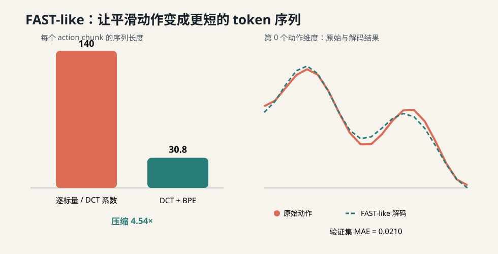

# 第 11 讲：FAST——怎样把高频连续动作压缩成短 token 序列？



前几讲里，我们一直把 action chunk 看成一个连续张量：

```text
[H, A] = [未来 H 个控制时刻, 每个时刻 A 维动作]
```

π₀ 用 flow matching 一次并行地生成整个张量。这条路线很适合连续控制，却也带来了一套专用的 action expert、流时间和 ODE 采样流程。

如果希望直接沿用大语言模型熟悉的 next-token prediction，最自然的想法是把每个动作数值分桶，再让模型逐个预测离散 token。问题很快出现：机器人数据频率高，连续两帧动作通常很接近，一个 1 秒的 chunk 仍会产生很长的 token 序列。模型把大量计算花在重复描述一条平滑轨迹。

FAST（Frequency-space Action Sequence Tokenization）抓住了动作在时间上的平滑性。它先把一条轨迹从“每个时刻是多少”改写成“包含哪些变化频率”，再把频繁出现的系数组合压成 token：

```text
连续 action chunk
    ↓ 训练集分位数归一化
[-1, 1] 附近的动作
    ↓ 沿时间轴做 DCT
低频到高频的系数
    ↓ 缩放、取整、按频率优先展平
整数系数序列
    ↓ BPE
可变长度 action token
```

接下来讲清楚：**DCT、量化和 BPE 怎样共同把高频连续动作变成适合自回归模型学习的短序列？**

学完后，你应该能顺着代码完成 encode 和 decode，知道误差从哪里产生，也能解释 FAST 与 π₀ flow policy 改变的是系统中的哪一层。

---

## 1. 先看完整系统中的位置

先确定 FAST 在 π 系列中的位置。课程按论文出现顺序把 FAST 放在 π₀ 和 π₀.₅ 之间，但模型关系并不是一条替代链：

```text
                 ┌── π₀-FAST：离散 action token + 自回归生成
π₀ 基础架构 ─────┤
                 └── π₀.₅：继续使用连续 flow action expert
```

FAST 是 π₀ 家族对动作表征和自回归训练路线的一次重要探索。它没有取代 flow matching，也不是进入 π₀.₅ 前必须经过的组件。

从目前公开实现看，连续 action head 仍然更加常见：π₀、π₀.₅ 和 GR00T N1.5 使用 flow matching，OpenVLA-OFT 使用连续 action chunk 与回归目标。openpi 同时保留 π₀-FAST checkpoint，但其 PyTorch 实现目前还不支持 π₀-FAST，π₀.₅ 也只开放了 flow-matching head。

因此，本课程的主实现继续沿 flow matching 前进。单独学习 FAST，可以让我们理解另一条完整路径：怎样把连续控制信号接入语言模型熟悉的 next-token prediction。

VLA 仍然接收图像、语言和机器人状态。FAST 修改的是动作表示以及与之配套的输出头和训练目标：

```text
图像 + 语言 + state
        │
        ▼
      VLM trunk
        │
        ├── π₀ 路线：continuous action expert → flow velocity → ODE → [H, A]
        │
        └── FAST 路线：autoregressive LM head → action tokens → FAST decode → [H, A]
```

两条路线可以消费相同的 observation 和 action chunk，也可以交给相同的 executor、runtime 与 simulator。变化集中在三处：

1. 数据管线需要用训练集动作拟合 FAST tokenizer；
2. 模型输出从连续向量场改成离散 token 的概率分布；
3. flow matching loss 改成 action token 的 next-token cross entropy。

控制频率、chunk 的物理时长和 ActionSpec 依旧有效。FAST 压缩的是表示长度，不会改变 `H / fps` 所定义的时间跨度。

---

## 2. 为什么逐维分桶会浪费 token？

设动作张量为：

$$
\mathbf A\in\mathbb R^{H\times A}.
$$

若把每个标量独立量化成一个 token，序列长度固定为：

$$
L_{scalar}=H\times A.
$$

本讲实验使用 `H=20, A=7`，因此每个 chunk 都要 140 个 token。动作是否平滑、是否有大量冗余，都不会缩短这个序列。

想象一个关节在 1 秒内匀速移动。20 个采样值都不同，但它们主要由“起点”和“斜率”决定。逐点 tokenization 重复记录了这条直线上的每个点。

对自回归 Transformer 来说，长序列还会带来两类成本：

- 必须串行地产生更多 action token，增加解码延迟；
- self-attention 的计算量会随序列长度近似二次增长。

因此 FAST 的目标不只是减少词表大小，更重要的是减少每个 action chunk 需要生成的 token 数量。

---

## 3. 第一步：只用 train split 做分位数归一化

不同机器人、不同关节的数值范围可能差很多。直接进行统一量化时，大范围维度会占据更多整数区间，小范围维度则损失精度。

FAST 对每个动作维度计算训练集的第 1 和第 99 百分位数：

$$
q_{01}^{(j)},\qquad q_{99}^{(j)}.
$$

然后把动作映射到 `[-1, 1]`：

$$
\tilde a^{(j)}
=2\frac{a^{(j)}-q_{01}^{(j)}}{q_{99}^{(j)}-q_{01}^{(j)}}-1.
$$

超出分位数范围的值会被裁剪。这能降低少量异常值对有效分辨率的影响，也意味着这里可能产生第一部分重建误差。

代码在 [`fast.py`](../../src/pi_from_scratch/representations/fast.py) 的 `FastQuantileStats` 中：

```python
stats = FastQuantileStats.fit(train_chunks)
normalized = stats.normalize(action_chunk)
```

`fit` 的输入名刻意写成 `train_actions`。validation 和 test action 不能参与统计量计算，否则它们的分布信息会提前进入 tokenizer，形成数据泄漏。

对于多机器人预训练，归一化统计量还要和具体 action schema、机器人或数据源绑定。两个语义不同的第 0 维不能因为张量下标相同，就共享同一组分位数。

---

## 4. 第二步：沿时间轴做 DCT

### 4.1 从时间值换到频率系数

对每个动作维度，FAST 沿 horizon 方向独立做离散余弦变换（DCT）。本项目使用正交归一化的 DCT-II：

$$
c_{k,j}=\alpha_k\sum_{h=0}^{H-1}
\tilde a_{h,j}
\cos\left[\frac{\pi}{H}\left(h+\frac12\right)k\right],
$$

其中：

$$
\alpha_0=\sqrt{\frac1H},\qquad
\alpha_k=\sqrt{\frac2H}\quad(k>0).
$$

`k=0` 表示直流分量，也就是这段动作的整体水平；较小的 `k` 描述缓慢变化；较大的 `k` 描述快速抖动。

机械臂动作通常在相邻控制时刻保持连续，所以能量更容易集中到前几个低频系数。后面的高频系数大多接近 0。这为后面的 BPE 创造了大量重复模式。

### 4.2 为什么变换后仍然有 H×A 个数？

DCT 本身不缩短序列。它是可逆的线性坐标变换：

```python
coefficients = dct_actions(normalized_actions)
reconstructed = idct_actions(coefficients)
```

在没有量化误差的情况下，`idct_actions(dct_actions(x))` 会回到 `x`。测试 `test_orthonormal_dct_round_trip` 就在检查这件事。

DCT 的价值在于重新组织信息，让平滑动作变成“少量显著低频系数 + 大量重复的小系数”。真正缩短序列的是第五步的 BPE。

---

## 5. 第三步：缩放与取整

连续的 DCT 系数还不能直接作为离散 token。FAST 将它们乘以一个缩放系数并四舍五入：

$$
z_{k,j}=\operatorname{round}(s\,c_{k,j}).
$$

论文采用 `s=10` 作为默认值。

`s` 控制精度与可压缩性的权衡：

- `s` 较小，更多系数会变成 0，序列容易压缩，重建误差上升；
- `s` 较大，能保留更细的动作差异，整数种类和 token 长度通常增加。

这里产生第二部分重建误差。解码时只能得到 `z / s`，取整前的小数部分无法恢复。

---

## 6. 第四步：按频率优先展平

DCT 后的张量仍是 `[H, A]`，但第一维现在代表频率 `k`。按照 PyTorch 的行优先顺序展平：

```text
c[0, 0], c[0, 1], ..., c[0, A-1],
c[1, 0], c[1, 1], ..., c[1, A-1],
...
```

也就是先放所有动作维度的低频系数，再逐步走向高频。这与官方 FAST processor 的数组展平顺序一致。

这个顺序很关键。高频区域中的小整数和 0 会成片出现，BPE 可以把常见的相邻组合合并。若编码和解码使用不同展平顺序，张量形状看起来仍正确，动作语义却已经错位。

---

## 7. 第五步：BPE 学习常见系数组合

BPE 可以从最小的整数符号开始，反复寻找训练语料中最常出现的相邻 token 对，并为它分配一个新 token。

假设量化后的高频片段经常出现：

```text
0, 0, 0, 0
```

第一次合并可能得到：

```text
Z2 = (0, 0)
```

下一次可以继续得到：

```text
Z4 = (Z2, Z2) = (0, 0, 0, 0)
```

原来的四个系数现在只需一个 token。相同机制也会学习跨动作维度反复出现的系数组合。

本项目的 `IntegerBPE` 直接在有符号整数上训练，便于逐步检查 merge rule：

```python
bpe = IntegerBPE.fit(integer_sequences, ...)
tokens = bpe.encode(integer_coefficients)
integer_coefficients = bpe.decode(tokens)
```

官方实现会先把整数序列序列化成字符，再使用 byte-level BPE。本讲省去了字符编码工程，因此 token id 和官方 tokenizer 不兼容。压缩逻辑与可逆边界保持一致：

> BPE 对量化后的整数序列是无损的；整个 FAST pipeline 的误差来自分位数裁剪和系数量化。

这一区分很重要。增加 BPE merge 数量只会改变 token 长度，不会进一步改变解码动作。

---

## 8. 完整的 encode / decode

`FastActionTokenizer.fit` 完成两件只能依赖训练集的工作：

1. 计算每个动作维度的分位数统计量；
2. 在训练 chunk 的量化 DCT 系数上学习 BPE merge rules。

编码过程是：

```python
tokenizer = FastActionTokenizer.fit(train_chunks, scale=10, vocab_size=256)
tokens = tokenizer.encode(action_chunk)
```

解码过程严格逆序执行：

```text
BPE token
  → 展开为整数系数
  → reshape 成 [frequency, action_dim]
  → 除以 scale
  → inverse DCT
  → 反归一化
  → 连续 action chunk [H, A]
```

代码会检查解码后的整数数量是否正好等于 `H×A`。丢 token、多 token 或形状配置不一致都会立即报错，不能靠静默截断来掩盖损坏的数据。

tokenizer artifact 至少需要保存：

- `horizon` 与 `action_dim`；
- 量化 `scale`；
- 每维分位数统计量；
- 基础整数区间；
- 有顺序的 BPE merge rules。

部署时必须加载和训练 checkpoint 匹配的同一份 artifact。只换一组归一化统计量，模型看到的 action token 语义就会改变。

---

## 9. 跑一次本讲实验

安装项目后执行：

```bash
pi-fast-tokenizer-demo
```

也可以直接运行模块：

```bash
python -m pi_from_scratch.cli.lesson11 \
  --horizon 20 \
  --action-dim 7 \
  --scale 10 \
  --vocab-size 256
```

程序会生成：

```text
outputs/lesson11/metrics.json
outputs/lesson11/comparison.svg
```

仓库保存的固定种子结果如下：

| 表示 | 平均序列长度 | validation MAE | 说明 |
|---|---:|---:|---|
| 逐标量量化 | 140 | 0.0334 | 每个时刻、每个维度各占一个 token |
| DCT + 量化 | 140 | 0.0210 | 坐标改变了，尚未压缩 |
| DCT + 量化 + BPE | 30.81 | 0.0210 | 平均压缩约 4.54× |

请留意后两行的 MAE 相同。BPE 只对整数序列重新编码，因此不会增加重建误差。

报告还给出：

```text
relative_quadratic_attention_work ≈ 0.048
```

这是用 `(平均 FAST token 数 / 140)²` 算出的注意力计算量代理，帮助建立长度变化的直觉。它不等于真实训练吞吐；真实速度还受视觉 token、padding、batching、硬件利用率和自回归实现影响。第 16 讲组装策略模型时再测端到端吞吐。

---

## 10. FAST 怎样接入自回归 VLA？

训练样本可以组织成：

```text
[image tokens] [language tokens] [state tokens] [action tokens]
```

模型仍然做熟悉的 next-token prediction：

\[
\mathcal L_{AR}
=-\sum_{i=1}^{L}\log p_\theta(z_i\mid z_{<i},\text{observation},\text{language},\text{state}).
\]

通常只在 action token 位置计算输出损失，图像、语言和状态作为条件上下文。推理时，从 action vocabulary 逐个生成 token，遇到结束条件后交给 FAST decoder 恢复 `[H,A]` 动作。

FAST token 可以放进语言模型词表的保留区间。模型学习到的 token id 语义来自 tokenizer artifact，因此需要防止它们与普通文本 token 冲突。

变长序列还需要明确：

- action 序列结束标记；
- 最大 token 长度与超长处理；
- batch 内 padding 及 attention mask；
- 非法 token、解码长度错误时的安全策略。

这些属于 model adapter 和 runtime contract。本讲先让动作 codec 独立可测，避免把 tokenization、语言模型和机器人执行混在一个类中。

---

## 11. FAST 与 π₀ flow policy 的关系

可以从四个维度比较两条路线：

| 维度 | π₀ flow action expert | π₀-FAST / 自回归动作 token |
|---|---|---|
| 输出 | 连续 velocity field | 离散 token logits |
| 训练目标 | flow matching MSE | next-token cross entropy |
| 生成方式 | 多步 ODE，chunk 内并行 | token-by-token autoregressive decoding |
| 额外 artifact | normalization + flow 配置 | normalization + DCT/量化 + BPE vocabulary |

FAST 论文的关键观察是：经过合适的 action tokenization 后，自回归 VLA 的表现可以与 diffusion/flow 类方法竞争，并显著改善以往 action tokenization 在高频灵巧任务上的速度瓶颈。

这不表示 action codec 能单独决定最终效果。视觉语言骨干、训练数据规模、action schema、模型容量和部署 runtime 仍然共同影响成功率。

两者也共享很多基础设施：

- 相同的 train/validation episode split；
- 相同的 ActionSpec 与物理时间定义；
- 相同的 observation adapter；
- 相同的 simulator 和任务成功指标；
- 解码后相同的安全限制与 executor。

因此第 16 讲可以在同一评估协议下比较 flow baseline 和 FAST-like decoder，而无需复制一套环境代码。

---

## 12. FAST+ 解决了什么？

若每个机器人数据集都单独训练 tokenizer，词表会被局部动作模式限制，也不方便在大规模跨机器人预训练中共享输出空间。

FAST 工作同时提供了 FAST+：在约一百万条真实机器人动作轨迹上训练的通用 action tokenizer。它希望让不同 embodiment 使用同一套频率空间词表，减少为每个新数据集重新拟合 BPE 的成本。

“共享 tokenizer”仍然不等于“动作维度自动对齐”。机器人 A 的第 0 维和机器人 B 的第 0 维若物理语义不同，数据 adapter 仍需提供明确 schema、padding/mask 或 embodiment-specific 映射；归一化统计量也要按数据语义管理。语言 prompt 可以帮助模型识别任务和机器人上下文，却不能代替底层 action contract。

---

## 13. 对着本项目代码阅读

建议按下面的顺序打开文件：

1. [`representations/fast.py`](../../src/pi_from_scratch/representations/fast.py)：DCT、统计量、整数 BPE 和总 codec；
2. [`evaluation/fast.py`](../../src/pi_from_scratch/evaluation/fast.py)：train/validation 划分和可复现实验；
3. [`cli/lesson11.py`](../../src/pi_from_scratch/cli/lesson11.py)：命令行只负责组装；
4. [`test_fast.py`](../../tests/test_fast.py)：每个关键边界怎样验收。

模块边界是：

```text
representation/fast.py   纯动作表示，不知道 VLM 和 simulator
evaluation/fast.py       生成数据、测长度与误差、输出报告
cli/lesson11.py          解析参数并调用前两层
```

以后接入 LeRobot 数据集时，只需用 train episode 产生的真实 `[N,H,A]` 替换合成 smooth chunks。tokenizer 本身无需了解 LeRobot 的存储格式。

---

## 14. 本讲实现与论文实现的边界

本讲完成了：

- train-only 的 1% / 99% 分位数归一化；
- 沿时间轴的正交 DCT-II 与逆变换；
- scale-and-round 量化；
- frequency-major 展平；
- 可训练、可逆的整数 BPE；
- token 长度、重建误差和注意力成本代理实验。

本讲暂时没有实现：

- 官方字符序列化和 byte-level BPE 的格式兼容；
- FAST+ 官方预训练 vocabulary 的加载；
- action token 的自回归 Transformer；
- 大规模跨 embodiment 数据训练；
- 论文任务上的成功率与真实吞吐复现。

所以这里称为 **FAST-like tokenizer**。它适合学习算法边界和验证数据流，生成的 token 不能直接喂给 openpi 的 π₀-FAST checkpoint。

---

## 15. 验收与思考题

先运行：

```bash
pytest -q tests/test_fast.py
```

五个测试分别保证：

1. DCT 与 inverse DCT 在浮点误差内互逆；
2. 分位数统计量只来自显式传入的训练数据；
3. BPE decode 能无损恢复整数系数，并压缩重复模式；
4. 完整 tokenizer 保持 `[H,A]` 形状且误差受控；
5. 解码后的系数数量错误时立即失败。

然后尝试回答：

1. `H` 翻倍、动作仍然很平滑时，逐标量 token 数和 FAST token 数会怎样变化？
2. 为什么只做 DCT 不会缩短序列？
3. 把 `scale` 从 10 改成 5，重建误差和压缩率预计怎样变化？
4. BPE vocabulary 可以用 validation episodes 一起训练吗？为什么？
5. BPE token 数下降 4 倍，为什么不能直接宣称真实训练吞吐提高 16 倍？
6. 两种 action schema 不同的机器人共享 FAST+ 时，哪些信息仍需由数据 adapter 明确提供？

你还可以做两组小实验：

```bash
pi-fast-tokenizer-demo --scale 5 --output-dir outputs/lesson11_scale5
pi-fast-tokenizer-demo --scale 20 --output-dir outputs/lesson11_scale20
```

对比两份 `metrics.json`，观察量化精度与 BPE 压缩率的变化。

---

## 16. 小结

回到开头的问题，FAST 的完整逻辑可以压缩成三句话：

1. 分位数归一化先让不同动作维度进入可比较的数值范围；
2. DCT 把平滑时间轨迹改写成少量低频信息和大量可重复的小系数；
3. 量化把系数离散化，BPE 再把常见整数片段合并成短 token 序列。

DCT 负责暴露冗余，BPE 负责利用冗余。解码时按相反顺序恢复连续 action chunk，再交给已经实现的 executor 和 runtime。

到这里，我们已经看到 π 系列的两种动作生成方式：π₀ 的连续 flow matching 和 π₀-FAST 的离散自回归 token。下一讲进入 π₀.₅，关注点会从“动作怎样表示”移到“机器人数据和高层语义数据怎样在同一个模型里共同训练”。

---

## 参考资料与扩展阅读

- FAST 论文：[FAST: Efficient Action Tokenization for Vision-Language-Action Models](https://www.physicalintelligence.company/download/fast.pdf)
- FAST 官方 tokenizer 与模型卡：[physical-intelligence/fast](https://huggingface.co/physical-intelligence/fast)
- 官方 processor 源码：[processing_action_tokenizer.py](https://huggingface.co/physical-intelligence/fast/blob/main/processing_action_tokenizer.py)
- openpi 的 tokenizer 实现：[openpi/models/tokenizer.py](https://github.com/Physical-Intelligence/openpi/blob/main/src/openpi/models/tokenizer.py)
- openpi 的 π₀-FAST 模型：[openpi/models/pi0_fast.py](https://github.com/Physical-Intelligence/openpi/blob/main/src/openpi/models/pi0_fast.py)
- openpi 的模型支持范围：[Physical-Intelligence/openpi](https://github.com/Physical-Intelligence/openpi)
- 连续回归 action head 对照：[OpenVLA-OFT](https://openvla-oft.github.io/)
- flow-matching action expert 对照：[GR00T N1.5](https://research.nvidia.com/labs/gear/gr00t-n15/)

扩展阅读时可以继续追问两个方向：频率空间是否适合所有控制信号，以及新的 action codec 能否同时优化压缩率、重建误差和跨 embodiment 泛化。阅读这些工作时，建议始终回到相同的验收表：token 数、重建误差、模型训练吞吐、闭环成功率和部署延迟。
