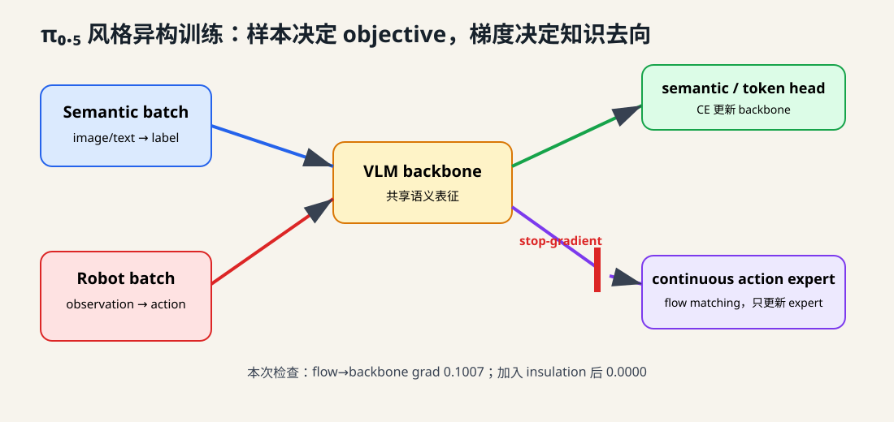
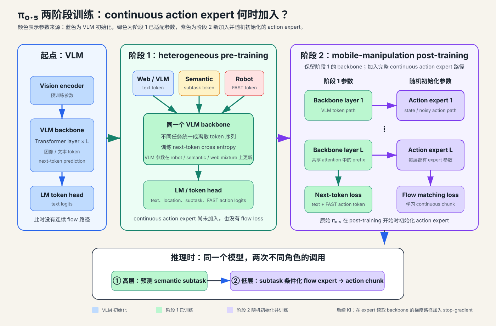

# 第 12 讲：π₀.₅——机器人轨迹与语义知识怎样进入同一个模型？



设想我们只用 PushT 一类轨迹训练机器人。模型能学会“当前点在这里，下一步向目标移动”，却很难仅凭这些动作回答：陌生厨房里哪些东西应该收进橱柜？“收拾卧室”可以拆成哪些子任务？从未见过的物品属于哪一类？

这些知识大量存在于网页图文、目标检测、问答和人类语言指导中。它们没有关节动作，不能直接放进 flow matching loss。π₀.₅ 的关键变化，是让一套模型从不同数据源学习各自擅长的信息，再通过高层 subtask 与低层 action 把语义和控制连接起来。

本讲解决：**异构样本如何共享模型、选择正确的训练目标，并控制 action expert 对预训练语义表征的影响？**

本讲暂不追求开放世界泛化。合成实验只检查 sample type、mixture ratio、objective routing 和 stop-gradient 是否真的生效。

## 一、先看完整路线：π₀.₅ 有两个训练阶段



原始 π₀.₅ 从预训练 VLM 出发，训练过程可以概括为：

```text
VLM initialization
        │
        ▼
阶段 1：heterogeneous pre-training
robot / semantic / web data 全部转成离散 token
robot action 使用 FAST tokenizer
训练目标主要是 next-token prediction
        │
        ▼
阶段 2：mobile-manipulation post-training
保留 next-token prediction
加入随机初始化的 continuous action expert
用 flow matching 学习精细 action chunk
        │
        ▼
推理：先预测高层 subtask，再生成低层 action chunk
```

第一阶段使用离散 token，是因为 text、object location、semantic subtask 和 FAST action 都可以放进相同的自回归训练接口。第二阶段加入 flow action expert，让机器人以更低的在线计算量输出高精度连续动作。

这里也能看出第 11 讲为什么要学习 FAST。FAST 在 π₀.₅ 中承担预训练阶段的 action representation；部署阶段仍由 flow action expert 生成连续动作。

### 1.1 第一阶段有没有 continuous action expert？

按照原始 π₀.₅ 的两阶段 recipe，第一阶段只训练离散 token VLA。机器人 action 先经过 FAST，随后由 VLM backbone 和 token head 完成 next-token prediction。continuous action expert 在这时尚未加入计算图，所以也没有 flow matching loss 可以更新它。

第二阶段开始时，系统才加入 continuous action expert，并将这条路径随机初始化。这里加入的不只是最后一个 action output head。第 6 讲介绍的双 expert 结构会在每个 Transformer layer 中保留一套 action-expert 参数，另外还有 state/noisy-action projection、flow-time conditioning 和 action output projection：

```text
layer 1: VLM block  <attention>  action-expert block 1
layer 2: VLM block  <attention>  action-expert block 2
...
layer L: VLM block  <attention>  action-expert block L
```

因此“阶段 2 加入 action expert”的实际含义，是增加整条连续动作生成路径。阶段 1 已经学好的 VLM 参数成为它读取的视觉语言 condition；新 expert 从 flow matching 信号开始学习怎样把这些 condition 变成连续 action chunk。

这项设计会带来训练动力学问题：一个跨越多层、随机初始化的 expert 可能通过共享 attention 把 flow gradient 传回已经训练好的 VLM。原始 π₀.₅ 依靠先离散预训练、再联合 post-training 缓解这一问题；后续 Knowledge Insulation 在 expert 读取 backbone 的梯度路径上进一步加入 stop-gradient。两种 recipe 会在第七节单独比较。

## 二、异构数据共享什么，又各自提供什么？

π₀.₅ 论文中的训练源包括：

| 数据源 | 典型输入 | 监督信号 | 主要作用 |
|---|---|---|---|
| mobile manipulator | 多相机、state、task prompt | robot action / subtask | 学目标平台和家庭任务 |
| diverse robot data | 其他机器人 observation | robot action | 扩充低层技能与场景 |
| cross-embodiment lab data | 不同形态机器人 | robot action | 转移基础操控能力 |
| high-level robot annotation | 场景与总任务 | semantic subtask | 学任务分解和阶段选择 |
| verbal instruction | 场景、历史、人类指令 | next subtask | 学人类在线指导 |
| web VLM data | 图像与文本问题 | caption、answer、location 等 | 保留并扩展视觉语义知识 |

这些样本可以共享视觉编码器、语言模型和 token vocabulary。它们的 label 并不相同：web sample 没有 action chunk，robot sample 也不一定有问答答案。

训练代码因此需要显式 sample type。把所有内容塞进一个带大量可选字段的字典，会让错误的默认值悄悄进入 loss。

本仓使用两个最小 contract：

```python
@dataclass(frozen=True)
class RobotActionBatch:
    observation: Tensor       # [B, observation_dim]
    actions: Tensor           # [B, H, action_dim]
    action_tokens: Tensor     # [B], toy 离散 action label
    source: str

@dataclass(frozen=True)
class SemanticBatch:
    observation: Tensor       # [B, observation_dim]
    labels: Tensor            # [B]
    source: str
```

实现位于 [`data/mixtures.py`](../../src/pi_from_scratch/data/mixtures.py)。真实系统还会为 caption、object detection、subtask prediction 等任务定义更细的 target type；本讲先保留“有连续动作”和“只有语义标签”这条最关键的边界。

## 三、Objective routing：样本决定计算哪些 loss

假设模型参数分成三部分：

```text
θ_b：VLM backbone
θ_d：semantic / discrete action head
θ_a：continuous action expert
```

semantic sample 只计算交叉熵：

$$
\mathcal L_{sem}
=-\log p_{\theta_b,\theta_d}(y\mid o).
$$

robot sample 可以同时提供离散 action 监督和连续 action 监督。这种 combined loss 用在原始 π₀.₅ 的 **post-training 阶段**，该阶段同时训练 token 与 flow；后续 Knowledge Insulation 又把它扩展成带 stop-gradient 的单阶段 recipe。

$$
\mathcal L
=M_{token}\mathcal L_{CE}
+\lambda_{flow}M_{action}\mathcal L_{flow}.
$$

$M_{token}$ 与 $M_{action}$ 是样本级或 token 级 mask：

- $M_{token}=1$：该样本具有 text、subtask、location 或 FAST action token target；
- $M_{action}=1$：该样本具有连续 action chunk，可以计算 flow matching；
- $\lambda_{flow}$：平衡 flow 与 token loss。原始 π₀.₅ 论文在 post-training 中将它设为 10。

把训练阶段和样本类型放在一起：

| 阶段与样本 | FAST / text token CE | continuous flow loss |
|---|---:|---:|
| 阶段 1 robot sample | ✓，action 经过 FAST | —，此时没有 continuous expert |
| 阶段 1 semantic / web sample | ✓ | — |
| 阶段 2 robot sample | ✓，继续预测 FAST action token | ✓，同一 action chunk 也作为 flow target |
| 阶段 2 semantic / web sample | ✓ | — |

因此，post-training 没有丢掉 action token loss。对于同一条 robot trajectory，连续 action chunk 会派生出两种 target：

```text
continuous action chunk A
        ├── FAST(A) ──> 离散 token CE，继续训练 backbone/token path
        └── A + noise + τ ──> flow MSE，训练 continuous action expert
```

论文这样设计有两个目的：FAST token 路径保持更快的 representation learning，flow 路径负责高精度、低延迟的连续动作推理。部署时只使用 flow expert 生成低层动作，FAST action decoding 不在实时控制路径上。

这里的 flow path 延续第 5 讲约定：

$$
A_\tau=(1-\tau)\epsilon+\tau A,
\qquad
u=A-\epsilon,
$$

$$
\mathcal L_{flow}
=\left\|v_{\theta_a}(A_\tau,\tau,h)-u\right\|_2^2,
$$

其中 $h=f_{\theta_b}(o)$ 是 backbone condition。

代码路由位于 [`objectives/mixed.py`](../../src/pi_from_scratch/objectives/mixed.py)：

```python
if isinstance(batch, SemanticBatch):
    return semantic_ce(batch)

if isinstance(batch, RobotActionBatch):
    return discrete_action_ce(batch) + continuous_flow_mse(batch)
```

类型路由带来一个简单但重要的保证：semantic batch 不会因为没有 action 而生成假的全零 flow target，robot batch 则可以从同一份 action 同时构造 FAST target 和 flow target。

## 四、Mixture ratio 是训练配置的一部分

“使用了五种数据”还不足以描述一次训练。假设每一步先选择数据源：

$$
k\sim\operatorname{Categorical}(p_{robot},p_{semantic},\ldots),
$$

再从对应 dataset 取一个 batch。训练了 $N$ 步后，实际看到的 robot batch 数量是随机变量：

$$
N_{robot}=\sum_{i=1}^{N}\mathbb 1[k_i=robot].
$$

所以 checkpoint provenance 至少要保存：

- 请求的 sampling probability；
- 各数据源真实 batch count；
- 每类 objective 的累计 loss 和 token/sample 数；
- 随机种子与数据版本。

本讲的 `MixtureSchedule` 会预先采样并记录整个任务序列：

```python
schedule = MixtureSchedule.draw(
    num_steps=2000,
    robot_probability=0.35,
    seed=12,
)
```

固定实验请求 `35%` robot batch，实际得到 `687 / 2000 = 34.35%`。短实验里的真实比例可能明显偏离配置值，因此报告两者都很重要。

数据比例还改变优化含义。语义 batch 太多时，backbone 学到很多视觉语言知识，action expert 的更新却可能不足；robot batch 占比过高时，模型又容易丢失 web-scale knowledge。论文中的比例是大规模系统选择，不能直接照搬到 PushT 或 LIBERO 小数据实验。

## 五、跨机器人数据仍需要 action contract

第 3 讲讨论过机器人 A 和机器人 B 的动作维度可能拥有不同语义。π₀.₅ 确实联合了多种 embodiment，但它没有依赖“相同下标自然表示相同关节”这个假设。

论文公开了三项相关处理：

1. joint control 与 end-effector control 会在 prompt 中加入 control mode；
2. 每个 dataset 按自身每个 action dimension 的 1% / 99% 分位数归一化到 `[-1,1]`；
3. action tensor 扩展到混合数据中的最大维度，低维机器人使用 zero padding。

教学框架还应继续保存 `embodiment_id`、`ActionSpec` 和有效维度 mask。prompt 能告诉模型“当前控制模式是什么”，底层 adapter 仍负责维度顺序、单位、坐标系、padding 和 inverse transform。

## 六、为什么需要高层 subtask？

给定总任务：

```text
clean the bedroom
```

直接让低层 policy 在每个控制周期都根据这句话预测关节动作，会把十分钟任务的阶段信息全部压给一个 action generator。π₀.₅ 使用同一个模型做两种频率不同的推理：

```text
高层，低频：observation + task → “pick up the pillow”
                                ↓
低层，高频：observation + subtask → continuous action chunk
```

可以写成：

$$
\ell_{t+1}\sim\pi_{HL}(\ell\mid o_t,g),
$$

$$
A_{t:t+H}\sim\pi_{LL}(A\mid o_t,q_t,\ell_{t+1}).
$$

$g$ 是总任务，$\ell_{t+1}$ 是当前 subtask。高层输出本身也成为低层模型的语言 condition。

同一个模型并不意味着两者共享完全相同的调用节拍。subtask 可以保持一段时间，低层 action chunk 会更频繁地重新生成。第 9、10 讲的 runtime 时间戳和 action buffer 在这里仍然有效。

## 七、Knowledge Insulation 解决什么训练冲突？

这一节先建立训练 recipe 的主干。若想继续追踪 attention 中的 key/value、前向信息流、反向梯度流和论文消融，请阅读[附录 A：Knowledge Insulation](../appendices/a_knowledge_insulation.md)。

原始 π₀.₅ 采用两阶段 recipe：先用 FAST action token 适配 backbone，再在 post-training 加入 flow action expert。后续的 Knowledge Insulation 工作进一步提出单阶段联合训练：

先把三个容易混淆的训练起点放在一起：

| recipe | continuous action expert 何时出现 | action expert 初始化 | backbone 怎样获得机器人监督 |
|---|---|---|---|
| π₀ | 从 VLA 训练开始就存在 | 随机初始化 | flow loss 可以沿条件路径影响 backbone |
| 原始 π₀.₅ | 第一阶段没有；第二阶段加入 | post-training 开始时随机初始化 | 第一阶段先由 FAST action token 训练，第二阶段继续联合训练 |
| π₀.₅ + KI | 单阶段开始时就存在 | 随机初始化 | discrete action/VLM loss 更新 backbone；flow 路径被 stop-gradient 隔离 |

所以你在第 6 讲看到的“每层都有 action expert”描述的是 π₀ 的连续 flow 架构，以及 π₀.₅ 进入第二阶段后的模型结构。它没有要求 π₀.₅ 第一阶段必须提前创建一组闲置的 expert 参数。

```text
discrete action / VLM loss ──> 更新 backbone

backbone activation ── stop-gradient ──> continuous action expert
                                      flow loss 只更新 expert 路径
```

写成简化形式：

$$
h=f_{\theta_b}(o),
\qquad
\tilde h=\operatorname{sg}(h),
$$

$$
v=v_{\theta_a}(A_\tau,\tau,\tilde h).
$$

前向传播时，action expert 仍然读到 backbone 表征。反向传播经过 $\operatorname{sg}$ 时：

$$
\frac{\partial\mathcal L_{flow}}{\partial\theta_b}=0,
\qquad
\frac{\partial\mathcal L_{flow}}{\partial\theta_a}\ne0.
$$

这和冻结整个 VLM 有明显区别。semantic CE 与 discrete action CE 依然更新 backbone，让视觉语言表征适应机器人场景；刚初始化的 continuous expert 无法用高噪声梯度直接改写 backbone。

完整论文在 blockwise attention 的 backbone key/value 路径上实施 stop-gradient。本讲的小模型在 action expert 读取 condition 时调用：

```python
condition = self.encode(observation)
if insulate_backbone:
    condition = condition.detach()
```

这个简化保留了梯度边界，省略了大型 Transformer 的注意力细节。

## 八、运行实验：先检查梯度，再谈效果

执行：

```bash
pi-pi05-mixture-demo
```

默认结果：

| 检查项 | backbone gradient norm |
|---|---:|
| semantic CE | 0.3676 |
| discrete action CE | 0.2633 |
| flow，无 insulation | 0.1007 |
| flow，有 insulation | 0.0000 |

前两行说明 backbone 仍能从语义和离散 action 学习。最后一行验证 flow loss 已被隔离。

实验还固定同一份 robot batch、noise 和 flow time，仅用 flow loss训练 40 步：

| 方案 | flow loss（首步→末步） | backbone 参数漂移 | semantic logits 漂移 |
|---|---:|---:|---:|
| 无 insulation | 2.0280 → 0.0312 | 3.5006 | 0.1955 |
| 有 insulation | 2.0280 → 0.1045 | 0.0000 | 0.0000 |

两种 action expert 都在降低 flow loss。insulated 模型的 backbone 完全不动，所以原 semantic logits 也保持不变。

这项 toy 结果只证明 stop-gradient 接线正确。它无法证明真实任务成功率更高，也没有模拟 discrete action 和 web data 同时继续改进 backbone 的完整训练过程。

## 九、四种常见失败

### 9.1 用全零 action 填补 semantic sample

这样会训练模型在大量网页图像上输出“机器人保持不动”。正确做法是跳过该样本不存在的 objective。

### 9.2 只写配置比例，不记录实际计数

短训练和多 worker 数据加载会让实际比例偏移。没有 count，很难解释某个 loss 为什么几乎没有更新。

### 9.3 Stop-gradient 后移

如果 flow loss 已经经过 cross-attention 更新了 backbone，再在 action output 前 `detach`，隔离已经来不及。梯度边界必须位于 action expert 读取 backbone activation 的路径上。

### 9.4 只隔离 flow loss，同时取消离散 action 与 VLM 训练

此时 backbone 虽然不会遗忘，也无法适应机器人 observation。Knowledge Insulation 的完整逻辑依赖两条训练路径：backbone 由离散 action/VLM objective 更新，continuous expert 由 flow objective 更新。

## 十、与 π₀.₅、KI 和 openpi 的差异

### 原始 π₀.₅

论文使用约 400 小时 mobile-manipulator 数据以及更大规模的其他机器人、high-level 和 web mixture。预训练持续 280k steps，随后进行 80k steps post-training。这些规模和比例没有进入本仓。

### Knowledge Insulation

本讲把它作为 π₀.₅ 训练 recipe 的重要后续改进，并明确与原始两阶段方案区分。真实 KI 在双专家 Transformer 的 attention 路径中实现 stop-gradient，同时联合训练 FAST action tokens、VLM data 和 continuous action expert。

### 本仓实现

`TinyPi05` 使用低维 synthetic feature、一个共享 MLP 和两个小 head。离散 action 只用单个分类 label 代替 FAST 序列，continuous head 继续使用第 5 讲的 flow path。它用于检查数据与梯度路由，不构成 π₀.₅ 复现。

openpi 当前提供 π₀.₅ flow checkpoint 和训练配置，但没有公开论文的私有异构数据全集。本课程不会从配置文件反推并补造未公开数据比例。

## 十一、本讲验收

```bash
ruff check .
pytest -q tests/test_pi05_mixture.py
pi-pi05-mixture-demo --seed 12
```

机器可检查条件：

- typed batch 在 batch size、dtype 或 shape 错误时立即失败；
- mixture schedule 对相同 seed 完全可复现；
- semantic batch 只激活 semantic CE；
- robot batch 激活 discrete action CE 与 flow MSE；
- insulated flow loss 对 backbone 的 gradient norm 为 0；
- 同一 flow loss 仍能更新 action expert；
- flow-only 微调中 insulated backbone 参数漂移为 0。

## 十二、下一讲接口

本讲冻结了：

```text
typed heterogeneous batch
sample kind -> objective routing
requested and realized mixture ratio
high-level subtask -> low-level action condition
backbone / action-expert gradient boundary
```

第 13 讲会给高层策略增加 memory state。短期视觉历史帮助低层策略跨过遮挡，长期文本摘要帮助高层策略记住哪些 subtask 已完成。

## 自测问题

1. web VQA sample 为什么不能计算 flow matching loss？
2. 原始 π₀.₅ 的 pre-training 与 post-training 分别使用什么 action representation？
3. requested mixture ratio 与 realized ratio 为什么都要保存？
4. stop-gradient 是否会阻止 semantic CE 更新 backbone？
5. Knowledge Insulation 为什么还需要 discrete action objective？
6. 两种机器人共享最大 action tensor 后，为什么仍需要 dimension mask 和 ActionSpec？
7. high-level subtask 和低层 action chunk 应该使用相同推理频率吗？

## 扩展阅读

- [π₀.₅: a Vision-Language-Action Model with Open-World Generalization](https://www.physicalintelligence.company/download/pi05.pdf)：主线阅读第 IV 节，重点看 Figure 3、异构数据类别、两阶段 recipe 和高低层推理。
- [Knowledge Insulating Vision-Language-Action Models](https://www.physicalintelligence.company/download/pi05_KI.pdf)：先阅读本仓的[附录 A](../appendices/a_knowledge_insulation.md)，再重点看原文 Figure 1、第 5 节与公式 (5)、(6)。
- [openpi](https://github.com/Physical-Intelligence/openpi)：查看 π₀.₅ 的公开模型与配置边界。公开代码不能替代论文中未开放的数据 mixture。
- [Open X-Embodiment](https://robotics-transformer-x.github.io/)：扩展理解跨机器人数据规模。阅读时重点关注 action space、embodiment 和 dataset mixture 如何被标准化。
