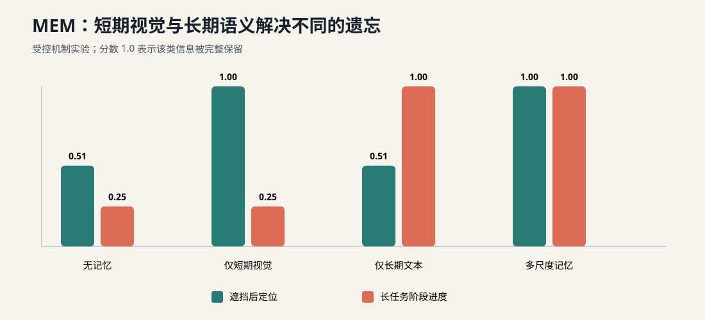

# 第 13 讲：MEM——机器人怎样同时记住刚才看见的东西和几分钟前做过的事？



机器人看见杯子在左边，伸手时自己的手臂挡住了相机。下一帧只剩下一片遮挡，policy 仍要继续向左完成抓取。另一个机器人正在准备三明治，五分钟前已经放过奶酪，现在需要记住任务进度，避免再次执行同一步。

这两个问题都需要历史信息，但需要保存的内容差异很大：遮挡前杯子的精确位置要保留视觉细节，已经完成的配方步骤只需一条紧凑的语义摘要。

本讲解决：**VLA 如何用短期视频记忆保留细节，用长期文本记忆追踪任务状态，并把两者接入高层和低层 policy？**

本讲不会训练论文中的视频 encoder 或 memory summarizer。我们先用透明、确定性的组件验证 memory state、更新时间和 partial-observability 实验。

## 一、先看全景：MEM 是两种时间尺度的组合

把全部历史帧直接输入 VLA，token 数和视觉编码延迟会随着任务时间持续增长。只保留每隔几十秒的一帧，又容易错过抓取、滑动和遮挡等快速变化。

MEM 把历史分成两条路径：

```text
最近几秒的密集 image/state
        ↓ video encoder
short-term visual tokens ───────────────┐
                                       ▼
当前 observation + task goal ───────> VLA ──> action chunk
                                       ▲
过去数分钟的 semantic events          │
        ↓ summary/update               │
long-term text memory ──> next subtask ┘
```

两类 memory 的职责可以先用这张表固定：

| memory | 时间范围 | 表示 | 保留的信息 | 典型用途 |
|---|---|---|---|---|
| short-term | 最近数秒 | 密集 video + state feature | 位置、运动、接触、遮挡前细节 | 继续抓取、re-grasp、动态判断 |
| long-term | 数分钟 | 压缩自然语言 | 已完成步骤、失败历史、任务阶段 | 配方进度、计数、长任务规划 |

“短”和“长”由任务节拍决定。论文预训练时使用 6 个 observation（5 个历史帧和当前帧），相邻 observation 间隔 1 秒；post-training 能扩展到最多 18 帧、覆盖 54 秒。长期文本 memory 则服务于最长约 15 分钟的任务。

## 二、从 memoryless policy 到 MEM factorization

普通 VLA 根据当前 observation $o_t$ 和任务 $g$ 生成 action chunk：

$$
\pi(A_{t:t+H}\mid o_t,g).
$$

MEM 希望同时预测 action、下一条 subtask $\ell_{t+1}$ 和更新后的语言 memory $m_{t+1}$。论文把它近似分解为高层与低层两部分：

$$
\pi(A_{t:t+H},\ell_{t+1},m_{t+1}
\mid o_{t-T:t},m_t,g)
$$

$$
\approx
\pi_{LL}(A_{t:t+H}\mid o_{t-K:t},\ell_{t+1},g)
\;\pi_{HL}(\ell_{t+1},m_{t+1}\mid o_t,m_t,g),
$$

其中：

- $T$ 表示完整任务可能涉及的历史范围；
- $K\ll T$ 是低层 policy 实际读取的短期 observation 数；
- $m_t$ 是此前语义事件的文本摘要；
- $\ell_{t+1}$ 是高层模型选择的下一项 subtask；
- $A_{t:t+H}$ 是低层 flow expert 生成的连续动作。

这条 factorization 把“几分钟前发生了什么”压缩进 $m_t$，同时把最近 $K$ 帧原样交给视觉路径。第 12 讲的高低层接口因此变成：

```text
HL: current observation + task + old memory
      → next subtask + updated memory

LL: recent video/state + task + next subtask
      → continuous action chunk
```

## 三、短期视频记忆为什么不能只拼接图片？

假设每帧图像产生 $P$ 个 patch token，一共有 $K$ 帧。把全部 token 送入普通 self-attention，联合时空 attention 的计算量近似：

$$
\mathcal O((KP)^2).
$$

这会很快超过机器人允许的推理延迟。MEM 的视频 encoder 从标准 ViT 扩展而来：

1. 每帧分别 patchify；
2. 大部分层继续做帧内双向 spatial attention；
3. 每隔若干层加入相同 patch 位置跨时间的 causal-temporal attention；
4. 在高层丢弃过去帧 token，只把压缩表示送进 VLM backbone。

分解后的 attention 避免一次处理全部时空 token：

$$
\mathcal O(KP^2+PK^2).
$$

论文实现每 4 层加入一次 temporal attention，并保持单图像输入时能够初始化自原有 VLM encoder。这里的 causal mask 也很关键：时刻 $t$ 的表示可以读过去，不能在训练时偷看未来 observation。

本仓先实现更透明的替身：`ShortTermVideoMemory` 保存固定容量 frame window，每个 frame 带：

```text
timestamp_s:  float
features:     float[feature_dim]
visible_mask: bool[feature_dim]
```

toy encoder 从新到旧寻找每个 feature 最近一次可见值：

```python
for frame in reversed(frames):
    take = frame.visible_mask & ~valid
    values[take] = frame.features[take]
```

当当前帧中的目标被遮挡时，它可以恢复遮挡前的位置。这个算子没有学习能力，只用于冻结 window、timestamp、visibility 和 encoder 输出 contract。

## 四、长期文本 memory 怎样更新？

长期 memory $m_t$ 是过去语义事件的摘要。高层 policy 每次选择新 subtask 时，也要决定怎样更新摘要：

$$
(\ell_{t+1},m_{t+1})
\sim\pi_{HL}(\cdot\mid o_t,m_t,g).
$$

一个简化例子：

```text
m_t:
completed: prepare pan, add bread

current result:
add cheese succeeded

m_{t+1}:
completed: prepare pan, add bread, add cheese
```

论文的训练标签由离线流程产生：输入 episode 的 subtask annotation 以及每次执行成功/失败标记，让现成 LLM 总结仍与未来执行相关的信息。摘要还要主动压缩，例如把三个不同颜色的碗改写成“已经把三个碗放进右上橱柜”。

压缩带来两个收益：

- memory token 数不会随任务时长线性增加；
- 自回归更新时需要从上一步携带的信息更少，降低 train/inference distribution shift。

本仓的 `LongTermTextMemory` 使用结构化计数生成可读摘要：

```python
memory.update("add cheese", success=True)
memory.update("close sandwich", success=False)
print(memory.summary())
```

输出类似：

```text
completed: add cheese; failed: close sandwich
```

它是确定性的标签与状态替身。真实 MEM 由模型生成 natural-language memory，因而还要处理 hallucination、遗漏和错误累积。

## 五、Memory 何时更新？

把 memory update 放进每个 `env.step()` 会混淆三个节拍：

```text
control loop：20 Hz 消费 action
low-level policy：按 execution horizon 重新生成 chunk
high-level policy / memory：subtask 完成、失败或超时后更新
```

推荐的 runtime 顺序是：

```text
1. control loop 持续消费 action buffer
2. short-term store 按 observation timestamp 接收新 frame/state
3. low-level replan 读取 recent visual context
4. subtask termination detector 产生 success/failure event
5. high-level policy 根据 event、m_t、o_t 和 goal 生成 ℓ_{t+1}, m_{t+1}
6. 后续 low-level chunk 使用新的 subtask
```

视觉 frame 必须使用 simulator/robot timestamp，长期 memory event 要记录对应 subtask 的结束时刻。墙钟 inference latency 继续由第 9、10 讲的 runtime 单独记录。

MEM 论文的真实机器人实验仍使用 inference-time RTC 或 training-time RTC。Memory 扩充 policy condition，RTC 处理 action chunk 在推理延迟下的交接，两者解决的时间问题位于不同层。

## 六、统一的 memory contract

本仓在 [`memory/multiscale.py`](../../src/pi_from_scratch/memory/multiscale.py) 暴露：

```python
@dataclass(frozen=True)
class MemoryContext:
    short_term_features: Tensor
    short_term_mask: Tensor
    long_term_summary: str
```

`MultiScaleMemory` 拥有两个 store，但 policy 只接收一个 typed context：

```python
memory = MultiScaleMemory(video_capacity=6, feature_dim=8)
context = memory.context()
```

后续接入 TinyPi0 时：

- short-term features 经过 projection，作为额外 visual/state tokens；
- long-term summary 经过现有 text tokenizer，加入高层 prompt；
- mask 明确哪些 feature 在当前 window 内从未可见；
- memory store 留在 runtime/session 层，不写进全局模型参数。

episode reset 必须同时清空两种 memory。让下一个任务读到上一个任务的摘要，会形成难以察觉的跨 episode 泄漏。

## 七、受控实验：两类记忆各解决一个问题

运行：

```bash
pi-memory-demo
```

实验包含两个互补任务。

### 7.1 遮挡后定位

目标最初随机出现在左或右，随后连续若干步不可见。决策时：

- 无短期视觉 memory 的方法只能固定猜右侧；
- 有短期视觉 memory 的方法读取最近一次可见位置。

### 7.2 长任务阶段进度

机器人依次完成：

```text
prepare pan → add bread → add cheese → close sandwich
```

当前画面不提供“此前完成了哪些步骤”。有长期 memory 的方法选择第一个未完成 subtask；其他方法每次都会重新选择 `prepare pan`。

固定 `seed=13`、200 个遮挡 episode 的结果：

| 方法 | 遮挡后定位准确率 | 长任务完成进度 | 两项平均 |
|---|---:|---:|---:|
| 无记忆 | 0.505 | 0.250 | 0.3775 |
| 仅短期视觉 | 1.000 | 0.250 | 0.6250 |
| 仅长期文本 | 0.505 | 1.000 | 0.7525 |
| 多尺度组合 | 1.000 | 1.000 | 1.0000 |

结果展示了分工关系：短期视觉保存精确的最近状态，长期文本保存跨阶段语义。单独拉长任意一条路径，都不等价于同时拥有两种信息。

这些分数来自手工规则，没有经过 policy learning。它们验证的是 partial-observability task 是否真的要求对应 memory，以及模块接线能否提供所需信息。

## 八、失败模式比平均分更重要

### 8.1 遮挡时间超过 short-term capacity

当最后一次可见 frame 被 deque 淘汰后，toy video encoder 会返回 `valid_mask=False`。真实系统需要增加窗口、降低采样间隔，或把关键事件提升为长期 memory。

### 8.2 文本摘要丢掉未来仍需要的细节

“已把杯子放好”可能省略杯子的具体位置。摘要器需要根据未来任务保留相关信息，文本长度只是约束之一。

### 8.3 模型把失败写成成功

高层模型基于自己生成的 $m_t$ 继续更新 $m_{t+1}$，一次错误会持续影响后续 subtask。部署应保存 event trace，必要时允许 verifier 或人工修正 memory。

### 8.4 Causal confusion

带历史的 policy 可能只复制过去动作，因为训练数据中相邻动作高度相关。评估要改变 observation 或目标，检查模型是否真正使用 scene condition。MEM 论文认为其大规模多样数据没有表现出明显退化，但这不构成所有小数据训练的保证。

### 8.5 Memory 与当前 observation 冲突

物体可能被人移动，旧 memory 说“杯子在左边”，新画面却清楚显示它在右边。策略需要学习信息新鲜度和可见性；安全系统不应盲从陈旧摘要。

## 九、与 MEM 论文实现的差异

论文中的 π₀.₆-MEM：

- 初始化自 Gemma 3 4B VLM；
- 使用学习得到的 video encoder，交替 spatial 与 causal-temporal attention；
- 同时训练 FAST discrete action 与 860M flow-matching action expert；
- action expert 到 VLM backbone 使用 Knowledge Insulation；
- 历史 state 经过连续 projection，每个时刻只产生一个 state token；
- 使用 robot、policy rollout、human correction、vision-language 和 video-language mixture；
- 在真实机器人长任务、partial observability 和 in-context adaptation 上评估。

本仓只实现 bounded visual store、latest-visible toy encoder、结构化文本摘要和两个合成任务。这里没有训练 memory updater，没有图像 patch，也没有复现论文真实机器人结果。

这种简化让我们能先回答三项工程问题：memory 属于哪个 session、何时更新、怎样进入 policy condition。第 16 讲再把 context 接入统一仿真 runner。

## 十、本讲验收

```bash
ruff check .
pytest -q tests/test_memory.py
pi-memory-demo --seed 13
```

机器可检查条件：

- visual memory 只保留固定容量 frame；
- timestamp 不递增时立即失败；
- 当前 feature 被遮挡时，可以恢复 window 中最近一次可见值；
- success 与 failure event 在文本摘要中分开记录；
- `MemoryContext` 同时暴露短期 feature/mask 与长期 summary；
- short-only 只通过遮挡任务；
- long-only 只通过长阶段任务；
- multi-scale 在两项受控机制检查中都通过。

## 十一、下一讲接口

本讲冻结了：

```text
timestamped short-term observation window
video encoder output + valid mask
long-term semantic memory state
subtask success/failure -> memory update
MemoryContext -> high/low-level policy
episode reset boundary
```

第 14 讲进入 π*₀.₆ / RECAP。届时 failure、intervention 和 autonomous rollout 不再只更新文本记忆，它们还会进入离线 value/advantage 管线，改变 policy 的训练权重与条件。

## 自测问题

1. 为什么把全部历史图像拼进 VLM 会遇到实时性问题？
2. short-term video 与 long-term text 各自适合保存什么信息？
3. $m_{t+1}$ 为什么要读取 $m_t$，而不能每次从头总结全部视频？
4. memory update 为什么不需要按 20 Hz control frequency 运行？
5. RTC 和 MEM 分别解决哪一种时间问题？
6. 当目标重新可见且位置变化时，策略应该怎样处理旧 memory？
7. 为什么跨 episode 保留 memory 会造成评估泄漏？

## 扩展阅读

- [MEM: Multi-Scale Embodied Memory for Vision Language Action Models](https://www.pi.website/download/Mem.pdf)：必读第 III 节。先看 Figure 2 的 high/low-level factorization，再看语言摘要标签生成和 Figure 4 的 video encoder。
- [MEM 项目页](https://www.pi.website/research/memory)：结合长任务、遮挡和 in-context adaptation 视频理解三类能力。视频结果属于论文系统，不代表本仓 toy 实现。
- [ContextVLA](https://arxiv.org/abs/2510.04246)：继续追问多帧 observation 怎样以较低代价进入 VLA。重点比较其 amortized context 与 MEM 的短期 video encoder。
- [MeMViT](https://arxiv.org/abs/2201.08383)：补充视频模型中的长期 latent memory。阅读重点是 memory compression 与计算量，不需要展开视频识别 benchmark。
- [SAM2Act](https://arxiv.org/abs/2501.18564)：观察视觉基础模型和 memory 在机器人操控中的另一种结合方式，并比较它与自然语言长期摘要的职责差异。
