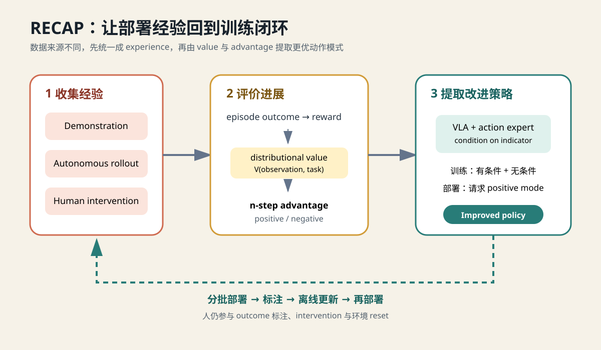

# 第 14 讲：π*₀.₆ / RECAP——机器人怎样从自己的成功、失败和人工纠正中继续学习？



一个模仿学习 policy 已经学会把杯子放进托盘。实际部署后，它仍会遇到训练集里少见的局面：夹爪只夹住杯沿、移动时碰到障碍物、杯子滑落后不知道怎样恢复。机器人每天都在产生这些轨迹，其中既有失败，也有失败发生前做对的部分，还可能包含人在关键时刻接管后的纠正动作。

如果把失败 episode 整条丢掉，最需要学习的状态也会一起消失；如果把所有动作无条件混合训练，policy 又会同时模仿好行为和坏行为。

RECAP 给出的路线是：**保留全部经验，为每个时间点开始的动作片段生成“相对当前策略是否更优”的标签，再让 VLA 学会根据这个标签选择动作模式。**


**只有 episode 最终的成功或失败，怎样逐步得到每个动作片段的 positive / negative 标签，并把它用于 flow VLA 训练？**

先看完整信息链，后面每一节只解释其中一条箭头：

```text
episode 最终结果 success / failure
              ↓ 外部标注
逐步 reward r_t
              ↓ 从后向前累加
return label R_t
              ↓ 归一化、离散
value-bin label R_t^B
              ↓ 训练 distributional Value Model
预测的连续 value V(o_t, task)
              ↓ 比较执行 N 步前后的完整回报
n-step advantage A_t^(N)
              ↓ task-specific threshold
improvement indicator I_t ∈ {positive, negative}
              ↓ condition dropout / optional CFG
advantage-conditioned VLA
```

## 一、基本出发点：失败轨迹不能浪费，也不能直接照抄

RECAP 使用三类机器人经验：

| 来源 | 包含的信息 | 可能的问题 |
|---|---|---|
| demonstration | 人类执行的任务主干 | 很少覆盖 policy 自己造成的错误状态 |
| autonomous rollout | policy 真正会访问的状态、成功和失败 | 同时包含合理动作、绕路和错误动作 |
| human intervention | 人在即将失败时给出的纠正动作 | 成本高，通常只覆盖局部片段 |

失败轨迹不等于“每一步都错了”。例如：

```text
t=0  正确接近杯子
t=1  正确对准夹爪
t=2  正确夹住杯沿
t=3  移动时碰到障碍物
t=4  杯子滑落
t=5  episode 失败
```

前半段仍能提供接近和对准的有效数据，后半段提供 policy 独有的失败状态。如果直接做混合 behavior cloning，模型只会学到这些行为的混合分布：

$$
\pi(a\mid o,\ell)
=\sum_q \pi(a\mid o,\ell,q)p(q\mid o,\ell),
$$

其中 $q$ 可以理解为行为质量。模型还需要一个 condition 来区分期望的模式。

RECAP 使用的 condition 叫 improvement indicator：

```text
Advantage: positive
Advantage: negative
```

它是局部、相对的改进标签，表示从当前状态开始执行这段动作，结果是否好于 reference policy 的预期。

## 二、一条抓杯轨迹怎样变成每个时刻的 Value 标签？

这一节用同一个例子贯穿 reward、return 和 bin label。

任务是：

```text
把桌上的红色杯子放进托盘。
```

机器人产生一条成功 episode：

| 时刻 | observation |
|---:|---|
| $o_0$ | 机械臂在初始位置 |
| $o_1$ | 夹爪接近杯子 |
| $o_2$ | 夹爪对准杯子 |
| $o_3$ | 已经夹住杯子 |
| $o_4$ | 杯子移动到托盘上方 |
| $o_5$ | 杯子进入托盘，episode 结束 |

### 2.1 最终成功由谁给出？

RECAP 算法只要求一个可靠的 episode outcome：

```text
success = true / false
```

它可以来自人工、仿真环境、传感器或独立的 success detector。论文真实机器人系统主要依赖人工提供 reward feedback，同时也需要人工 intervention 和环境 reset。Value Model 不充当最终裁判，因为它本身就要用这些 outcome 训练。

```text
外部 success/failure → 训练标签 → Value Model
```

让同一个 Value Model 先判断成功、再把自己的判断当作监督，会形成自我强化的错误闭环。

### 2.2 从 outcome 生成逐步 reward

论文定义：

$$
r_t=
\begin{cases}
-1, & \text{未终止},\\
0, & \text{成功终止},\\
-C_{fail}, & \text{失败终止}.
\end{cases}
$$

每个未终止时刻的 `-1` 是时间成本，因此更快成功会获得更高、也就是更接近 0 的 return。

这条成功轨迹得到：

| $t$ | $r_t$ |
|---:|---:|
| 0 | -1 |
| 1 | -1 |
| 2 | -1 |
| 3 | -1 |
| 4 | -1 |
| 5，成功终止 | 0 |

人工只标一次最终 outcome，中间的 `-1` 全部由程序生成。

### 2.3 从后向前得到 return label

Return 表示从时刻 $t$ 到 episode 结束真正获得的累计回报：

$$
R_t(\tau)=\sum_{i=t}^{T}r_i.
$$

从结尾向前累加：

| $t$ | observation | $r_t$ | $R_t$ |
|---:|---|---:|---:|
| 0 | 初始位置 | -1 | -5 |
| 1 | 接近杯子 | -1 | -4 |
| 2 | 对准杯子 | -1 | -3 |
| 3 | 夹住杯子 | -1 | -2 |
| 4 | 托盘上方 | -1 | -1 |
| 5 | 成功终止 | 0 | 0 |

这一步回答了“只有最终 reward，前面的标签从哪里来”：episode 结束后，程序利用完整未来从后向前计算每个时间点的 Monte Carlo return。训练时已经拥有整条轨迹，不需要让机器人再执行一次。

如果失败时设置 $C_{fail}=10$，同长度失败轨迹的 reward 和 return 是：

```text
reward: [-1, -1, -1, -1, -1, -10]
return: [-15, -14, -13, -12, -11, -10]
```

失败状态整体落在更低的 return 区域。

### 2.4 按任务归一化

抓杯可能需要 100 步，做咖啡可能需要几千步。直接比较原始 return，会把任务本身的长度混进状态质量。

论文按任务最大 episode 长度做归一化，把 value 放到大致 $(-1,0)$。为了演示，假设抓杯任务的参考最大长度是 10：

$$
\tilde R_t=\frac{R_t}{10}.
$$

成功轨迹变为：

```text
[-0.5, -0.4, -0.3, -0.2, -0.1, 0.0]
```

真实工程要保存每个 task 的归一化配置，并且只能用 train episodes 估计统计量。

### 2.5 将连续 return 离散成 201 类标签

RECAP 把归一化 return 离散到 $B=201$ 个 value bins。若范围为 `[-1, 0]`，bin 中心可以写成：

$$
v(b)=-1+\frac{b}{200},
\qquad b=0,\ldots,200.
$$

简化的 nearest-bin 映射是：

$$
R_t^B=
\operatorname{round}\left[(\tilde R_t+1)(B-1)\right].
$$

上面的抓杯轨迹最终产生：

| observation | $\tilde R_t$ | 分类标签 $R_t^B$ |
|---|---:|---:|
| $o_0$ | -0.5 | 100 |
| $o_1$ | -0.4 | 120 |
| $o_2$ | -0.3 | 140 |
| $o_3$ | -0.2 | 160 |
| $o_4$ | -0.1 | 180 |
| $o_5$ | 0.0 | 200 |

因此，一条 episode 被展开成多个 Value Model 训练样本：

```text
(o_0, “把红色杯子放进托盘”) → class 100
(o_1, “把红色杯子放进托盘”) → class 120
...
(o_5, “把红色杯子放进托盘”) → class 200
```

## 三、Value Model 学什么？怎样从离散分布得到连续 Value？

RECAP 单独训练语言条件的 distributional Value Model：

$$
p_\phi(V\mid o_t,\ell)\in\Delta^B,
\qquad B=201.
$$

输入是当前 observation $o_t$ 和任务语言 $\ell$，输出是 201 个 bin 的概率。监督目标是上一节得到的 $R_t^B$：

$$
\mathcal L_V=
\mathbb E_{\tau\sim D}
\sum_t
H\left(R_t^B(\tau),p_\phi(V\mid o_t,\ell)\right).
$$

如果 $o_2$ 的标签是 bin 140，那么该位置的交叉熵为：

$$
\mathcal L_{V,t}
=-\log p_\phi(V=140\mid o_2,\ell).
$$

### 3.1 概率加权得到一个连续标量

Advantage 计算需要单个连续 value。模型已经输出每个 bin 的概率，因此对 bin 中心求期望：

$$
V_\phi(o_t,\ell)
=\sum_{b=0}^{200}p_\phi(V=b\mid o_t,\ell)v(b).
$$

用 3 个 bin 做一个小例子：

| bin center $v(b)$ | probability |
|---:|---:|
| -0.50 | 0.2 |
| -0.30 | 0.6 |
| -0.10 | 0.2 |

期望为：

$$
V=0.2(-0.5)+0.6(-0.3)+0.2(-0.1)=-0.3.
$$

这里更准确的说法是“从离散预测分布计算连续标量估计”。它没有精确逆转训练标签的量化过程。

### 3.2 为什么保留完整分布？

下面两种预测的期望都可能是 `-0.5`：

```text
分布 A：几乎所有概率集中在 -0.5
分布 B：一半概率在 -0.9，一半概率在 -0.1
```

分布 A 表示模型较确定；分布 B 表示当前画面可能对应“即将失败”或“即将成功”两个 mode。完整分布能表达不确定性和多峰性，后续 advantage 使用其期望作为一个标量摘要。

论文的 Value Model 使用较小的 Gemma 3 VLM backbone，并在多模态 web 数据上少量联合训练以缓解过拟合。本仓首版没有训练图像 Value Model，先用确定性算子验证标签与时间索引。

## 四、从状态 Value 到动作片段的 n-step advantage

Value 回答：

```text
从当前 observation 开始，预计还能获得多少 return？
```

RECAP 接下来要回答：

```text
数据中从当前时刻开始的这段动作，比原先预期更好吗？
```

使用 n-step advantage：

$$
A_t^{(N)}=
\sum_{i=t}^{t+N-1}r_i
+V(o_{t+N},\ell)
-V(o_t,\ell).
$$

时间轴是：

```text
o_t
  ── a_t / r_t ──> o_{t+1}
  ── a_{t+1} / r_{t+1} ──> ...
  ── a_{t+N-1} / r_{t+N-1} ──> o_{t+N}
```

从 $o_t$ 开始执行 $N$ 个已记录的动作，获得 $N$ 个 reward，最后到达 $o_{t+N}$。求和下标从 $t$ 到 $t+N-1$，一共刚好 $N$ 项。

### 4.1 为什么不能只计算 $V(o_{t+N})-V(o_t)$？

假设在 $o_t$ 时预计还要 5 步成功：

$$
V(o_t)=-5.
$$

正常执行两步后，预计还剩 3 步：

$$
V(o_{t+2})=-3.
$$

只看 value 差会得到：

$$
-3-(-5)=+2,
$$

看起来像超出预期的进步。实际上机器人已经为这两步支付：

$$
r_t+r_{t+1}=-2.
$$

完整 advantage 是：

$$
A_t^{(2)}=-2+(-3)-(-5)=0.
$$

它准确表示“执行得符合预期”。三种情况可以并排比较：

| 两步后的状态 | 两步 reward | 新 value | advantage | 含义 |
|---|---:|---:|---:|---|
| 正常推进，还剩 3 步 | -2 | -3 | 0 | 符合预期 |
| 推进更快，只剩 1 步 | -2 | -1 | +2 | 好于预期 |
| 原地绕路，仍剩 5 步 | -2 | -5 | -2 | 差于预期 |

期间 reward 补回了已经发生的时间成本。如果中间 reward 全为 0，value difference 在终止前才可能与 advantage 相同；RECAP 每个普通时间步都是 `-1`，所以不能省略这一项。

### 4.2 $N$ 是提前设置的超参数

$N$ 决定“向后观察多长的真实进展”：

| $N$ | 优势 | 风险 |
|---:|---|---|
| 小 | 局部、方差较低 | 强依赖 bootstrap value，相邻画面变化可能很小 |
| 大 | 使用更多真实 reward，能看见完整动作效果 | trajectory 随机性更大，credit assignment 更粗 |
| 到 episode 结束 | 完整 Monte Carlo outcome | 方差最高，当前行为受很远的后续行为影响 |

论文 post-training 使用固定 $N=50$ lookahead；pre-training 使用整条 episode，相当于令 lookahead 到达终点。`50 steps` 对应多少物理时间取决于数据频率：

```text
10 Hz → 5.0 s
20 Hz → 2.5 s
50 Hz → 1.0 s
```

自己的系统最好先定义 `advantage_lookahead_seconds`，再按 dataset control frequency 转成 $N$。它和 action chunk horizon $H$ 是两个概念：$H$ 决定模型预测多少动作，$N$ 决定训练标签向后评价多少轨迹步。

episode 尾部不足 $N$ 步时，lookahead 必须在当前 episode 终止，不能跨到下一条轨迹。本仓 [`n_step_advantages`](../../src/pi_from_scratch/data/experience.py) 使用 `min(t + N, T)` 处理这个边界。

## 五、把 advantage 变成逐时间点的 improvement indicator

连续 advantage 会按任务阈值 $\epsilon_\ell$ 二值化：

$$
I_t=
\mathbb 1[A_t^{(N)}>\epsilon_\ell].
$$

最终形成：

```text
(o_t, 从 t 开始的 action chunk) → Advantage: positive
(o_t, 从 t 开始的 action chunk) → Advantage: negative
```

它表示相对改进，不能理解成整个 episode 的绝对质量分数。失败 episode 的前半段可能是 positive，成功 episode 中的绕路也可能是 negative。

### 5.1 为什么阈值按任务设置？

叠衣、装箱和做咖啡的长度、value 噪声与行为分布不同。一个全局阈值会让某些任务几乎全为 positive，另一些任务几乎全为 negative。

论文 pre-training 为每个任务选择阈值，使随机抽取的 demonstration 中约 30% 被标成 positive；downstream iteration 通常让 evaluation rollouts 中约 40% 为 positive。针对高成功率但速度偏慢的 T-shirt/shorts folding，论文提高阈值，只留下约 10% positive。这里的比例是论文经验配置，不能直接照搬到新数据集。

### 5.2 人工 intervention 为什么强制 positive？

人在即将失败时接管，接管起点的 value 往往很低；critic 的局部噪声可能把真正有效的恢复动作标错。论文假设 expert correction 是好动作，因此 intervention mask 对应的位置直接令：

$$
I_t=\text{positive}.
$$

代码对应：

```python
threshold = task_advantage_threshold(advantages, quantile=0.30)
indicator = improvement_indicators(
    advantages,
    threshold=threshold,
    intervention_mask=intervention_mask,
)
```

真实数据必须同时保存 episode source 和逐步 intervention mask，因为一次 autonomous rollout 中可能只有少量时间段由人接管。

## 六、为什么 RECAP 采用条件化，而没有直接使用 PPO 或 GRPO？

GAE 或 n-step advantage 本身可以沿机器人时间轴计算。传统 PPO 的主要障碍出现在 policy update：

$$
\rho_t=
\frac{\pi_\theta(a_t\mid o_t)}
{\pi_{old}(a_t\mid o_t)}.
$$

PPO 需要新旧 policy 对同一动作的 log probability。自回归 token policy 可以把每个 softmax token 的 log probability 相加；flow policy 学到的是向量场：

$$
v_\theta(x_\tau,\tau,o),
$$

标准 flow-matching loss是速度回归：

$$
\mathcal L_{flow}
=\|v_\theta-u\|^2.
$$

它不会直接给出容易计算的 $\log\pi_\theta(A\mid o)$。所以 RECAP 论文选择绕开 PPO ratio，将 advantage 变成条件输入。GRPO 常用同一 prompt 的组内样本相对 reward，并通过可计算的 token log probability 更新 policy，也不对应这里的训练过程。

直接把可能为负的 advantage 乘到 flow MSE 上也不稳定：负权重会鼓励无限增大误差。AWR 可以将 advantage 变成非负权重，但低权重又会让大量失败数据几乎不参与训练。

Advantage conditioning 保留全部样本：

$$
\pi_\theta(a\mid o,\ell,I).
$$

```text
positive 数据 → 学 positive mode
negative 数据 → 学 negative mode
省略 indicator → 学完整 behavior distribution
```

这正好服务于 RECAP 的出发点：利用失败轨迹提供的状态覆盖，同时保留部署时选择更优行为的入口。

## 七、Condition dropout 与 CFG 分别发生在什么时候？

训练时，π*₀.₆ 会以 30% 概率省略 advantage indicator，让同一个模型学习：

$$
\pi_\theta(a\mid o,\ell,I)
\quad\text{和}\quad
\pi_\theta(a\mid o,\ell).
$$

这一步没有过滤 negative 样本。它只改变该训练样本是否向模型显示 indicator。

部署有两种选择。

### 7.1 直接请求 positive mode

```text
observation + task + "Advantage: positive"
```

然后从 conditional policy 生成 action chunk。

### 7.2 用 CFG 加强 positive 引导

对 flow vector field 做：

$$
v_{guided}
=v_{uncond}
+\beta(v_{positive}-v_{uncond}).
$$

$\beta>1$ 会进一步推向 positive distribution。论文指出 CFG 太强可能把 action 推到训练分布边界，引发激进运动，因此主要通过 task-specific threshold 控制 positive mode 的质量，在需要时使用中等 CFG。

在 π*₀.₆ 的 token 顺序中：

```text
observation + task
    → predicted subtask
    → "Advantage: positive" / "Advantage: negative"
    → FAST action tokens + continuous action chunk
```

Indicator 放在 predicted subtask 之后，因此只条件化离散和连续 action likelihood，不改变 subtask prediction。

## 八、现在再看完整 RECAP 循环

前面的标签链已经清楚后，完整系统可以读成：

```text
阶段 A：预训练
multi-task demonstrations
    ↓ 为每条 episode 生成 return bins
train V_pre
    ↓ 估计 advantage / indicator
train advantage-conditioned π*_pre

阶段 B：适配目标任务
π*_pre + target-task demonstrations
    ↓ SFT，indicator 固定为 positive
initial specialist π_l^0

阶段 C：经验迭代
deploy π_l^(k-1)
    ↓ autonomous rollout + optional intervention + outcome label
aggregate D_l
    ↓ 从 V_pre 初始化并更新 task Value Model
recompute advantage / indicator
    ↓ 从 π*_pre 初始化并更新 policy
π_l^k
    └──────────────────────────────> 下一轮部署
```

这是 iterated offline RL：收集一批数据、离线训练、再部署下一版。论文系统没有在机器人运行的同时持续更新参数。

每轮 specialist 的 Value Model 和 policy 都从稳定的 pretrained checkpoint 初始化，再使用累计 target-task data 训练，从而减少连续 checkpoint 漂移。

系统仍依赖人工或外部机制完成 outcome label、必要的 intervention 和环境 reset；探索主要依靠 policy 随机性与人工纠正。

## 九、π*₀.₆ 怎样接回前面的 π 系列？

```text
π₀.₅
heterogeneous data + high/low-level prediction
                         ↓
π₀.₆
Gemma 3 4B backbone + 860M action expert + 更多 robot data/context
                         ↓
FAST
离散 action token CE 训练 backbone
                         ↓
Knowledge Insulation
flow expert 读取 backbone activation，flow gradient 在边界停止
                         ↓
π*₀.₆ / RECAP
增加独立 Value Model、advantage indicator 和经验迭代
```

RECAP 改变的是部署经验怎样进入训练以及 policy 怎样提取更优 mode。Flow matching、action chunk、VLM/action expert 与 KI 的基本职责继续保留。

## 十、本仓最小实现验证什么？

数据 contract 位于 [`data/experience.py`](../../src/pi_from_scratch/data/experience.py)：

```python
@dataclass(frozen=True)
class ExperienceEpisode:
    task: str
    observations: Tensor       # [T + 1, observation_dim]
    actions: Tensor            # [T, action_dim]
    rewards: Tensor            # [T]
    source: ExperienceSource
    success: bool
    intervention_mask: Tensor  # bool[T]
```

本仓将 reward 与 action transition 对齐，并把 terminal outcome 放在最后一个 transition；论文公式也可采用 terminal state reward 的下标习惯。两种写法可以相差一个下标，contract 内保持一致即可。

运行：

```bash
pi-recap-demo --seed 14
```

受控数据令同一个 observation 对应两个 action mode：

$$
a_{good}=0.6o+1,
\qquad
a_{bad}=0.6o-1.
$$

训练集同时包含 demonstration、autonomous bad action 和少量 intervention correction。比较：

1. 混合数据直接 BC，模型会落在两个 mode 中间；
2. advantage-conditioned regression，positive 与 negative 输入选择不同 mode。

输出：

```text
outputs/lesson14/metrics.json
outputs/lesson14/comparison.svg
```

这个实验验证：

```text
同一 observation + 不同 improvement condition
                     ↓
              不同 action mode
```

它没有训练 learned Value Model，也没有证明真实机器人收益。首版代码先冻结 experience、return、n-step advantage、intervention override 和 condition contract；训练小型视觉 Value Model 可以作为后续扩展实验。

## 十一、常见误解与工程风险

### 11.1 将 episode success 复制给所有动作

一条成功 episode 中可以有绕路，一条失败 episode 的前半段也可能正确。Outcome 用于生成 return，局部 action label 还要经过 Value Model 和 n-step advantage。

### 11.2 把 indicator 当成绝对质量分数

Indicator 相对于 reference behavior、task threshold 和当前 Value Model。数据分布或 policy 更新后，它可能需要重新计算。

### 11.3 在 validation 上计算统计量

归一化范围、value bin 配置和 task threshold 都属于训练统计量，只能从 train episodes 得到。

### 11.4 忘记数据 provenance

Human、旧 policy、新 policy 和 intervention 的分布不同。每条数据应保存 collector policy、iteration、task、embodiment、control frequency 与 intervention mask。

### 11.5 把 positive condition 当成安全保证

Value Model 会误判，强 CFG 也可能产生激进行为。关节限速、碰撞检测、急停与人工接管继续属于独立 safety layer。

### 11.6 只报告 success rate

RECAP 同时追求 robustness 和 throughput。评估至少记录成功率、单位时间成功次数、episode 时长、接管次数和失败类型。

## 十二、与论文系统的差异

[π*₀.₆ / RECAP 论文](https://www.physicalintelligence.company/download/pistar06.pdf)使用真实多机器人数据、670M-backbone language-conditioned distributional Value Model、π₀.₆ 级 VLA、FAST + KI，以及多轮真实机器人经验采集。论文报告在部分困难任务上吞吐超过两倍、失败数约减半；这些属于论文系统及其评估协议下的结果。

本仓使用一维 observation/action 合成数据，value/advantage 由透明函数代替，policy 是小型 MLP。它验证数据和算法接线，不能称为 RECAP 复现。

## 十三、本讲验收与下一讲接口

```bash
.venv/bin/ruff check .
.venv/bin/pytest -q tests/test_recap.py
pi-recap-demo --seed 14
```

机器可检查条件：

- episode contract 拒绝错位时间轴；
- success/failure reward 和 return 可以手算核对；
- n-step advantage 包含期间 reward，bootstrap 索引正确；
- lookahead 不跨 episode；
- intervention action 总能进入 positive 集合；
- conditioned policy 的 positive mode 明显优于无条件混合 BC。

本讲最终冻结：

```text
external outcome
→ reward
→ return
→ normalized value bin
→ distributional Value Model
→ expected continuous value
→ n-step advantage
→ task-specific indicator
→ conditional / unconditional VLA
```

第 15 讲会把这条经验学习线与 π₀、FAST、KI、RTC、π₀.₅ 和 MEM 放回总图，观察 π₀.₇ 怎样将 specialist/evaluation data 蒸馏进由多模态 context 引导的 generalist VLA。

## 自测问题

1. 为什么失败 episode 中仍可能存在 positive 动作片段？
2. 外部 outcome 怎样变成每个 observation 的 $R_t^B$ 标签？
3. 为什么 distributional Value Model 最后还要计算 bin expectation？
4. 为什么 $V(o_{t+N})-V(o_t)$ 不能替代完整 n-step advantage？
5. $N$、action chunk horizon $H$ 和 control frequency 有什么关系？
6. RECAP 为什么没有直接使用 PPO ratio？
7. Condition dropout 与 inference-time CFG 分别做什么？
8. Intervention action 为什么强制标成 positive？
9. RECAP 为什么属于 iterated offline RL？

## 扩展阅读

- [π*₀.₆: a VLA That Learns From Experience](https://www.physicalintelligence.company/download/pistar06.pdf)：先读 Figure 1 和第 IV 节，再读附录 F 的 $N=50$、condition dropout 与 task threshold。
- [RECAP 项目页](https://www.pi.website/blog/pistar06)：结合叠衣、装箱和咖啡任务视频理解 throughput 与 failure rate。
- [Classifier-Free Guidance for Offline Reinforcement Learning](https://arxiv.org/abs/2407.20199)：继续追踪 improvement conditioning 的理论来源。
- [Human-Gated DAgger](https://arxiv.org/abs/1710.02878)：理解人在必要时接管怎样提供纠正片段。
